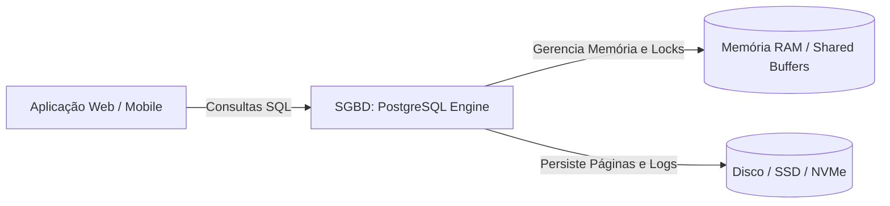
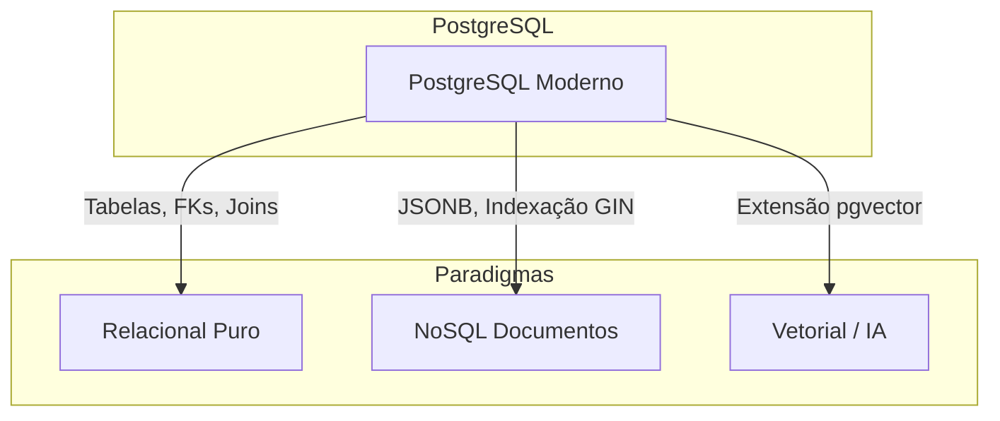

# 🐘 Módulo 01: Fundamentos de Banco de Dados e PostgreSQL
## 📑 Aula 01: Introdução ao Banco de Dados e ao Ecossistema PostgreSQL

> **Navegação**: [🏠 Início](../README.md) | [Módulo 01](./README.md) | [Próxima Aula: Escolha da Trilha de Setup ➡️](./02-instalacao-e-configuracao.md)

---

### 🎯 Objetivos de Aprendizagem
Ao final desta aula, você será capaz de:
- Compreender o conceito de SGBD (Sistema de Gerenciamento de Banco de Dados) e o modelo relacional.
- Comparar bancos de dados relacionais (SQL) e não-relacionais (NoSQL).
- Conhecer a história, evolução e diferenciais competitivos do PostgreSQL.
- Entender por que o PostgreSQL é considerado o banco de dados open source mais avançado do mundo.

---

### 1. O que é um Banco de Dados e um SGBD?

Um **Banco de Dados** (Database) é uma coleção organizada de dados estruturados, geralmente armazenados eletronicamente em um sistema de computador.

Um **SGBD** (Sistema de Gerenciamento de Banco de Dados, ou *DBMS - Database Management System*) é o software que interage com o usuário final, com as aplicações e com a camada de armazenamento físico para capturar e analisar os dados.

#### Funções Principais de um SGBD:
1. **Segurança e Controle de Acesso**: Autenticação de usuários, permissões granulares (`GRANT`/`REVOKE`).
2. **Integridade de Dados**: Garantia de regras de negócios via restrições (Constraints, Chaves Primárias e Estrangeiras).
3. **Concorrência**: Múltiplos usuários lendo e escrevendo sem corrupção de dados.
4. **Recuperação e Tolerância a Falhas**: Capacidade de restaurar o estado consistente após uma queda de energia ou crash.

---

### 2. O Modelo Relacional e o Teorema ACID

Criado por Edgar F. Codd em 1970 na IBM, o **Modelo Relacional** organiza os dados em tabelas (formalmente chamadas de *relações*), compostas por linhas (*tuplas*) e colunas (*atributos*).

Para garantir que operações de negócios sejam confiáveis, SGBDs relacionais seguem rigorosamente as propriedades **ACID**:

| Propriedade | Significado | Exemplo Prático |
| :--- | :--- | :--- |
| **A** - Atomicidade | "Tudo ou Nada". A transação é executada por completo ou é totalmente revertida (*rollback*). | Em uma transferência bancária de R$ 100, se o débito da conta A ocorrer mas o crédito da conta B falhar, o débito é desfeito. |
| **C** - Consistência | O banco de dados só transita de um estado válido para outro estado válido, respeitando todas as regras e constraints. | Não é permitido salvar um pedido para um cliente cujo `id_cliente` não existe na tabela de clientes. |
| **I** - Isolamento | Transações concorrentes não interferem umas nas outras antes de serem finalizadas (*commit*). | Dois usuários comprando o último ingresso ao mesmo tempo: um terá sucesso e o outro receberá erro de estoque esgotado. |
| **D** - Durabilidade | Uma vez confirmada (*commit*), a alteração não se perde mesmo em caso de falha de energia ou pane no hardware. | A gravação em disco (WAL) garante que após a confirmação os dados estão seguros. |

> [!IMPORTANT]
> Em sistemas financeiros, e-commerces, prontuários de saúde e ERPs, a garantia **ACID** é inegociável. Essa é uma das principais razões da hegemonia do PostgreSQL no mercado corporativo.

---

### 3. SQL vs NoSQL: Onde o PostgreSQL se Posiciona?

Historicamente existia uma separação rígida entre bancos relacionais e bancos NoSQL (documentos, chave-valor, grafos). O PostgreSQL quebrou essa dicotomia ao se tornar um **banco objeto-relacional híbrido**.

> [!NOTE]
> O suporte a **JSONB** nativo do PostgreSQL com índices `GIN` muitas vezes supera bancos NoSQL dedicados (como MongoDB) em velocidade de consulta, mantendo todas as garantias ACID!

---

### 4. A História e Evolução do PostgreSQL

* **1986 (Origem acadêmica)**: O projeto começou na Universidade da Califórnia em Berkeley sob liderança do professor **Michael Stonebraker** (ganhador do Prêmio Turing), como sucessor do projeto *Ingres*. Daí veio o nome **Post-ingres** -> **Postgres**.
* **1994**: Dois alunos de Berkeley (Andrew Yu e Jolly Chen) adicionaram um interpretador de linguagem SQL, renomeando o projeto para **Postgres95**.
* **1996**: O código tornou-se código aberto global e foi rebatizado como **PostgreSQL**.
* **Hoje**: É mantido pelo *PostgreSQL Global Development Group*, uma comunidade global independente, sem dono corporativo único, regida por uma das licenças mais liberais do mundo (Licença PostgreSQL, similar à MIT/BSD).

#### Por que o PostgreSQL é o favorito da indústria?
1. **Extensibilidade Ilimitada**: Permite criar novos tipos de dados, operadores, métodos de índice e linguagens de programação procedural (PL/pgSQL, PL/Python, PL/v8 Javascript).
2. **Ecossistema de Extensões**: Ferramentas como **PostGIS** (geolocalização e GIS líder global), **TimescaleDB** (séries temporais), **pgvector** (busca semântica e IA / LLMs) e **Citus** (distribuição horizontal).
3. **Padrão ANSI SQL Estrito**: Implementa a maior parte dos padrões SQL formais (SQL:2023).
4. **Sem aprisionamento tecnológico (*Vendor Lock-in*)**: Por ser 100% livre e de código aberto, você pode rodá-lo localmente, em Docker, em servidores on-premises ou na nuvem (AWS RDS, Google Cloud SQL, Azure e Neon).

---

### 5. Resumo e Próximos Passos

| Conceito | Descrição |
| :--- | :--- |
| **SGBD** | Camada de software que assegura integridade, persistência e consulta eficiente aos dados. |
| **ACID** | Atomicidade, Consistência, Isolamento e Durabilidade. |
| **Objeto-Relacional** | Combina rigor relacional clássico com tipos avançados (JSONB, Arrays, Objetos). |
| **PostgreSQL** | O mais avançado e extensível SGBD relacional de código aberto do mundo. |

> [!TIP]
> Na próxima aula, configuraremos nosso ambiente local com Docker, cliente `psql` e conheceremos as opções de conexão para iniciar a prática real!

---

### 📝 Autoavaliação de Fixação

- [ ] O que difere um arquivo texto convencional (como CSV) de um banco de dados relacional com SGBD?
- [ ] O que significa cada letra da sigla ACID e por que o Isolamento é crucial em sistemas concorrentes?
- [ ] Por que dizemos que o PostgreSQL é um banco objeto-relacional e não apenas puramente relacional?
- [ ] Qual o papel de Michael Stonebraker na computação e na criação do Postgres?

---
> **Navegação**: [🏠 Início](../README.md) | [Módulo 01](./README.md) | [Próxima Aula: Escolha da Trilha de Setup ➡️](./02-instalacao-e-configuracao.md)
