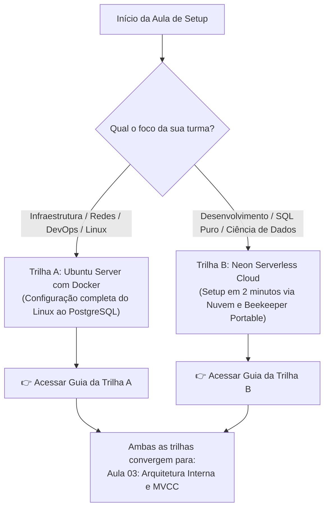

# 🐘 Módulo 01: Fundamentos de Banco de Dados e PostgreSQL
## 📑 Aula 02: Preparação do Ambiente: Escolha da sua Trilha de Laboratório

> **Navegação**: [⬅️ Aula Anterior: Introdução](./01-introducao-ao-banco-de-dados.md) | [Módulo 01](./README.md) | [Avançar para a Aula 03: Arquitetura Interna ➡️](./03-arquitetura-postgresql.md)

---

### 🎯 Visão Geral e Guia de Decisão

Para atender a diferentes perfis de turmas e propostas pedagógicas, este curso disponibiliza **duas trilhas completas e independentes de preparação de ambiente**.

Desta forma, o **professor pode orientar a turma a seguir apenas a trilha desejada e pular completamente a outra**, economizando tempo de aula e alinhando o laboratório aos objetivos curriculares.

---

### ⚖️ Tabela Comparativa: Qual Trilha Escolher?

| Critério | 🖥️ Trilha A: Ubuntu Server com Docker | ☁️ Trilha B: Neon Serverless e Beekeeper |
| :--- | :--- | :--- |
| **Público Ideal** | Cursos de Redes, Infraestrutura, Sistemas Operacionais, DevOps e DBAs. | Cursos de Programação (Web, Mobile, Backend), Engenharia de Software e Análise de Dados. |
| **Tempo de Setup** | Aproximadamente 15 a 25 minutos. | **Menos de 3 minutos**. |
| **Ambiente Necessário** | Acesso ao terminal de um Ubuntu Server limpo (VM, WSL2 ou VPS). | Apenas um navegador web e conexão à internet. |
| **Instalação de Softwares** | Exige instalação do Docker Engine, Compose e pacotes via `apt`. | **Zero instalação obrigatória**. O Beekeeper Studio é portátil (não precisa de admin). |
| **Recursos de Máquina** | Consome memória RAM e CPU do computador host. | Carga 100% processada na nuvem (ótimo para computadores modestos). |
| **Custo** | Gratuito (computação local). | Gratuito (plano gratuito do Neon sem cartão de crédito). |
| **Destaque Pedagógico** | Aprendizado de comandos Linux, containers e redes. | Branches instantâneos (Git para BD) e foco total em SQL. |
| **Acesso ao Guia** | 👉 [**Acessar Trilha A (Ubuntu Server)**](./02a-trilha-ubuntu-server-docker.md) | 👉 [**Acessar Trilha B (Neon Cloud)**](./02b-trilha-neon-cloud-beekeeper.md) |

---

### 🚀 Escolha o seu Caminho e Inicie a Prática:

#### Opção 1: Você vai usar o Ubuntu Server local ou em máquina virtual?
> Siga o passo a passo completo com todos os comandos Linux para atualizar o sistema, registrar repositórios oficiais, instalar o Docker Engine, configurar permissões e subir o compose:
> 
> ➡️ [**Clique aqui para abrir a Trilha A: Ubuntu Server com Docker**](./02a-trilha-ubuntu-server-docker.md)

---

#### Opção 2: Você vai usar o Neon Cloud diretamente ou com o Beekeeper Studio?
> Siga o guia simplificado para criar seu banco de dados na nuvem gratuita do Neon em 3 segundos e conectar via navegador ou via cliente executável portátil sem precisar de privilégios de administrador:
> 
> ➡️ [**Clique aqui para abrir a Trilha B: Neon Serverless Cloud e Beekeeper Studio**](./02b-trilha-neon-cloud-beekeeper.md)

---

> [!NOTE]
> Independentemente da trilha escolhida pelo professor para a sua turma, ambas entregam um banco de dados **PostgreSQL 16** totalmente funcional. Ao concluir o setup de qualquer uma das duas, avance diretamente para a [Aula 03: Arquitetura Interna, Processos, WAL e MVCC](./03-arquitetura-postgresql.md)!

---
> **Navegação**: [⬅️ Aula Anterior: Introdução](./01-introducao-ao-banco-de-dados.md) | [Módulo 01](./README.md) | [Avançar para a Aula 03: Arquitetura Interna ➡️](./03-arquitetura-postgresql.md)
