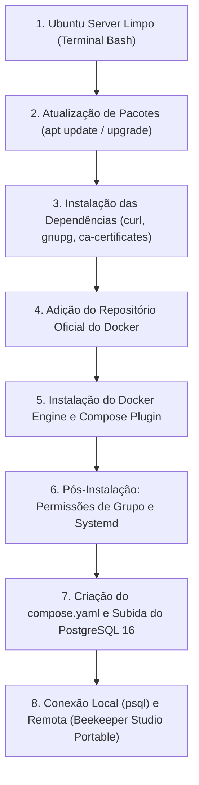
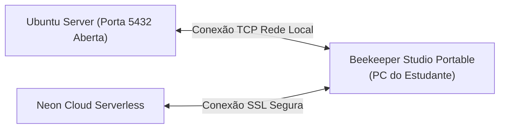

# 🐘 Módulo 01: Fundamentos de Banco de Dados e PostgreSQL
## 📑 Aula 02: Preparação do Ubuntu Server, Instalação do Docker e Ferramental de Trabalho

> **Navegação**: [⬅️ Aula Anterior: Introdução](./01-introducao-ao-banco-de-dados.md) | [Módulo 01](./README.md) | [Próxima Aula: Arquitetura Interna ➡️](./03-arquitetura-postgresql.md)

---

### 🎯 Objetivos de Aprendizagem
Ao final desta aula, você será capaz de:
- Preparar um servidor limpo com **Ubuntu Server** (22.04 ou 24.04 LTS) do zero via linha de comando.
- Instalar e configurar o **Docker Engine** e o plugin **Docker Compose** a partir do repositório oficial do Docker.
- Ajustar permissões de usuário no Linux para operar o Docker sem necessidade de `sudo`.
- Configurar regras de firewall (`ufw`) para expor a porta padrão `5432`.
- Orquestrar o container do PostgreSQL 16 com persistência de dados em volumes.
- Instalar o cliente `postgresql-client` no Ubuntu e operar o terminal interativo `psql`.
- Conectar remotamente utilizando o **Beekeeper Studio Portable** executado no seu computador de trabalho.

---

### 1. Cenário de Laboratório: Partindo do Zero no Ubuntu Server

Neste guia, assumimos que o estudante está diante do terminal limpo de um **Ubuntu Server** recém-instalado (seja em máquina virtual como VirtualBox, VMware, WSL2 ou em uma VPS na nuvem). Não há nada previamente instalado.



---

### 2. Passo a Passo Completo: Preparando o Ubuntu Server e Instalando o Docker

Execute os passos a seguir sequencialmente no terminal do seu Ubuntu Server.

#### Passo 2.1: Atualizar os Repositórios e Pacotes do Sistema
Antes de qualquer instalação, sincronize a lista de pacotes e aplique as correções mais recentes do sistema operacional:

```bash
sudo apt update && sudo apt upgrade -y
```

#### Passo 2.2: Instalar Pacotes Utilitários Básicos e Pré-requisitos
Instalamos ferramentas essenciais para manipulação de chaves criptográficas e download seguro via HTTPS:

```bash
sudo apt install -y ca-certificates curl gnupg lsb-release
```

#### Passo 2.3: Adicionar a Chave GPG Oficial do Docker
Para garantir autenticidade e segurança, baixamos a chave pública oficial do Docker:

```bash
# Cria o diretório de chaveiros do apt com permissões seguras
sudo install -m 0755 -d /etc/apt/keyrings

# Baixa a chave criptográfica oficial do Docker
sudo curl -fsSL https://download.docker.com/linux/ubuntu/gpg -o /etc/apt/keyrings/docker.asc

# Ajusta permissão de leitura para todos os usuários
sudo chmod a+r /etc/apt/keyrings/docker.asc
```

#### Passo 2.4: Registrar o Repositório Oficial do Docker no APT
Configuramos a fonte de pacotes estável apropriada para a arquitetura do seu processador (`x86_64` ou `arm64`):

```bash
echo \
  "deb [arch=$(dpkg --print-architecture) signed-by=/etc/apt/keyrings/docker.asc] https://download.docker.com/linux/ubuntu \
  $(. /etc/os-release && echo "$VERSION_CODENAME") stable" | \
  sudo tee /etc/apt/sources.list.d/docker.list > /dev/null

# Atualiza os índices do apt com o novo repositório
sudo apt update
```

#### Passo 2.5: Instalar o Docker Engine e o Plugin Docker Compose
Agora instalamos o motor oficial do Docker, a interface de linha de comando (`docker-ce-cli`) e o plugin moderno do Compose (`docker-compose-plugin`):

```bash
sudo apt install -y docker-ce docker-ce-cli containerd.io docker-buildx-plugin docker-compose-plugin
```

#### Passo 2.6: Configuração Pós-Instalação: Permissões de Usuário
Por padrão, o socket do Docker pertence ao usuário `root`. Para que o estudante consiga rodar comandos do Docker sem digitar `sudo` a cada operação:

```bash
# Adiciona o usuário logado ao grupo 'docker'
sudo usermod -aG docker $USER

# Habilita o serviço no systemd para iniciar automaticamente no boot do servidor
sudo systemctl enable --now docker

# Atualiza o grupo da sessão do terminal atual sem precisar deslogar
newgrp docker
```

#### Passo 2.7: Validar a Instalação do Docker
Verifique se o motor e o Compose estão respondendo perfeitamente:

```bash
# Testa a execução de um container de diagnóstico
docker run --rm hello-world

# Verifica a versão do Compose (deve exibir Docker Compose version v2.x.x)
docker compose version
```

> [!TIP]
> Se o comando `docker run --rm hello-world` executar e exibir a mensagem de boas-vindas do Docker sem erros de permissão de socket, o seu Ubuntu Server está 100% pronto!

---

### 3. Instalação do Cliente Nativo `postgresql-client` no Ubuntu

É uma excelente prática instalar as ferramentas de cliente do PostgreSQL diretamente no Ubuntu Server. Dessa forma, você ganha acesso ao executável `psql` e ao `pg_dump` no próprio host, sem precisar entrar dentro de containers:

```bash
sudo apt install -y postgresql-client
```

Verifique a versão instalada:
```bash
psql --version
```

---

### 4. Configuração de Rede e Firewall (UFW)

Se você planeja conectar ferramentas visuais instaladas no seu computador pessoal (como o Beekeeper Studio no Windows ou macOS) ao Ubuntu Server rodando em uma VM ou rede local:

#### Descobrir o Endereço IP do seu Ubuntu Server:
```bash
hostname -I
```
*(Anote o primeiro IP listado, por exemplo: `192.168.1.50` ou `10.0.2.15`).*

#### Liberar a Porta 5432 no Firewall (caso o UFW esteja ativo):
```bash
# Permite tráfego TCP na porta do PostgreSQL
sudo ufw allow 5432/tcp

# Verifica o status atual das regras
sudo ufw status
```

---

### 5. Criando a Estrutura do Laboratório com Docker Compose

Como estamos em um ambiente de servidor sem interface gráfica, criaremos o diretório de trabalho e o arquivo de orquestração inteiramente via terminal.

#### Passo 5.1: Criar e Acessar o Diretório do Projeto
```bash
mkdir -p ~/postgres-lab && cd ~/postgres-lab
```

#### Passo 5.2: Criar o Arquivo `compose.yaml` via Linha de Comando
Utilize o comando `cat` com redirecionador para criar o arquivo sem precisar de editores manuais:

```bash
cat << 'EOF' > compose.yaml
services:
  postgres:
    image: postgres:16-alpine
    container_name: postgres_estudos
    restart: always
    environment:
      POSTGRES_USER: admin
      POSTGRES_PASSWORD: secretpassword123
      POSTGRES_DB: universidade
    ports:
      - "0.0.0.0:5432:5432"
    volumes:
      - postgres_dados:/var/lib/postgresql/data

volumes:
  postgres_dados:
    driver: local
EOF
```

> [!NOTE]
> O mapeamento `"0.0.0.0:5432:5432"` instrui o Docker a escutar em todas as interfaces de rede do servidor, permitindo tanto conexões locais (`localhost`) quanto conexões externas vindas da sua rede local.

#### Passo 5.3: Inicializar o Container do PostgreSQL
```bash
# Baixa a imagem postgres:16-alpine e inicia em segundo plano (-d)
docker compose up -d
```

#### Passo 5.4: Comandos Úteis de Gerenciamento no Linux

```bash
# Verificar se o container está ativo e com status "Up"
docker compose ps

# Visualizar logs em tempo real (pressione Ctrl + C para sair dos logs)
docker compose logs -f postgres

# Parar o container mantendo os dados preservados no volume
docker compose down

# Reiniciar o container
docker compose restart postgres
```

---

### 6. Conectando-se ao Banco pelo Terminal: O Cliente `psql`

Você tem duas maneiras equivalentes de abrir o terminal interativo do PostgreSQL:

#### Método A: Conectando de dentro do container Docker
```bash
docker exec -it postgres_estudos psql -U admin -d universidade
```

#### Método B: Conectando via `postgresql-client` instalado no Ubuntu Server
```bash
psql -h localhost -p 5432 -U admin -d universidade
```
*(Quando solicitado, digite a senha configurada no compose: `secretpassword123`).*

#### Meta-comandos Fundamentais do `psql`:

| Comando | Descrição | Equivalente em outros bancos |
| :--- | :--- | :--- |
| `\l` | Lista todos os bancos de dados do servidor | `SHOW DATABASES;` |
| `\c nome_banco` | Conecta-se a outro banco de dados | `USE nome_banco;` |
| `\dt` | Lista todas as tabelas do schema atual | `SHOW TABLES;` |
| `\dt+` | Lista tabelas exibindo tamanho em disco | Detalhes físicos |
| `\d nome_tabela` | Descreve colunas, tipos e constraints da tabela | `DESCRIBE nome_tabela;` |
| `\dn` | Lista todos os Schemas existentes | N/A |
| `\du` | Lista usuários e roles de permissão | `SELECT * FROM mysql.user;` |
| `\x` | Alterna modo de exibição expandido (vertical) | Formatação por registro |
| `\timing` | Liga/Desliga o cronômetro de medição de tempo das queries | Benchmark rápido |
| `\i arquivo.sql` | Executa comandos contidos em um arquivo SQL externo | Execução de script |
| `\q` | Sai do cliente psql e retorna ao prompt do Linux | Sair / Exit |

> [!IMPORTANT]
> Comandos SQL tradicionais terminam obrigatoriamente com ponto e vírgula (`;`). Os meta-comandos que iniciam com barra invertida (`\`) **não utilizam** ponto e vírgula.

---

### 7. Interface Gráfica: Beekeeper Studio Portable (Opção Recomendada)

Para estudantes que utilizam seus computadores pessoais para visualizar os dados rodando no Ubuntu Server:

#### 🐝 Por que o Beekeeper Studio Portable é a Escolha Ideal?
Em computadores de laboratório com bloqueio de instalação ou máquinas pessoais, o **Beekeeper Studio Community Edition (Portable)** roda com duplo clique sem precisar de instalador:



* **Sem necessidade de privilégios de Administrador**: Roda direto do pendrive ou da pasta Downloads.
* **Interface Limpa**: Foco direto em consultas, edição de dados e histórico de comandos.
* **Importação Fácil via URL**: Conecta em segundos utilizando a URI do banco.

#### Onde Baixar:
Acesse os [Releases Oficiais do Beekeeper Studio no GitHub](https://github.com/beekeeper-studio/beekeeper-studio/releases):
* **Windows**: `Beekeeper-Studio-Portable-x.x.x.exe`
* **Linux Desktop**: `Beekeeper-Studio-x.x.x.AppImage` (conceda permissão com `chmod +x`)
* **macOS**: `Beekeeper-Studio-x.x.x.dmg`

#### Como Conectar ao seu Ubuntu Server pelo Beekeeper:
1. Abra o Beekeeper Studio no seu computador.
2. Clique no botão **"Import from URL"** no topo da tela inicial.
3. Cole a URI substituindo pelo IP do seu Ubuntu Server (obtido no Passo 4):
   ```text
   postgresql://admin:secretpassword123@<IP_DO_UBUNTU_SERVER>:5432/universidade?sslmode=disable
   ```
4. Clique em **Test Connection**. Ao receber a confirmação verde, clique em **Salvar e Conectar**.

---

### 8. Exercício Prático: Testando o Ambiente Completo

Conecte-se ao seu PostgreSQL (seja pelo terminal via `psql` ou pelo Beekeeper Studio) e execute o script abaixo:

```sql
-- 1. Inspecionar a versão do motor
SELECT version();

-- 2. Criar tabela de verificação do laboratório
CREATE TABLE ambiente_laboratorio (
    id INT GENERATED ALWAYS AS IDENTITY PRIMARY KEY,
    servidor_so TEXT NOT NULL,
    docker_ativo BOOLEAN DEFAULT TRUE,
    data_configuracao TIMESTAMPTZ DEFAULT CURRENT_TIMESTAMP
);

-- 3. Inserir registro confirmando o setup
INSERT INTO ambiente_laboratorio (servidor_so)
VALUES ('Ubuntu Server 24.04 LTS com Docker Compose');

-- 4. Consultar os dados gravados
SELECT * FROM ambiente_laboratorio;
```

<details>
<summary>👁️ Clique aqui para ver o resultado esperado</summary>

```text
 id |               servidor_so                | docker_ativo |       data_configuracao       
----+------------------------------------------+--------------+-------------------------------
  1 | Ubuntu Server 24.04 LTS com Docker Compose | t            | 2026-10-07 15:20:00.123456-03
(1 row)
```
</details>

---

### 📝 Checklist de Conclusão da Aula

- [ ] Atualizei os repositórios do Ubuntu Server (`sudo apt update && sudo apt upgrade -y`).
- [ ] Adicionei a chave GPG e o repositório oficial do Docker para Ubuntu.
- [ ] Instalei os pacotes `docker-ce`, `docker-ce-cli` e `docker-compose-plugin`.
- [ ] Adicionei meu usuário ao grupo `docker` e validei com `docker run --rm hello-world`.
- [ ] Instalei o cliente nativo `postgresql-client`.
- [ ] Criei o diretório `~/postgres-lab` e o arquivo `compose.yaml`.
- [ ] Subi o container do PostgreSQL 16 com `docker compose up -d` e verifiquei o status.
- [ ] Conectei com sucesso usando o `psql` e executei o script de teste.
- [ ] Configurei o Beekeeper Studio Portable para conectar no banco.

---
> **Navegação**: [⬅️ Aula Anterior: Introdução](./01-introducao-ao-banco-de-dados.md) | [Módulo 01](./README.md) | [Próxima Aula: Arquitetura Interna ➡️](./03-arquitetura-postgresql.md)
