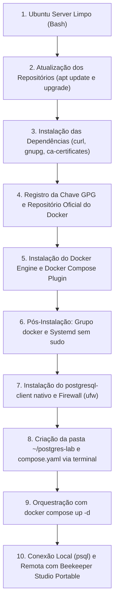

# 🐘 Módulo 01: Fundamentos de Banco de Dados e PostgreSQL
## 📑 Trilha A: Instalação e Configuração no Ubuntu Server com Docker

> **Navegação**: [⬅️ Voltar ao Portal de Escolha de Trilha](./02-instalacao-e-configuracao.md) | [Módulo 01](./README.md) | [Avançar para a Aula 03: Arquitetura Interna ➡️](./03-arquitetura-postgresql.md)

---

### 🎯 Perfil Desta Trilha
* **Público-Alvo**: Turmas de Redes, Infraestrutura, DevOps, Administração de Banco de Dados (DBA) ou aulas com servidores dedicados e máquinas virtuais.
* **Pré-requisitos**: Acesso ao terminal de um **Ubuntu Server limpo** (22.04 LTS ou 24.04 LTS), sem nada previamente instalado.
* **Objetivo**: Dominar a configuração completa do sistema operacional Linux, Docker Engine oficial, Docker Compose e cliente `psql`.

> [!TIP]
> **Professor**: Se sua turma for focada exclusivamente em desenvolvimento de software, análise de dados ou SQL puro e você preferir **não gastar tempo com infraestrutura Linux**, instrua seus alunos a pularem este arquivo e acessarem a [**Trilha B: Neon Cloud Serverless e Beekeeper Studio**](./02b-trilha-neon-cloud-beekeeper.md).

---

### 🗺️ Fluxo de Trabalho da Trilha A



---

### 1. Preparação do Ubuntu Server do Zero

Execute os comandos a seguir diretamente no terminal do seu Ubuntu Server.

#### Passo 1.1: Atualizar Repositórios e Pacotes Existentes
Antes de qualquer instalação, garanta que o sistema operacional possua os índices mais recentes:

```bash
sudo apt update && sudo apt upgrade -y
```

#### Passo 1.2: Instalar Pacotes Utilitários Básicos
Instalamos ferramentas essenciais para gerenciar certificados SSL e baixar chaves criptográficas com segurança:

```bash
sudo apt install -y ca-certificates curl gnupg lsb-release
```

#### Passo 1.3: Adicionar a Chave GPG Oficial do Docker
Baixamos a chave criptográfica oficial fornecida pelos desenvolvedores do Docker:

```bash
# Cria o diretório de chaveiros do apt com permissões seguras
sudo install -m 0755 -d /etc/apt/keyrings

# Baixa a chave pública oficial do Docker
sudo curl -fsSL https://download.docker.com/linux/ubuntu/gpg -o /etc/apt/keyrings/docker.asc

# Concede permissão de leitura para todos os usuários do sistema
sudo chmod a+r /etc/apt/keyrings/docker.asc
```

#### Passo 1.4: Registrar o Repositório Oficial do Docker no APT
Configuramos o repositório oficial do Docker para a arquitetura do seu servidor (`x86_64` ou `arm64`):

```bash
echo \
  "deb [arch=$(dpkg --print-architecture) signed-by=/etc/apt/keyrings/docker.asc] https://download.docker.com/linux/ubuntu \
  $(. /etc/os-release && echo "$VERSION_CODENAME") stable" | \
  sudo tee /etc/apt/sources.list.d/docker.list > /dev/null

# Atualiza os índices do apt com o novo repositório registrado
sudo apt update
```

#### Passo 1.5: Instalar o Docker Engine e o Plugin Docker Compose
Instalamos os pacotes oficiais mais atualizados:

```bash
sudo apt install -y docker-ce docker-ce-cli containerd.io docker-buildx-plugin docker-compose-plugin
```

#### Passo 1.6: Pós-Instalação: Permissões de Usuário e Inicialização no Boot
Para que o estudante possa executar comandos do Docker sem precisar digitar `sudo` a todo momento:

```bash
# Adiciona o usuário atual ao grupo 'docker'
sudo usermod -aG docker $USER

# Habilita o serviço Docker no systemd para iniciar automaticamente ao ligar o servidor
sudo systemctl enable --now docker

# Atualiza a sessão do terminal atual sem precisar reiniciar ou deslogar
newgrp docker
```

#### Passo 1.7: Validar a Instalação do Docker
Teste a execução de um container de diagnóstico e confirme a versão do Compose:

```bash
# Executa container oficial de teste
docker run --rm hello-world

# Verifica a versão instalada do Docker Compose
docker compose version
```

---

### 2. Instalação do Cliente Nativo `postgresql-client` no Host

Instalar o cliente `psql` diretamente no Ubuntu Server facilita conexões rápidas e scripts de backup sem precisar entrar dentro do container:

```bash
sudo apt install -y postgresql-client
```

Confirme a versão:
```bash
psql --version
```

---

### 3. Configuração de Rede e Firewall (UFW)

Caso o Ubuntu Server esteja rodando em uma máquina virtual (VirtualBox, VMware) ou servidor em rede local e o estudante deseje conectar ferramentas visuais instaladas em seu computador pessoal:

#### Descobrir o Endereço IP do Ubuntu Server:
```bash
hostname -I
```
*(Anote o endereço IP exibido, por exemplo: `192.168.1.50` ou `10.0.2.15`).*

#### Liberar a Porta 5432 no Firewall:
```bash
sudo ufw allow 5432/tcp
sudo ufw status
```

---

### 4. Criação do Laboratório com Docker Compose

Como o Ubuntu Server opera estritamente via terminal, crie a pasta e o arquivo `compose.yaml` com os comandos abaixo:

```bash
# Cria o diretório do laboratório e entra nele
mkdir -p ~/postgres-lab && cd ~/postgres-lab

# Cria o arquivo compose.yaml com cat
cat << 'EOF' > compose.yaml
services:
  postgres:
    image: postgres:16-alpine
    container_name: postgres_estudos
    restart: always
    environment:
      POSTGRES_USER: admin
      POSTGRES_PASSWORD: secretpassword123
      POSTGRES_DB: universidade
    ports:
      - "0.0.0.0:5432:5432"
    volumes:
      - postgres_dados:/var/lib/postgresql/data

volumes:
  postgres_dados:
    driver: local
EOF
```

#### Inicializar o Banco de Dados:
```bash
docker compose up -d
```

#### Comandos Úteis de Gerenciamento:
```bash
# Verificar status do container
docker compose ps

# Visualizar logs em tempo real (Ctrl + C para sair)
docker compose logs -f postgres

# Parar o serviço mantendo os dados preservados
docker compose down

# Reiniciar o serviço
docker compose restart postgres
```

---

### 5. Conectando-se ao Banco pelo Terminal (`psql`)

#### Opção 1: Via Docker Exec
```bash
docker exec -it postgres_estudos psql -U admin -d universidade
```

#### Opção 2: Via postgresql-client instalado no Ubuntu Server
```bash
psql -h localhost -p 5432 -U admin -d universidade
```
*(Digite a senha `secretpassword123` quando solicitada).*

---

### 6. Conexão Externa com Beekeeper Studio Portable

Se o estudante estiver utilizando um computador pessoal (Windows, macOS ou Linux Desktop) conectado à mesma rede do Ubuntu Server:

1. Baixe o **Beekeeper Studio Portable** (Community Edition) nos [Releases do GitHub](https://github.com/beekeeper-studio/beekeeper-studio/releases).
2. Abra o executável com duplo clique (não exige instalação nem permissão de administrador).
3. Clique em **"Import from URL"** no canto superior.
4. Cole a Connection String com o IP do Ubuntu Server anotado no Passo 3:
   ```text
   postgresql://admin:secretpassword123@<IP_DO_UBUNTU_SERVER>:5432/universidade?sslmode=disable
   ```
5. Clique em **Test Connection** e depois em **Salvar e Conectar**.

---

### 7. Exercício Prático: Validação do Ambiente

Conecte-se via `psql` ou Beekeeper e execute:

```sql
-- 1. Verificar a versão do motor
SELECT version();

-- 2. Criar tabela de teste
CREATE TABLE ambiente_laboratorio (
    id INT GENERATED ALWAYS AS IDENTITY PRIMARY KEY,
    servidor_so TEXT NOT NULL,
    docker_ativo BOOLEAN DEFAULT TRUE,
    data_configuracao TIMESTAMPTZ DEFAULT CURRENT_TIMESTAMP
);

-- 3. Inserir registro
INSERT INTO ambiente_laboratorio (servidor_so)
VALUES ('Ubuntu Server com Docker Compose');

-- 4. Consultar registro
SELECT * FROM ambiente_laboratorio;
```

---

### 📝 Checklist de Conclusão da Trilha A

- [ ] Atualizei o Ubuntu Server com `apt update && apt upgrade -y`.
- [ ] Instalei os pacotes oficiais `docker-ce` e `docker-compose-plugin`.
- [ ] Configurei o grupo `docker` para operar sem `sudo`.
- [ ] Instalei o cliente `postgresql-client` e configurei o `ufw`.
- [ ] Criei o arquivo `compose.yaml` e subi o PostgreSQL 16 com sucesso.
- [ ] Conectei via `psql` e executei o exercício prático de validação.

---
> **Navegação**: [⬅️ Voltar ao Portal de Escolha de Trilha](./02-instalacao-e-configuracao.md) | [Módulo 01](./README.md) | [Avançar para a Aula 03: Arquitetura Interna ➡️](./03-arquitetura-postgresql.md)
