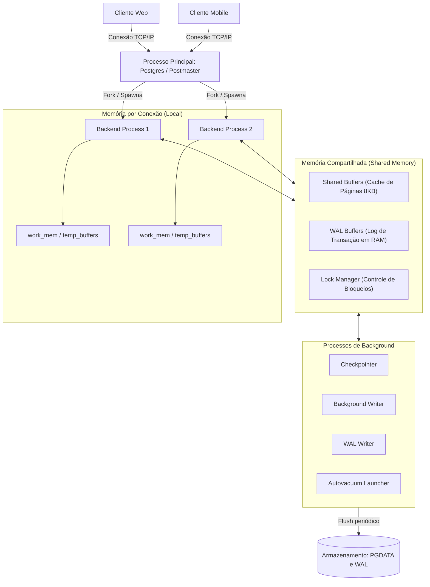
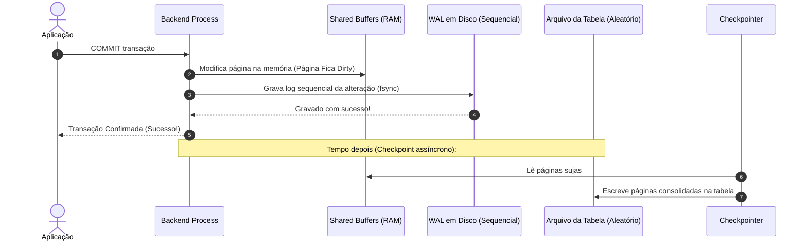
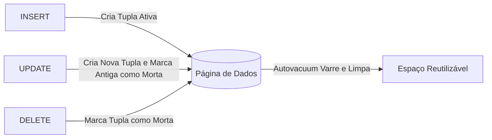

# 🐘 Módulo 01: Fundamentos de Banco de Dados e PostgreSQL
## 📑 Aula 03: Arquitetura Interna, Processos, WAL e MVCC

> **Navegação**: [⬅️ Aula Anterior: Escolha da Trilha de Setup](./02-instalacao-e-configuracao.md) | [Módulo 01](./README.md) | [Módulo 02: Modelagem e DDL ➡️](../02-modelagem-e-ddl/README.md)

---

### 🎯 Objetivos de Aprendizagem
Ao final desta aula, você será capaz de:
- Entender o modelo cliente-servidor baseado em processos (*process-per-connection*) do PostgreSQL.
- Diferenciar as áreas de memória compartilhada (*Shared Buffers*) e memória de sessão de trabalho (*work_mem*).
- Explicar o papel crucial do **WAL (Write-Ahead Logging)** para durabilidade e recuperação de falhas.
- Compreender como o **MVCC (Multi-Version Concurrency Control)** funciona internamente através das colunas ocultas `xmin`, `xmax` e `ctid`.
- Compreender o ciclo de vida de tuplas mortas (*dead tuples*) e o papel do **VACUUM**.

---

### 1. Visão Geral da Arquitetura do Servidor

Diferente de bancos de dados que usam um modelo unicamente baseado em threads dentro de um único processo monítico, o PostgreSQL adota um modelo clássico e extremamente robusto baseado em **processos Unix**.



> [!NOTE]
> Cada nova conexão estabelecida cria um **Backend Process** dedicado. Por isso, gerenciar centenas de conexões diretas consome memória do sistema operacional — razão pela qual o uso de **Connection Poolers** (como PgBouncer ou o pool nativo do Neon) é fundamental em produção.

---

### 2. Estrutura de Memória: Compartilhada vs. Local

A memória do PostgreSQL é dividida estrategicamente em dois grandes blocos:

#### A. Memória Compartilhada (Shared Memory)
Acessível por todos os processos do cluster:
* **`shared_buffers`**: O principal cache em memória RAM do banco. O PostgreSQL lê as páginas de 8KB do disco para os shared buffers. Recomenda-se tipicamente alocar entre **25% e 40%** da RAM total do servidor dedicado para este parâmetro.
* **`wal_buffers`**: Buffer transitório para armazenar os logs do WAL antes de serem gravados fisicamente em disco.
* **`lock_locks / Lock Manager`**: Armazena as estruturas de trava para garantir integridade e isolamento entre transações concorrentes.

#### B. Memória Local (Por Processo / Sessão)
Alocada individualmente sob demanda para operações específicas:
* **`work_mem`**: Quantidade de memória usada para operações de ordenação (`ORDER BY`, `DISTINCT`), merges e joins baseados em hash (`HASH JOIN`). Se a ordenação exceder o `work_mem`, o PostgreSQL despejará os dados temporariamente em disco (*spill to disk*), degradando a performance.
* **`maintenance_work_mem`**: Utilizada para operações de manutenção mais pesadas, como `VACUUM`, `CREATE INDEX` e adição de chaves estrangeiras.

```sql
-- Inspecionando os valores atuais de memória do seu servidor
SHOW shared_buffers;
SHOW work_mem;
SHOW maintenance_work_mem;
```

---

### 3. O Mecanismo WAL (Write-Ahead Logging)

Como o PostgreSQL garante que uma transação está 100% segura sem precisar gravar imediatamente todas as alterações em blocos aleatórios de arquivos de tabela no disco? A resposta é o **WAL**!



#### Regra de Ouro do WAL:
> *"Nenhuma alteração de página de dados pode ser escrita no arquivo de tabela em disco antes que o registro do log de transações correspondente (WAL) tenha sido gravado e sincronizado fisicamente com o disco permanente."*

Gravar no WAL é uma escrita sequencial contínua (extremamente rápida para discos HDD e SSDs). Se o servidor perder a energia subitamente, ao reiniciar o PostgreSQL entrará em **Crash Recovery**, relendo o WAL a partir do último checkpoint e restaurando exatamente o estado consistente.

---

### 4. MVCC: Controle de Concorrência Multiversão

No PostgreSQL, **leitores nunca bloqueiam escritores, e escritores nunca bloqueiam leitores** (*Readers do not block Writers, and Writers do not block Readers*).

Para alcançar isso, quando você executa um `UPDATE`, o PostgreSQL **não sobrescreve** a linha antiga in-place. Em vez disso:
1. Marca a linha antiga como não mais válida para transações futuras.
2. Cria uma nova versão física da linha (*nova tupla*) com os novos valores.
3. Quando você faz um `DELETE`, ele apenas marca a tupla como expirada.

#### As Colunas de Sistema Ocultas:
Toda tabela no PostgreSQL possui colunas mágicas invisíveis que gerenciam essa visibilidade:
* **`xmin`**: ID da transação que criou/inseriu a linha.
* **`xmax`**: ID da transação que excluiu ou atualizou a linha (0 se a linha ainda estiver ativa).
* **`ctid`**: Posição física da tupla na página de disco (formato: `(número_da_página, índice_na_página)`).

#### Laboratório Prático de MVCC:
Execute no terminal e veja o MVCC em ação:

```sql
-- Criar tabela de teste
CREATE TABLE demo_mvcc (
    id INT,
    nome VARCHAR(50)
);

-- Inserir um registro
INSERT INTO demo_mvcc VALUES (1, 'Ana');

-- Consultar revelando as colunas ocultas do MVCC
SELECT ctid, xmin, xmax, id, nome FROM demo_mvcc;
```

Resultado inicial:
```text
 ctid  | xmin | xmax | id | nome 
-------+------+------+----+------
 (0,1) |  750 |    0 |  1 | Ana
```

Agora, execute um `UPDATE`:
```sql
UPDATE demo_mvcc SET nome = 'Ana Silva' WHERE id = 1;

-- Inspecione novamente!
SELECT ctid, xmin, xmax, id, nome FROM demo_mvcc;
```

Resultado após o update:
```text
 ctid  | xmin | xmax | id |   nome    
-------+------+------+----+-----------
 (0,2) |  751 |    0 |  1 | Ana Silva
```

> [!IMPORTANT]
> Observe o que aconteceu:
> 1. O `ctid` mudou de `(0,1)` para `(0,2)` (uma nova tupla física foi alocada na página).
> 2. O `xmin` passou a ser `751` (o ID da nova transação).
> 3. A linha antiga na posição `(0,1)` ainda está fisicamente no disco, mas seu `xmax` foi definido como `751`, tornando-a invisível para nós. Ela agora é uma **Dead Tuple** (Tupla Morta / Lixo).

---

### 5. O Papel do `VACUUM` e Bloat

Se tuplas antigas continuassem se acumulando no disco indefinidamente, as tabelas sofreriam de **Table Bloat** (inchaço desnecessário de espaço em disco e lentidão de leitura).

É aqui que entram o comando `VACUUM` e o processo em background **Autovacuum**:
* **Autovacuum Daemon**: Monitora automaticamente tabelas com alto índice de alterações e remove o espaço apontado pelas tuplas mortas, permitindo que novas tuplas reutilizem aquele mesmo espaço físico.
* **`VACUUM FULL`**: Reescreve a tabela inteira do zero para devolver espaço livre ao sistema operacional. **Atenção:** Bloqueia a tabela com trava exclusiva (`ACCESS EXCLUSIVE LOCK`), impedindo qualquer leitura ou escrita durante a execução.



---

### 6. Atividade Prática 02: Provocando Tuplas Mortas e Rodando o VACUUM

Neste laboratório prático, você vai verificar a criação de **Dead Tuples** nos metadados do PostgreSQL e observar a ação do comando `VACUUM` limpando o lixo em tempo real.

#### Roteiro do Laboratório:

```sql
-- Passo 1: Criar tabela de teste de bloat
CREATE TABLE teste_bloat (
    id INT,
    conteudo TEXT
);

-- Passo 2: Inserir 1.000 linhas
INSERT INTO teste_bloat (id, conteudo)
SELECT s, 'Dado original do registro número ' || s
FROM generate_series(1, 1000) AS s;

-- Passo 3: Consultar o catálogo para ver tuplas vivas e mortas
SELECT 
    relname AS tabela,
    n_live_tup AS tuplas_vivas,
    n_dead_tup AS tuplas_mortas
FROM pg_stat_user_tables
WHERE relname = 'teste_bloat';
```

Resultado inicial esperado:
```text
   tabela    | tuplas_vivas | tuplas_mortas 
-------------+--------------+---------------
 teste_bloat |         1000 |             0
```

Agora, vamos atualizar todos os 1.000 registros para provocar tuplas mortas via MVCC:

```sql
-- Passo 4: Atualizar todos os registros (Gera 1.000 tuplas mortas!)
UPDATE teste_bloat SET conteudo = 'Dado atualizado pela segunda vez';

-- Passo 5: Atualizar novamente (Gera mais 1.000 tuplas mortas!)
UPDATE teste_bloat SET conteudo = 'Dado atualizado pela terceira vez';

-- Passo 6: Inspecionar o catálogo de estatísticas novamente
SELECT 
    relname AS tabela,
    n_live_tup AS tuplas_vivas,
    n_dead_tup AS tuplas_mortas
FROM pg_stat_user_tables
WHERE relname = 'teste_bloat';
```

<details>
<summary>💡 Clique para ver o resultado após os updates e como limpar</summary>

Você verá que `tuplas_vivas = 1000`, mas agora `tuplas_mortas = 2000`! O banco tem o dobro de lixo em relação a dados úteis.

Para forçar a limpeza imediata das tuplas mortas, execute:
```sql
VACUUM VERBOSE teste_bloat;

-- Verifique novamente o catálogo:
SELECT 
    relname AS tabela,
    n_live_tup AS tuplas_vivas,
    n_dead_tup AS tuplas_mortas
FROM pg_stat_user_tables
WHERE relname = 'teste_bloat';
```
*O número de `tuplas_mortas` cairá para 0, deixando o espaço físico das páginas pronto para reutilização!*
</details>

---

### 📝 Checklist de Conclusão da Aula

- [ ] Entendi a diferença entre processos dedicados por conexão e modelo de threads.
- [ ] Sei qual a função do `shared_buffers` e do `work_mem`.
- [ ] Compreendi a garantia de durabilidade fornecida pelo log sequencial WAL.
- [ ] Consegui visualizar na prática as colunas ocultas `ctid`, `xmin` e `xmax`.
- [ ] Entendi a necessidade do processo `Autovacuum` para limpeza de tuplas mortas.

---
> **Navegação**: [⬅️ Aula Anterior: Escolha da Trilha de Setup](./02-instalacao-e-configuracao.md) | [Módulo 01](./README.md) | [Módulo 02: Modelagem e DDL ➡️](../02-modelagem-e-ddl/README.md)
