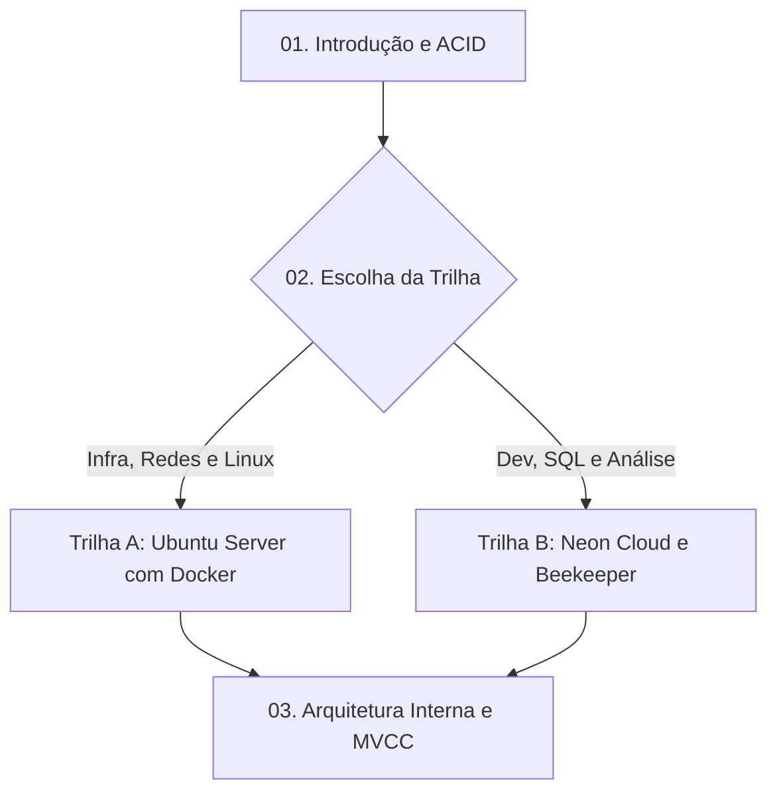

# 🐘 Módulo 01: Fundamentos de Banco de Dados e PostgreSQL

Bem-vindo ao primeiro módulo do curso! Aqui estabelecemos a base teórica e instrumental indispensável para qualquer profissional que trabalha com dados.

---

## 🗺️ Mapa de Conteúdo do Módulo

---

## 📑 Aulas Disponíveis

1. [**Aula 01: Introdução ao Banco de Dados e ao Ecossistema PostgreSQL**](./01-introducao-ao-banco-de-dados.md)
   - O que é SGBD e Modelo Relacional.
   - O Teorema ACID e garantias transacionais.
   - SQL vs NoSQL e a abordagem híbrida do Postgres.
   - História de Michael Stonebraker e evolução da licença open source.

2. [**Aula 02: Preparação do Ambiente: Escolha da sua Trilha de Laboratório**](./02-instalacao-e-configuracao.md)
   - Guia de decisão para professores e alunos (quando usar Trilha A vs Trilha B).
   - [**Trilha A: Ubuntu Server com Docker**](./02a-trilha-ubuntu-server-docker.md) — Setup do zero no Linux, repositório oficial do Docker, `docker compose`, permissões sem sudo, UFW, `postgresql-client` e teste de validação.
   - [**Trilha B: Neon Serverless Cloud e Beekeeper Studio**](./02b-trilha-neon-cloud-beekeeper.md) — Setup instantâneo na nuvem gratuita sem gerenciar servidores, Web SQL Editor e cliente desktop portátil **Beekeeper Studio** sem necessidade de administrador.

3. [**Aula 03: Arquitetura Interna, Processos, WAL e MVCC**](./03-arquitetura-postgresql.md)
   - Modelo baseado em processos (*process-per-connection*).
   - Memória: `shared_buffers` vs `work_mem`.
   - Write-Ahead Logging (WAL) e recuperação de desastres.
   - MVCC desmistificado: as colunas `xmin`, `xmax` e `ctid`.
   - Limpeza de tuplas mortas e o papel do `Autovacuum`.

4. [**Atividades Práticas do Módulo 01**](./04-atividades-praticas.md)
   - **Subitem 1.1**: Auditoria de Metadados e Catálogos do PostgreSQL (`pg_database`, `pg_tables`, extensões).
   - **Subitem 1.2**: Validação de Conectividade com `psql` e Beekeeper Studio Portable.
   - **Subitem 1.3**: Laboratório de MVCC, Tuplas Mortas e Recuperação com `VACUUM`.

---

## 🧭 Navegação Rápida
* [⬅️ Voltar para a Página Principal do Repositório](../README.md)
* [Ir para o Módulo 02: Modelagem e DDL ➡️](../02-modelagem-e-ddl/README.md)
