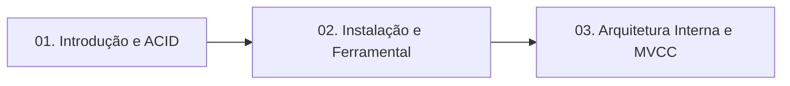

# 🐘 Módulo 01: Fundamentos de Banco de Dados e PostgreSQL

Bem-vindo ao primeiro módulo do curso! Aqui estabelecemos a base teórica e instrumental indispensável para qualquer profissional que trabalha com dados.

---

## 🗺️ Mapa de Conteúdo do Módulo

---

## 📑 Aulas Disponíveis

1. [**Aula 01: Introdução ao Banco de Dados e ao Ecossistema PostgreSQL**](./01-introducao-ao-banco-de-dados.md)
   - O que é SGBD e Modelo Relacional.
   - O Teorema ACID e garantias transacionais.
   - SQL vs NoSQL e a abordagem híbrida do Postgres.
   - História de Michael Stonebraker e evolução da licença open source.

2. [**Aula 02: Preparação do Ubuntu Server, Instalação do Docker e Ferramental de Trabalho**](./02-instalacao-e-configuracao.md)
   - Preparação do Ubuntu Server do zero (atualizações, dependências e repositório oficial do Docker).
   - Instalação do Docker Engine e Compose Plugin com permissões de usuário sem sudo.
   - Instalação do `postgresql-client` e regras de firewall UFW.
   - Setup com Docker Compose (`postgres:16-alpine`) e anatomia de URIs.
   - Cliente de linha de comando `psql` e seus meta-comandos.
   - Conexão gráfica com Beekeeper Studio Portable (recomendado para aulas).
   - Primeiro exercício prático executável.

3. [**Aula 03: Arquitetura Interna, Processos, WAL e MVCC**](./03-arquitetura-postgresql.md)
   - Modelo baseado em processos (*process-per-connection*).
   - Memória: `shared_buffers` vs `work_mem`.
   - Write-Ahead Logging (WAL) e recuperação de desastres.
   - MVCC desmistificado: as colunas `xmin`, `xmax` e `ctid`.
   - Limpeza de tuplas mortas e o papel do `Autovacuum`.

---

## 🧭 Navegação Rápida
* [⬅️ Voltar para a Página Principal do Repositório](../README.md)
* [Ir para o Módulo 02: Modelagem e DDL ➡️](../02-modelagem-e-ddl/README.md)
