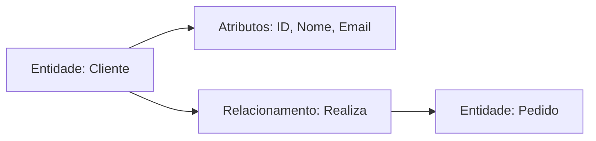
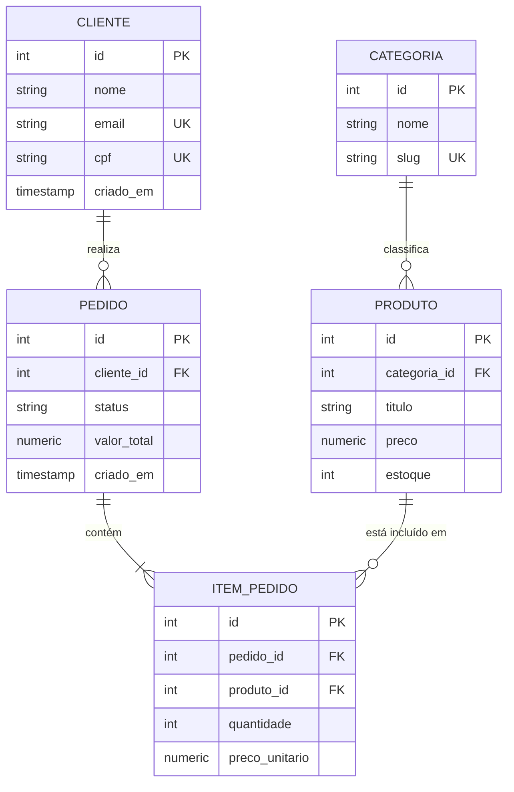
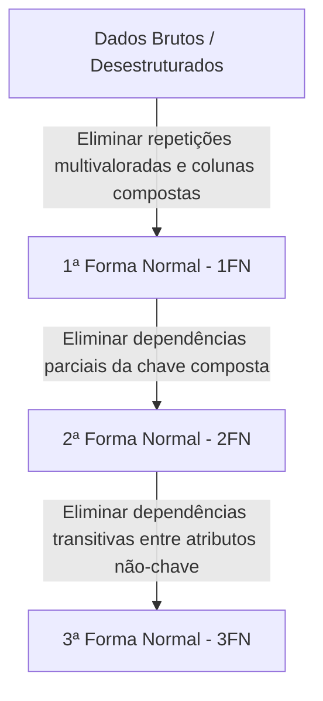
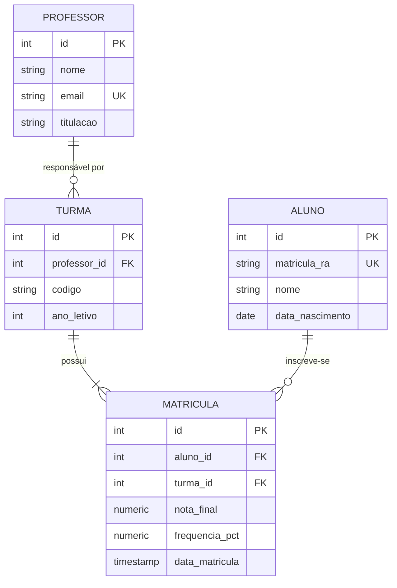

# 🐘 Módulo 02: Modelagem de Dados e DDL
## 📑 Aula 01: Modelagem Relacional, Normalização e Diagramas ER

> **Navegação**: [⬅️ Módulo 01](../01-fundamentos/README.md) | [Módulo 02](./README.md) | [Próxima Aula: Tipos de Dados ➡️](./02-tipos-de-dados.md)

---

### 🎯 Objetivos de Aprendizagem
Ao final desta aula, você será capaz de:
- Identificar entidades, atributos e relacionamentos a partir de requisitos de negócio.
- Compreender e aplicar as cardinalidades: 1:1 (um para um), 1:N (um para muitos) e N:N (muitos para muitos).
- Normalizar schemas até a Terceira Forma Normal (1FN, 2FN e 3FN) para evitar anomalias de inserção, atualização e deleção.
- Representar esquemas de banco de dados visualmente utilizando diagramas `erDiagram` do Mermaid.

---

### 1. Elementos Fundamentais da Modelagem

* **Entidade**: Representa um objeto do mundo real sobre o qual precisamos guardar dados (ex.: `Cliente`, `Produto`, `Pedido`, `Curso`).
* **Atributo**: Características ou propriedades que descrevem a entidade (ex.: `nome`, `preco`, `data_nascimento`).
* **Tupla (Linha)**: Uma ocorrência específica de uma entidade (ex.: O cliente *"Lucas Silva, lucas@email.com"*).
* **Chave Primária (Primary Key - PK)**: Identificador único e imutável de uma linha. Não pode ser nulo.
* **Chave Estrangeira (Foreign Key - FK)**: Atributo que referencia a chave primária de outra tabela, estabelecendo o vínculo relacional.

---

### 2. Cardinalidades e Como Mapeá-las em Tabelas

#### A. Um para Um (1:1)
Cada registro da Tabela A relaciona-se com no máximo um da Tabela B.
* *Exemplo*: Um `Usuario` tem um único `PerfilUsuario`.
* *Regra de Modelagem*: A chave estrangeira vai em uma das tabelas com restrição `UNIQUE`.

#### B. Um para Muitos (1:N)
Um registro da Tabela A pode relacionar-se com múltiplos registros da Tabela B, mas cada registro de B pertence a apenas um de A.
* *Exemplo*: Um `Cliente` pode fazer vários `Pedidos`, mas cada `Pedido` pertence a apenas um `Cliente`.
* *Regra de Modelagem*: A chave primária do lado "1" torna-se chave estrangeira (FK) na tabela do lado "N".

#### C. Muitos para Muitos (N:N)
Múltiplos registros de A relacionam-se com múltiplos de B.
* *Exemplo*: Um `Estudante` matricula-se em várias `Disciplinas`, e uma `Disciplina` possui vários `Estudantes`.
* *Regra de Modelagem*: **Obrigatório** criar uma terceira tabela intermediária (tabela associativa/pivot) contendo as duas chaves estrangeiras.

---

### 3. Diagrama Entidade-Relacionamento com Mermaid

O GitHub renderiza nativamente diagramas ER em blocos de código com linguagem `mermaid`:

> [!TIP]
> Observe a notação do Mermaid no diagrama acima:
> * `||--o{` significa: **Um para zero ou muitos**.
> * `||--|{` significa: **Um para um ou muitos** (obrigatório pelo menos 1 item por pedido).
> * `PK` denota Primary Key, `FK` Foreign Key e `UK` Unique Key.

---

### 4. Normalização de Dados (1FN, 2FN e 3FN)

Normalização é uma técnica formal para projetar bancos de dados minimizando a redundância e prevenindo anomalias de manipulação.

#### 1ª Forma Normal (1FN) - Atomicidade
* Todos os atributos devem conter apenas **valores atômicos** (indivisíveis).
* Não deve haver atributos multivalorados (ex.: coluna `telefones` com `'119999-9999, 118888-8888'`).
* Não deve haver listas ou campos compostos.

> [!WARNING]
> Erro clássico: colocar vários e-mails ou itens separados por vírgula em um único campo de texto. Crie tabelas filhas ou utilize arrays nativos do PostgreSQL apenas quando apropriado.

#### 2ª Forma Normal (2FN) - Dependência Funcional Total
* Deve estar na 1FN.
* Todos os atributos não-chave devem depender da **totalidade** da chave primária, e não apenas de parte dela (aplicável em tabelas com chaves primárias compostas).

#### 3ª Forma Normal (3FN) - Sem Dependências Transitivas
* Deve estar na 2FN.
* Nenhum atributo não-chave pode depender de outro atributo não-chave.
* *Exemplo do erro*: Na tabela `funcionario(id_func, nome, id_departamento, nome_departamento)`. O `nome_departamento` depende de `id_departamento`, e não diretamente de `id_func`. Devemos mover o departamento para uma tabela própria `departamento(id_departamento, nome)`.

---

### 5. Exercício Prático: Modelando uma Plataforma Escolar

**Cenário**: Uma escola precisa controlar Professores, Turmas e Alunos.
- Um Professor leciona em várias Turmas, mas cada Turma tem apenas 1 Professor responsável.
- Um Aluno pode estar matriculado em várias Turmas, e cada Turma tem vários Alunos.
- É necessário registrar a nota final e frequência do Aluno em cada Turma.

Elabore a lista de tabelas, chaves primárias e chaves estrangeiras.

👁️ Clique aqui para ver a solução proposta da modelagem

* **Relacionamento Professor -> Turma**: 1:N (a FK `professor_id` reside na tabela `TURMA`).
* **Relacionamento Aluno <-> Turma**: N:N (resolvido pela tabela associativa `MATRICULA`, que guarda dados específicos do vínculo: nota e frequência).

---

### 📝 Checklist de Conclusão da Aula

- [ ] Sei diferenciar Entidade, Atributo, PK e FK.
- [ ] Sei quando criar uma tabela intermediária (tabela pivot) para cardinalidade N:N.
- [ ] Compreendi as 3 Formas Normais e sei como identificar dependências transitivas.
- [ ] Consigo desenhar diagramas `erDiagram` utilizando sintaxe Mermaid no GitHub.

---
> **Navegação**: [⬅️ Módulo 01](../01-fundamentos/README.md) | [Módulo 02](./README.md) | [Próxima Aula: Tipos de Dados ➡️](./02-tipos-de-dados.md)
