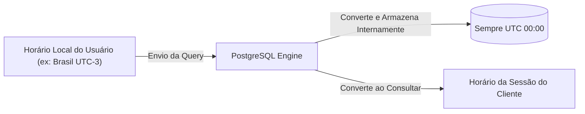

# 🐘 Módulo 02: Modelagem de Dados e DDL
## 📑 Aula 02: Tipos de Dados Ricos do PostgreSQL

> **Navegação**: [⬅️ Aula Anterior: Modelagem e ER](./01-modelagem-relacional.md) | [Módulo 02](./README.md) | [Próxima Aula: DDL e Constraints ➡️](./03-ddl-tabelas-e-constraints.md)

---

### 🎯 Objetivos de Aprendizagem
Ao final desta aula, você será capaz de:
- Escolher o tipo numérico adequado (e saber por que valores monetários nunca usam `FLOAT`).
- Entender a diferença real entre `VARCHAR`, `CHAR` e `TEXT` no motor do PostgreSQL.
- Manipular datas, fusos horários (`TIMESTAMPTZ`) e períodos com o tipo `INTERVAL`.
- Utilizar identificadores universais com o tipo nativo `UUID`.
- Compreender a diferença crítica entre `JSON` e `JSONB` e seus operadores.
- Criar tipos enumerados customizados com `CREATE TYPE ... AS ENUM`.

---

### 1. Tipos Numéricos e a Armadilha Financeira

| Tipo | Tamanho | Faixa / Precisão | Quando Usar |
| :--- | :--- | :--- | :--- |
| `SMALLINT` | 2 bytes | -32.768 a +32.767 | Pequenos contadores, códigos de estado civil, idade. |
| `INTEGER` / `INT` | 4 bytes | -2.147.483.648 a +2.147.483.647 | IDs padrão, quantidades, contadores gerais. |
| `BIGINT` | 8 bytes | ~ -9 quintilhões a +9 quintilhões | IDs de tabelas gigantescas (logs, transações financeiras). |
| `NUMERIC(p, s)` | Variável | Exato até 1.000 dígitos (`p` total, `s` decimais) | **Valores monetários, moedas, juros bancários**. |
| `REAL` / `DOUBLE PRECISION` | 4 / 8 bytes | Ponto flutuante aproximado (IEEE 754) | Coordenadas científicas, física, renderização 3D. |

> [!CAUTION]
> **NUNCA use `REAL` ou `DOUBLE PRECISION` (Float) para dinheiro!**
> Em ponto flutuante binário, `0.1 + 0.2` resulta em `0.30000000000000004`. Em aplicações bancárias ou contábeis, isso gera erros de arredondamento gravíssimos. Sempre use **`NUMERIC(15, 2)`** para moedas.

#### Auto-incremento: `SERIAL` vs `IDENTITY` (Padrão SQL Moderno)
No passado usava-se `SERIAL`. No PostgreSQL moderno (versão 10+), a convenção formal do padrão SQL:2003 é:

```sql
-- Forma antiga (Postgres legada):
id SERIAL PRIMARY KEY

-- Forma moderna e padronizada (Recomendada):
id INT GENERATED ALWAYS AS IDENTITY PRIMARY KEY
```

---

### 2. Tipos de Texto: O Mito do `VARCHAR` no PostgreSQL

No PostgreSQL, ao contrário de outros bancos de dados como MySQL ou Oracle:
* `CHAR(n)`: Preenche com espaços em branco à direita até o tamanho `n`. Geralmente evitado, exceto para siglas fixas (ex.: UF de estado `CHAR(2)`).
* `VARCHAR(n)`: Armazena texto com limite máximo de caracteres.
* `TEXT`: Armazena texto de tamanho arbitrário (até 1 GB por valor).

> [!TIP]
> **Fato de performance**: No PostgreSQL, não há **nenhuma diferença de performance de leitura ou escrita** entre `TEXT` e `VARCHAR(n)`. Ambos usam a mesma estrutura de armazenamento (*TOAST*). Use `VARCHAR(n)` se o limite for uma regra de validação de negócio (ex.: código postal de 8 dígitos). Se não houver razão de negócio para limitar, use `TEXT`.

---

### 3. Datas, Horas e Fusos: A Regra do `TIMESTAMPTZ`



* `DATE`: Apenas data (`'2026-10-07'`).
* `TIME`: Apenas horário (`'14:30:00'`).
* `TIMESTAMP`: Data e hora sem fuso horário (*Timestamp without time zone*). **Evite em produção!**
* `TIMESTAMPTZ`: Data e hora com fuso horário (*Timestamp with time zone*). **Padrão recomendado para auditorias e logs.**

#### O Poder do tipo `INTERVAL`:
O PostgreSQL permite matemática nativa com datas:

```sql
SELECT 
    NOW() AS agora,
    NOW() + INTERVAL '30 days' AS daqui_30_dias,
    NOW() - INTERVAL '2 hours 15 minutes' AS atras;
```

---

### 4. Identificadores Únicos Universais (UUID)

Chaves inteiras incrementais (`1, 2, 3...`) revelam a quantidade de registros para usuários mal-intencionados (ex.: URL `site.com/pedidos/45` facilita ataques de enumeração).
O tipo `UUID` (128 bits) resolve isso:

```sql
-- Gerando UUID v4 nativamente no PostgreSQL moderno:
SELECT gen_random_uuid();
-- Retorno: 'c9a646d3-9c61-4cc9-bc55-c277f9801198'
```

---

### 5. Dados Semi-Estruturados: JSON vs JSONB

O PostgreSQL suporta ambos, mas eles funcionam de forma muito distinta:

| Característica | `JSON` | `JSONB` (Binary JSON) |
| :--- | :--- | :--- |
| Armazenamento | Texto bruto literal (preserva espaços e ordem) | Formato binário decomposto e otimizado |
| Inserção | Mais rápida (não parseia) | Ligeiramente mais lenta (faz parsing e ordenação) |
| Leitura / Consultas | Mais lenta (re-parseia o texto a cada query) | **Extremamente rápida** |
| Indexação | Não suporta índices avançados | **Suporta índices GIN (General Inverted Index)** |
| Recomendação | Raramente usado | **Sempre use JSONB!** |

#### Sintaxe e Operadores Úteis do JSONB:

```sql
-- Criar tabela com metadados flexíveis
CREATE TABLE produto_tech (
    id INT GENERATED ALWAYS AS IDENTITY PRIMARY KEY,
    nome TEXT NOT NULL,
    atributos JSONB NOT NULL
);

-- Inserindo documentos JSON
INSERT INTO produto_tech (nome, atributos) VALUES 
('Notebook Gamer', '{"marca": "Dell", "ram_gb": 32, "tags": ["gamer", "rgb", "rtx4080"]}'),
('Smartphone Pro', '{"marca": "Apple", "ram_gb": 8, "tags": ["5g", "oled"]}');

-- 1. Operador ->> (Extrai valor como TEXT)
SELECT nome, atributos->>'marca' AS marca
FROM produto_tech
WHERE (atributos->>'ram_gb')::INT >= 16;

-- 2. Operador @> (Contém - ótimo com índices GIN)
SELECT nome FROM produto_tech
WHERE atributos @> '{"marca": "Dell"}';

-- 3. Operador ? (Verifica se uma chave ou tag existe)
SELECT nome FROM produto_tech
WHERE atributos->'tags' ? 'gamer';
```

---

### 6. Tipos Enumerados (ENUM)

Evita valores mágicos em colunas de status:

```sql
-- Criando o tipo enumerado
CREATE TYPE status_pedido AS ENUM ('pendente', 'pago', 'enviado', 'entregue', 'cancelado');

CREATE TABLE vendas (
    id INT GENERATED ALWAYS AS IDENTITY PRIMARY KEY,
    total NUMERIC(10,2) NOT NULL,
    status status_pedido DEFAULT 'pendente'
);

-- Válido:
INSERT INTO vendas (total, status) VALUES (150.00, 'pago');

-- Erro imediato de compilação SQL (Prevenção de bugs!):
-- INSERT INTO vendas (total, status) VALUES (90.00, 'aguardando'); 
-- ERROR: invalid input value for enum status_pedido: "aguardando"
```

---

### 📝 Exercício Prático: Escolha dos Tipos

Para cada campo abaixo, defina o tipo de dado ideal do PostgreSQL:
1. Saldo de uma carteira de criptomoedas ou conta corrente.
2. Identificador público de um usuário para a URL de perfil da API.
3. Histórico de tags de busca que um usuário pesquisou.
4. Data e hora de login de um usuário que reside em Tóquio acessando servidor em São Paulo.
5. Flag indicando se a conta está ativa ou inativa.

<details>
<summary>👁️ Clique aqui para ver o gabarito</summary>

1. **Saldo**: `NUMERIC(18, 8)` (cripto exige muitas casas decimais) ou `NUMERIC(15, 2)` (moeda tradicional).
2. **Identificador público**: `UUID` gerado com `gen_random_uuid()`.
3. **Tags de busca**: `TEXT[]` (array nativo) ou `JSONB`.
4. **Data e hora de login**: `TIMESTAMPTZ` (converte para UTC e ajusta para o fuso local do cliente).
5. **Conta ativa**: `BOOLEAN` (`TRUE` / `FALSE`).
</details>

---
> **Navegação**: [⬅️ Aula Anterior: Modelagem e ER](./01-modelagem-relacional.md) | [Módulo 02](./README.md) | [Próxima Aula: DDL e Constraints ➡️](./03-ddl-tabelas-e-constraints.md)
