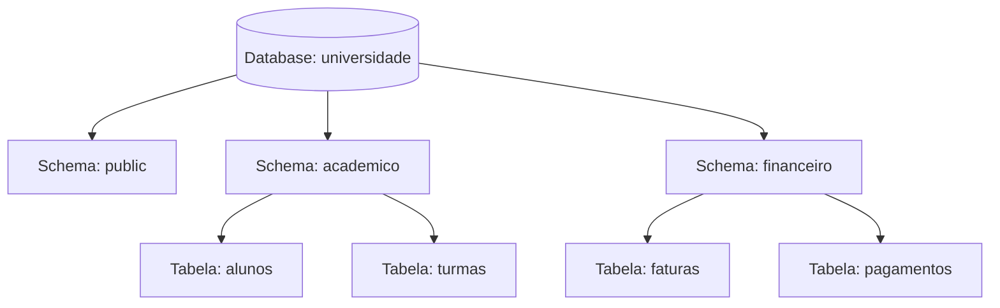
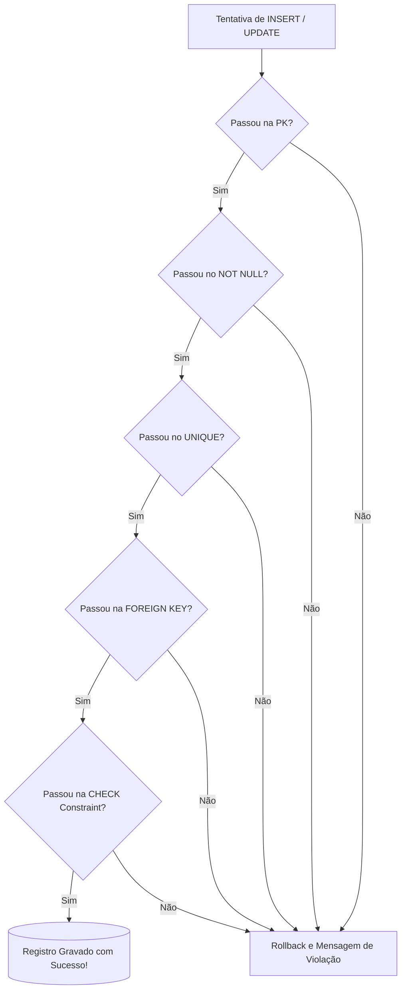
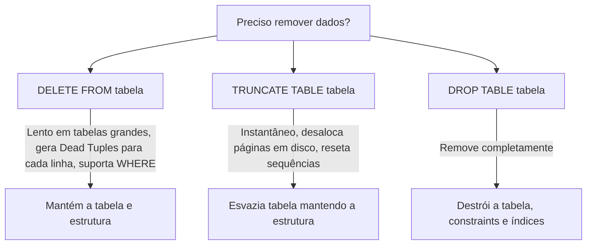

# 🐘 Módulo 02: Modelagem de Dados e DDL
## 📑 Aula 03: DDL, Schemas e Constraints Robustas

> **Navegação**: [⬅️ Aula Anterior: Tipos de Dados](./02-tipos-de-dados.md) | [Módulo 02](./README.md) | [Módulo 03: Manipulação DML e Consultas ➡️](../03-manipulacao-dml-e-consultas/README.md)

---

### 🎯 Objetivos de Aprendizagem
Ao final desta aula, você será capaz de:
- Compreender e executar comandos DDL (`CREATE`, `ALTER`, `DROP`, `TRUNCATE`).
- Organizar bancos de dados complexos através de **Schemas** e configurar o `search_path`.
- Implementar integridade referencial com `FOREIGN KEY` configurando ações em cascata (`ON DELETE CASCADE`, `RESTRICT`, `SET NULL`).
- Criar **Check Constraints** com regras de validação matemática e expressões regulares.
- Utilizar colunas geradas calculadas (`GENERATED ALWAYS AS ... STORED`).
- Aplicar padrões de migração de schema seguros sem travar tabelas em produção.

---

### 1. Organização Lógica: Schemas no PostgreSQL

No PostgreSQL, um único banco de dados (*database*) pode conter múltiplos **Schemas** (semelhantes a pastas ou namespaces de um sistema de arquivos). Por padrão, todos os objetos são criados no schema chamado `public`.



```sql
-- Criando um schema dedicado
CREATE SCHEMA IF NOT EXISTS academico;

-- Criando tabela dentro do schema
CREATE TABLE academico.alunos (
    id INT GENERATED ALWAYS AS IDENTITY PRIMARY KEY,
    nome TEXT NOT NULL
);

-- Definindo a prioridade de busca de schemas para a sessão atual:
SET search_path TO academico, public;
```

---

### 2. Constraints: As Barreiras de Proteção dos Dados

As constraints garantem que dados inválidos ou corrompidos **nunca** entrem no banco, independentemente de falhas no código backend.



#### A. Restrição de Chave Primária (Primary Key)
```sql
-- Chave simples
id INT GENERATED ALWAYS AS IDENTITY PRIMARY KEY

-- Chave Composta (útil em tabelas associativas N:N)
CREATE TABLE matricula (
    aluno_id INT,
    curso_id INT,
    data_inscricao DATE DEFAULT CURRENT_DATE,
    PRIMARY KEY (aluno_id, curso_id)
);
```

#### B. Restrição de Integridade Referencial (Foreign Key)
Define o que acontece com a linha filha quando a linha mãe for alterada ou deletada:

| Ação `ON DELETE` | Efeito |
| :--- | :--- |
| `RESTRICT` ou `NO ACTION` | Bloqueia a exclusão e lança erro se houver filhos vinculados (Padrão e mais seguro). |
| `CASCADE` | Deleta automaticamente todas as linhas filhas associadas. |
| `SET NULL` | Mantém os filhos, mas define a coluna FK como `NULL`. |

```sql
CREATE TABLE pedidos (
    id INT GENERATED ALWAYS AS IDENTITY PRIMARY KEY,
    cliente_id INT NOT NULL,
    CONSTRAINT fk_cliente_pedido
        FOREIGN KEY (cliente_id)
        REFERENCES clientes(id)
        ON DELETE RESTRICT
        ON UPDATE CASCADE
);
```

> [!WARNING]
> Use `ON DELETE CASCADE` com extrema cautela! Deletar um cliente e disparar uma cascata que apaga notas fiscais ou pedidos históricos pode violar leis contábeis e fiscais.

#### C. Check Constraints e Regex
Permite validar qualquer condição booleana:

```sql
CREATE TABLE produtos (
    id INT GENERATED ALWAYS AS IDENTITY PRIMARY KEY,
    sku TEXT NOT NULL UNIQUE,
    preco_venda NUMERIC(10,2) NOT NULL,
    preco_custo NUMERIC(10,2) NOT NULL,
    estoque INT NOT NULL DEFAULT 0,
    email_fornecedor TEXT NOT NULL,
    
    -- Validação 1: Preço nunca pode ser negativo ou zerado
    CONSTRAINT chk_preco_positivo CHECK (preco_venda > 0),
    
    -- Validação 2: Preço de venda deve ser maior ou igual ao custo
    CONSTRAINT chk_margem_lucro CHECK (preco_venda >= preco_custo),
    
    -- Validação 3: Estoque não pode ser negativo
    CONSTRAINT chk_estoque_nao_negativo CHECK (estoque >= 0),
    
    -- Validação 4: Validação de e-mail via Expressão Regular (Regex)
    CONSTRAINT chk_formato_email CHECK (email_fornecedor ~* '^[A-Za-z0-9._%+-]+@[A-Za-z0-9.-]+\.[A-Za-z]{2,}$')
);
```

#### D. Colunas Geradas (Generated Columns)
Calculadas automaticamente pelo banco e mantidas em disco:

```sql
CREATE TABLE itens_venda (
    id INT GENERATED ALWAYS AS IDENTITY PRIMARY KEY,
    quantidade INT NOT NULL,
    preco_unitario NUMERIC(10,2) NOT NULL,
    subtotal NUMERIC(10,2) GENERATED ALWAYS AS (quantidade * preco_unitario) STORED
);
```

---

### 3. Comandos DDL: Alterando Estruturas (`ALTER TABLE`)

À medida que o software evolui, os schemas precisam ser alterados:

```sql
-- Adicionar nova coluna com valor padrão seguro
ALTER TABLE clientes ADD COLUMN data_nascimento DATE;

-- Renomear coluna
ALTER TABLE clientes RENAME COLUMN data_nascimento TO nascimento;

-- Modificar tipo de uma coluna existente com conversão explícita
ALTER TABLE clientes ALTER COLUMN pontuacao TYPE BIGINT USING pontuacao::BIGINT;

-- Adicionar constraint com validação em background (Zero-Downtime Pattern)
ALTER TABLE produtos ADD CONSTRAINT chk_preco_minimo CHECK (preco_venda >= 1.00) NOT VALID;
ALTER TABLE produtos VALIDATE CONSTRAINT chk_preco_minimo;
```

> [!TIP]
> **Dica Pro de Produção**: Em tabelas com milhões de linhas, adicionar uma constraint trava a tabela para leituras/escritas. Adicionar com `NOT VALID` é instantâneo (valida apenas novos registros), e a linha seguinte `VALIDATE CONSTRAINT` varre os dados existentes em background sem travar escritas!

---

### 4. `DROP TABLE` vs `TRUNCATE TABLE` vs `DELETE`



---

### 📝 Exercício Prático: Schema Completo de uma Biblioteca

Escreva o DDL completo para criar uma tabela `livros` com os seguintes requisitos:
1. `id` serial auto-incremental seguro padrão moderno.
2. `isbn` de 13 caracteres, não nulo e único.
3. `titulo` em texto obrigatório.
4. `ano_publicacao` deve ser entre o ano 1450 (prensa de Gutenberg) e o ano atual + 1.
5. `paginas` deve ser estritamente maior que 0.

<details>
<summary>👁️ Clique aqui para ver o script SQL da solução</summary>

```sql
CREATE TABLE livros (
    id INT GENERATED ALWAYS AS IDENTITY PRIMARY KEY,
    isbn VARCHAR(13) NOT NULL,
    titulo TEXT NOT NULL,
    ano_publicacao INT NOT NULL,
    paginas INT NOT NULL,
    criado_em TIMESTAMPTZ DEFAULT CURRENT_TIMESTAMP,

    CONSTRAINT uq_livros_isbn UNIQUE (isbn),
    CONSTRAINT chk_livros_isbn_tamanho CHECK (length(isbn) = 13),
    CONSTRAINT chk_livros_ano CHECK (ano_publicacao >= 1450 AND ano_publicacao <= EXTRACT(YEAR FROM CURRENT_DATE) + 1),
    CONSTRAINT chk_livros_paginas CHECK (paginas > 0)
);
```
</details>

---
> **Navegação**: [⬅️ Aula Anterior: Tipos de Dados](./02-tipos-de-dados.md) | [Módulo 02](./README.md) | [Módulo 03: Manipulação DML e Consultas ➡️](../03-manipulacao-dml-e-consultas/README.md)
