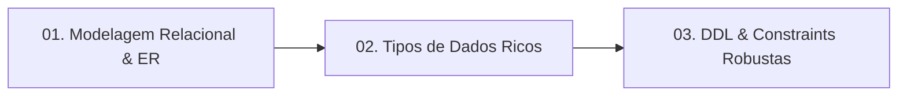

# 🐘 Módulo 02: Modelagem de Dados e DDL

Neste módulo, você aprenderá como projetar bancos de dados resilientes, escaláveis e à prova de corrupção de dados através de modelagem matemática e restrições nativas do PostgreSQL.

---

## 🗺️ Mapa de Conteúdo do Módulo

---

## 📑 Aulas Disponíveis

1. [**Aula 01: Modelagem Relacional, Normalização e Diagramas ER**](./01-modelagem-relacional.md)
   - Entidades, atributos e mapeamento de cardinalidades (1:1, 1:N, N:N).
   - Formas Normais (1FN, 2FN, 3FN) e como evitar redundâncias e anomalias.
   - Renderização nativa de diagramas `erDiagram` com Mermaid no GitHub.
   - Desafio prático de modelagem de plataforma educacional.

2. [**Aula 02: Tipos de Dados Ricos do PostgreSQL**](./02-tipos-de-dados.md)
   - Numéricos e a armadilha do ponto flutuante para dinheiro (`NUMERIC` vs `FLOAT`).
   - O mito do `VARCHAR` vs `TEXT` no motor do PostgreSQL.
   - Fusos horários com `TIMESTAMPTZ` e cálculos com `INTERVAL`.
   - Identificadores únicos com `UUID` e `gen_random_uuid()`.
   - Dados semi-estruturados com `JSONB` e operadores de busca.
   - Tipos enumerados seguros com `CREATE TYPE ... AS ENUM`.

3. [**Aula 03: DDL, Schemas e Constraints Robustas**](./03-ddl-tabelas-e-constraints.md)
   - Organização multi-tenant ou departamental com `SCHEMAS`.
   - Chaves Primárias (`IDENTITY`) e Estrangeiras (`ON DELETE CASCADE / RESTRICT`).
   - Validações de regras de negócio com `CHECK` e Expressões Regulares (`Regex`).
   - Colunas geradas armazenadas (`GENERATED ALWAYS AS ... STORED`).
   - Alterações de tabelas em produção com zero downtime (`NOT VALID`).
   - Comparativo técnico entre `DROP`, `TRUNCATE` e `DELETE`.

---

## 🧭 Navegação Rápida
* [⬅️ Voltar para o Módulo 01: Fundamentos](../01-fundamentos/README.md)
* [Ir para o Módulo 03: Manipulação DML e Consultas ➡️](../03-manipulacao-dml-e-consultas/README.md)
