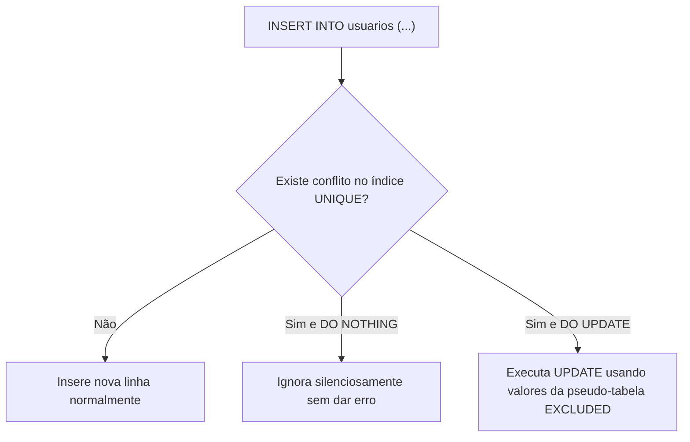

# 🐘 Módulo 03: Manipulação DML e Consultas
## 📑 Aula 01: DML Básico, Cláusula RETURNING e UPSERT

> **Navegação**: [⬅️ Módulo 02](../02-modelagem-e-ddl/README.md) | [Módulo 03](./README.md) | [Próxima Aula: Consultas e Filtros ➡️](./02-consultas-e-filtros.md)

---

### 🎯 Objetivos de Aprendizagem
Ao final desta aula, você será capaz de:
- Executar inserções simples e múltiplas em lote (*bulk insert*).
- Utilizar a cláusula exclusiva **`RETURNING`** para obter IDs e valores gerados em tempo real.
- Realizar atualizações (`UPDATE`) e exclusões (`DELETE`) seguras com rollback defensivo.
- Dominar o padrão **UPSERT** (`INSERT ... ON CONFLICT`) com a pseudo-tabela `EXCLUDED`.

---

### 1. Inserindo Dados (`INSERT INTO`)

#### A. Inserção Simples e Inserção em Lote (*Bulk Insert*)
Inserir múltiplas linhas em um único comando SQL é centenas de vezes mais rápido do que disparar múltiplos comandos isolados, pois reduz o overhead de rede e transações.

```sql
-- Criando tabela base para os exemplos
CREATE TABLE usuarios (
    id INT GENERATED ALWAYS AS IDENTITY PRIMARY KEY,
    nome TEXT NOT NULL,
    email TEXT NOT NULL UNIQUE,
    ativo BOOLEAN DEFAULT TRUE,
    pontos INT DEFAULT 0,
    criado_em TIMESTAMPTZ DEFAULT CURRENT_TIMESTAMP
);

-- Inserção de Múltiplas Linhas em lote:
INSERT INTO usuarios (nome, email, pontos) VALUES
    ('Carlos Eduardo', 'carlos@email.com', 120),
    ('Beatriz Lima', 'beatriz@email.com', 350),
    ('Mariana Souza', 'mariana@email.com', 80);
```

#### B. O Superpoder da Cláusula `RETURNING`
No PostgreSQL, você não precisa fazer um segundo `SELECT` para saber qual ID foi gerado ou qual timestamp foi atribuído por padrão:

```sql
INSERT INTO usuarios (nome, email)
VALUES ('Rafael Dias', 'rafael@email.com')
RETURNING id, criado_em, ativo;
```

Resultado retornado imediatamente para a aplicação:
```text
 id |           criado_em           | ativo 
----+-------------------------------+-------
  4 | 2026-10-07 15:10:00.342112-03 | t
```

---

### 2. Atualizando Dados com Segurança (`UPDATE`)

```sql
-- Atualizando um único registro com WHERE específico
UPDATE usuarios
SET pontos = pontos + 50,
    ativo = TRUE
WHERE id = 1
RETURNING id, nome, pontos;
```

> [!CAUTION]
> **O perigo do UPDATE e DELETE sem WHERE!**
> Se você esquecer a cláusula `WHERE`, **todas as linhas da tabela serão alteradas ou apagadas**. 
> Em ambientes de produção, sempre envolva operações manuais em transações defensivas:
> ```sql
> BEGIN;
> UPDATE usuarios SET ativo = FALSE; -- Esqueceu o WHERE!
> -- Inspecione:
> SELECT * FROM usuarios;
> -- Detectou a besteira? Desfaça tudo:
> ROLLBACK; 
> ```

---

### 3. Excluindo Registros (`DELETE`)

```sql
-- Removendo um usuário inativo e retornando o email apagado para auditoria
DELETE FROM usuarios
WHERE id = 3
RETURNING id, email;
```

---

### 4. Padrão UPSERT (`INSERT ... ON CONFLICT`)

Quantas vezes você precisou: *"Se o usuário já existir pelo e-mail, atualize seus dados; se não existir, crie-o"?* 
Em outros bancos de dados, isso exige transações complexas ou queries separadas sujeitas a *race conditions*. No PostgreSQL, fazemos isso nativamente e atomicamente com **`ON CONFLICT`**.



#### Caso 1: Ignorar se já existir (`DO NOTHING`)
```sql
INSERT INTO usuarios (nome, email, pontos)
VALUES ('Carlos Eduardo', 'carlos@email.com', 500)
ON CONFLICT (email) 
DO NOTHING;
-- Não quebra a transação, apenas ignora!
```

#### Caso 2: Atualizar se já existir (`DO UPDATE SET`)
A pseudo-tabela **`EXCLUDED`** contém os valores que você tentou inserir no comando:

```sql
INSERT INTO usuarios (nome, email, pontos)
VALUES ('Carlos Eduardo Atualizado', 'carlos@email.com', 500)
ON CONFLICT (email) 
DO UPDATE SET
    nome = EXCLUDED.nome,
    pontos = usuarios.pontos + EXCLUDED.pontos,
    ativo = TRUE
RETURNING id, nome, pontos;
```

> [!IMPORTANT]
> Para o `ON CONFLICT` funcionar, a coluna ou combinação de colunas informada entre parênteses **deve possuir uma restrição `UNIQUE` ou ser uma `PRIMARY KEY`**.

---

### 📝 Exercício Prático: Tabela de Inventário com UPSERT

Crie uma tabela `estoque_produtos` com as colunas: `produto_id` (PK, int), `quantidade` (int) e `ultima_movimentacao` (timestamptz).
Escreva uma query de UPSERT que:
- Insira o produto 101 com quantidade 10.
- Se o produto 101 já existir, **some** 10 à quantidade atual existente e atualize a data para `CURRENT_TIMESTAMP`.
- Retorne o `produto_id`, a nova `quantidade` total e a data atualizada.

<details>
<summary>👁️ Clique aqui para ver o script SQL da solução</summary>

```sql
-- 1. Criação da tabela
CREATE TABLE estoque_produtos (
    produto_id INT PRIMARY KEY,
    quantidade INT NOT NULL CHECK (quantidade >= 0),
    ultima_movimentacao TIMESTAMPTZ DEFAULT CURRENT_TIMESTAMP
);

-- 2. Query de UPSERT
INSERT INTO estoque_produtos (produto_id, quantidade, ultima_movimentacao)
VALUES (101, 10, CURRENT_TIMESTAMP)
ON CONFLICT (produto_id)
DO UPDATE SET
    quantidade = estoque_produtos.quantidade + EXCLUDED.quantidade,
    ultima_movimentacao = CURRENT_TIMESTAMP
RETURNING produto_id, quantidade, ultima_movimentacao;
```
</details>

---
> **Navegação**: [⬅️ Módulo 02](../02-modelagem-e-ddl/README.md) | [Módulo 03](./README.md) | [Próxima Aula: Consultas e Filtros ➡️](./02-consultas-e-filtros.md)
