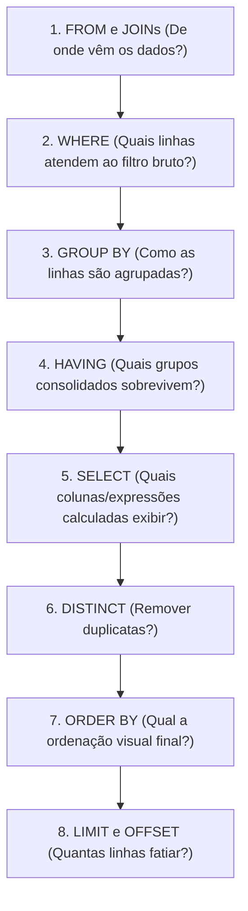

# 🐘 Módulo 03: Manipulação DML e Consultas
## 📑 Aula 02: Consultas, Filtros, Operadores e Paginação

> **Navegação**: [⬅️ Aula Anterior: DML Básico](./01-dml-basico.md) | [Módulo 03](./README.md) | [Próxima Aula: Agrupamentos e Agregações ➡️](./03-agrupamentos-e-agregacoes.md)

---

### 🎯 Objetivos de Aprendizagem
Ao final desta aula, você será capaz de:
- Compreender a **Ordem Lógica de Execução** de uma query SQL (por que não podemos usar aliases de coluna no `WHERE`).
- Filtrar com operadores avançados: `BETWEEN`, `IN`, `ILIKE` (busca case-insensitive nativa do Postgres).
- Lidar corretamente com valores nulos usando `IS NULL`, `COALESCE` e `NULLIF`.
- Evitar a perigosa armadilha lógica de `NOT IN` com valores `NULL`.
- Implementar paginação com `LIMIT`/`OFFSET` e compreender por que a **Paginação por Cursor** é superior para grandes massas de dados.

---

### 1. A Ordem Secreta: Como o SQL Realmente Executa sua Query

Muitos desenvolvedores acham que o banco executa uma query de cima para baixo porque ela começa com `SELECT`. **Isso é um engano!** 

A ordem de execução lógica é:



> [!IMPORTANT]
> **Por que este erro acontece?**
> Se você tentar rodar:
> ```sql
> SELECT salario * 12 AS salario_anual FROM funcionarios WHERE salario_anual > 50000;
> ```
> O PostgreSQL gerará o erro: `column "salario_anual" does not exist`. 
> Isso ocorre porque o passo `2. WHERE` é executado **antes** do passo `5. SELECT`, momento em que o alias `salario_anual` ainda não existe para o motor!

---

### 2. Base de Dados de Estudo

Execute este script para criar nossa base de testes:

```sql
CREATE TABLE clientes_loja (
    id INT GENERATED ALWAYS AS IDENTITY PRIMARY KEY,
    nome TEXT NOT NULL,
    cidade TEXT,
    idade INT,
    saldo NUMERIC(10,2),
    email_secundario TEXT
);

INSERT INTO clientes_loja (nome, cidade, idade, saldo, email_secundario) VALUES
    ('Ana Paula Ribeiro', 'São Paulo', 28, 1500.50, 'anap@corp.com'),
    ('Bruno Castro', 'Rio de Janeiro', 35, 4200.00, NULL),
    ('Carlos Henrique', 'Belo Horizonte', 19, 350.00, 'carlos.dev@gmail.com'),
    ('Daniela Martins', 'São Paulo', 42, 8900.20, NULL),
    ('Eduardo Fonseca', 'Curitiba', 31, 0.00, 'edu@contato.br'),
    ('Fernanda Alves', 'Salvador', 24, 2300.00, NULL);
```

---

### 3. Operadores de Filtro Avançados

#### A. Busca Textual: `LIKE` vs `ILIKE`
No PostgreSQL, o operador **`ILIKE`** realiza buscas sem diferenciar maiúsculas de minúsculas (*case-insensitive*):

```sql
-- Busca nomes que contenham "paula" independente da caixa:
SELECT nome, cidade FROM clientes_loja
WHERE nome ILIKE '%paula%';

-- Nomes que começam com a letra B:
SELECT nome FROM clientes_loja
WHERE nome LIKE 'B%';

-- Nomes onde a segunda letra é 'a' (underline _ representa exatamente 1 caractere):
SELECT nome FROM clientes_loja
WHERE nome LIKE '_a%';
```

#### B. Intervalos e Conjuntos: `BETWEEN` e `IN`
```sql
-- Idades entre 25 e 40 (inclusivo):
SELECT nome, idade FROM clientes_loja
WHERE idade BETWEEN 25 AND 40;

-- Cidades específicas:
SELECT nome, cidade FROM clientes_loja
WHERE cidade IN ('São Paulo', 'Curitiba', 'Porto Alegre');
```

---

### 4. O Valor `NULL` e Suas Pegadinhas

No modelo relacional, `NULL` não é zero nem string vazia: **`NULL` significa desconhecido ou ausência de informação**.

Por isso, `NULL = NULL` resulta em **`NULL`** (Desconhecido), e **nunca em `TRUE`**!

```sql
-- Incorreto (sempre retorna 0 linhas):
SELECT * FROM clientes_loja WHERE email_secundario = NULL;

-- Correto:
SELECT * FROM clientes_loja WHERE email_secundario IS NULL;
SELECT * FROM clientes_loja WHERE email_secundario IS NOT NULL;
```

#### A Função `COALESCE` (Substituição de Nulos):
Retorna o primeiro valor não-nulo da lista de argumentos:

```sql
SELECT 
    nome,
    COALESCE(email_secundario, 'E-mail não informado') AS contato
FROM clientes_loja;
```

#### A Perigosa Armadilha do `NOT IN` com `NULL`:
> [!CAUTION]
> Se um conjunto de valores contiver um único `NULL`, a expressão `valor NOT IN (1, 2, NULL)` avaliará para `UNKNOWN` para todas as linhas, retornando um resultado vazio inesperado!
> **Regra de ouro**: Em subconsultas com negação, prefira `NOT EXISTS` em vez de `NOT IN`.

---

### 5. Ordenação e Paginação

#### A. Ordenação Precisa (`ORDER BY` com `NULLS FIRST / LAST`):
```sql
-- Ordenar por saldo decrescente. Nulos no final:
SELECT nome, saldo, email_secundario
FROM clientes_loja
ORDER BY saldo DESC NULLS LAST;
```

#### B. Paginação Tradicional: `LIMIT` e `OFFSET`
```sql
-- Página 1 (Tamanho: 3 itens):
SELECT * FROM clientes_loja ORDER BY id LIMIT 3 OFFSET 0;

-- Página 2 (Próximos 3 itens):
SELECT * FROM clientes_loja ORDER BY id LIMIT 3 OFFSET 3;
```

#### C. Paginação por Cursor (Keyset Pagination) - Padrão de Alta Performance
Em tabelas com milhões de registros, `OFFSET 1000000` obriga o banco a ler 1 milhão de linhas para descartá-las, tornando o endpoint extremamente lento.
A paginação por cursor utiliza o índice da chave primária:

```sql
-- Buscar a próxima página buscando registros com ID maior que o último visto na página anterior:
SELECT * FROM clientes_loja
WHERE id > 3
ORDER BY id ASC
LIMIT 3;
```

---

### 📝 Exercício Prático

Escreva uma query na tabela `clientes_loja` que:
1. Retorne o `nome`, `cidade` e `saldo`.
2. Filtre clientes que residem em `'São Paulo'` ou `'Rio de Janeiro'`, cuja idade seja maior ou igual a 25 anos.
3. Se o saldo for nulo, exiba 0.00.
4. Ordene os resultados pelo maior saldo primeiro.

<details>
<summary>👁️ Clique aqui para ver a query de solução</summary>

```sql
SELECT 
    nome, 
    cidade, 
    COALESCE(saldo, 0.00) AS saldo
FROM clientes_loja
WHERE cidade IN ('São Paulo', 'Rio de Janeiro')
  AND idade >= 25
ORDER BY saldo DESC;
```
</details>

---
> **Navegação**: [⬅️ Aula Anterior: DML Básico](./01-dml-basico.md) | [Módulo 03](./README.md) | [Próxima Aula: Agrupamentos e Agregações ➡️](./03-agrupamentos-e-agregacoes.md)
