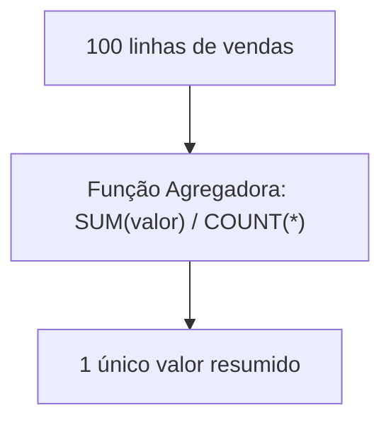
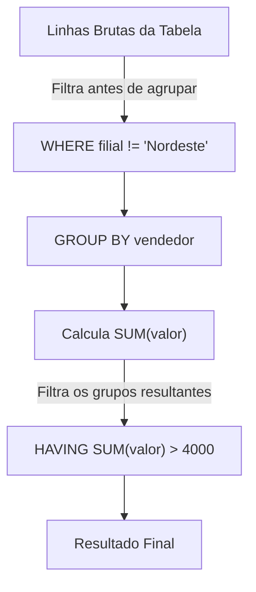

# 🐘 Módulo 03: Manipulação DML e Consultas
## 📑 Aula 03: Agrupamentos, Agregações e a Cláusula FILTER

> **Navegação**: [⬅️ Aula Anterior: Consultas e Filtros](./02-consultas-e-filtros.md) | [Módulo 03](./README.md) | [Próxima Aula: JOINs e Relacionamentos ➡️](./04-joins-e-relacionamentos.md)

---

### 🎯 Objetivos de Aprendizagem
Ao final desta aula, você será capaz de:
- Aplicar funções agregadoras padrão (`COUNT`, `SUM`, `AVG`, `MIN`, `MAX`).
- Usar funções agregadoras avançadas do PostgreSQL: `STRING_AGG` e `ARRAY_AGG`.
- Compreender a regra inviolável do `GROUP BY`.
- Diferenciar claramente o momento de uso de `WHERE` e `HAVING`.
- Utilizar a elegante e performática cláusula **`FILTER (WHERE ...)`** em agregações.
- Gerar relatórios multidimensionais com `GROUPING SETS`, `ROLLUP` e `CUBE`.

---

### 1. Funções Agregadoras Essenciais

As funções agregadoras processam múltiplos valores de uma coluna e retornam um único valor sintetizado.



```sql
-- Criando dados para análise
CREATE TABLE vendas_filiais (
    id INT GENERATED ALWAYS AS IDENTITY PRIMARY KEY,
    filial TEXT NOT NULL,
    vendedor TEXT NOT NULL,
    categoria TEXT NOT NULL,
    valor NUMERIC(10,2) NOT NULL,
    data_venda DATE NOT NULL
);

INSERT INTO vendas_filiais (filial, vendedor, categoria, valor, data_venda) VALUES
    ('Sul', 'Marcos', 'Eletrônicos', 3500.00, '2026-01-10'),
    ('Sul', 'Marcos', 'Móveis', 1200.00, '2026-01-11'),
    ('Sul', 'Camila', 'Eletrônicos', 4800.00, '2026-01-12'),
    ('Sudeste', 'Juliana', 'Informática', 5200.00, '2026-01-10'),
    ('Sudeste', 'Juliana', 'Móveis', 800.00, '2026-01-14'),
    ('Sudeste', 'Rodrigo', 'Eletrônicos', 2100.00, '2026-01-15'),
    ('Nordeste', 'Aline', 'Informática', 3900.00, '2026-01-16');
```

```sql
-- Agregações globais
SELECT 
    COUNT(*) AS total_transacoes,
    COUNT(DISTINCT vendedor) AS vendedores_distintos,
    SUM(valor) AS faturamento_total,
    ROUND(AVG(valor), 2) AS ticket_medio,
    MIN(valor) AS menor_venda,
    MAX(valor) AS maior_venda
FROM vendas_filiais;
```

---

### 2. A Regra de Ouro do `GROUP BY`

Ao agrupar linhas por categorias, qualquer coluna no `SELECT` que **não** esteja dentro de uma função agregadora **precisa obrigatoriamente** constar na cláusula `GROUP BY`.

```sql
-- Total faturado e quantidade de vendas por filial e categoria:
SELECT 
    filial,
    categoria,
    COUNT(*) AS qtd_vendas,
    SUM(valor) AS total_faturado
FROM vendas_filiais
GROUP BY filial, categoria
ORDER BY filial, total_faturado DESC;
```

---

### 3. O Confronto: `WHERE` vs `HAVING`

Esta é uma das maiores dúvidas de estudantes:



* **`WHERE`**: Filtra **linhas individuais** antes que qualquer agrupamento ou cálculo seja realizado. Não aceita funções agregadoras (`WHERE SUM(valor) > 10` é inválido).
* **`HAVING`**: Filtra **grupos consolidados** após o agrupamento ter sido computado.

```sql
-- Vendedores com faturamento total superior a R$ 4.000,00:
SELECT 
    vendedor,
    SUM(valor) AS faturamento_total
FROM vendas_filiais
WHERE categoria != 'Móveis' -- Filtra linhas antes
GROUP BY vendedor
HAVING SUM(valor) > 4000    -- Filtra o resultado acumulado
ORDER BY faturamento_total DESC;
```

---

### 4. Recurso Exclusivo do PostgreSQL: A Cláusula `FILTER`

No SQL tradicional, para calcular métricas condicionais é necessário usar expressões verbosas com `CASE WHEN`. O PostgreSQL implementou o padrão ANSI SQL:2003 com a cláusula **`FILTER (WHERE ...)`**, muito mais elegante e legível:

```sql
SELECT 
    filial,
    COUNT(*) AS total_geral,
    COUNT(*) FILTER (WHERE categoria = 'Eletrônicos') AS qtd_eletronicos,
    SUM(valor) FILTER (WHERE categoria = 'Eletrônicos') AS faturado_eletronicos,
    SUM(valor) FILTER (WHERE categoria = 'Móveis') AS faturado_moveis
FROM vendas_filiais
GROUP BY filial;
```

> [!TIP]
> A cláusula `FILTER` simplifica relatórios do tipo "Pivot / Tabela Dinâmica" no PostgreSQL, evitando subqueries complexas.

---

### 5. Agrupadores de Strings e Arrays

O PostgreSQL facilita agregar textos e arrays de múltiplos registros:

```sql
-- Agrupando todos os vendedores de cada filial em uma única linha separada por vírgula:
SELECT 
    filial,
    STRING_AGG(DISTINCT vendedor, ', ' ORDER BY vendedor) AS equipe,
    ARRAY_AGG(DISTINCT categoria) AS categorias_atendidas
FROM vendas_filiais
GROUP BY filial;
```

Resultado:
```text
  filial  |      equipe       |       categorias_atendidas       
----------+-------------------+----------------------------------
 Nordeste | Aline             | {Informática}
 Sudeste  | Juliana, Rodrigo  | {Informática,Móveis,Eletrônicos}
 Sul      | Camila, Marcos    | {Eletrônicos,Móveis}
```

---

### 📝 Exercício Prático: Análise de Vendas

Utilizando a tabela `vendas_filiais`, escreva uma consulta que:
1. Agrupe os dados por `categoria`.
2. Mostre o faturamento total da categoria.
3. Mostre o percentual de vendas acima de R$ 3.000,00 daquela categoria.
4. Filtre para exibir apenas categorias que tiveram faturamento total superior a R$ 5.000,00.

<details>
<summary>👁️ Clique aqui para ver a solução</summary>

```sql
SELECT 
    categoria,
    COUNT(*) AS total_pedidos,
    SUM(valor) AS faturamento_total,
    ROUND(
        (COUNT(*) FILTER (WHERE valor > 3000)::NUMERIC / COUNT(*)) * 100, 
        2
    ) AS pct_vendas_acima_3k
FROM vendas_filiais
GROUP BY categoria
HAVING SUM(valor) > 5000
ORDER BY faturamento_total DESC;
```
</details>

---
> **Navegação**: [⬅️ Aula Anterior: Consultas e Filtros](./02-consultas-e-filtros.md) | [Módulo 03](./README.md) | [Próxima Aula: JOINs e Relacionamentos ➡️](./04-joins-e-relacionamentos.md)
