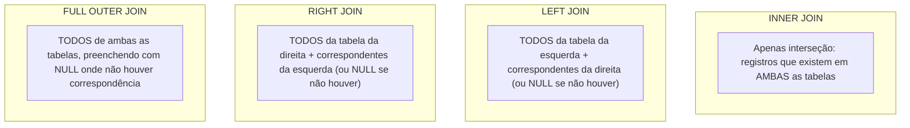

# 🐘 Módulo 03: Manipulação DML e Consultas
## 📑 Aula 04: JOINs, Relacionamentos, Subconsultas e LATERAL

> **Navegação**: [⬅️ Aula Anterior: Agrupamentos](./03-agrupamentos-e-agregacoes.md) | [Módulo 03](./README.md) | [Módulo 04: Recursos Avançados SQL ➡️](../04-recursos-avancados-sql/README.md)

---

### 🎯 Objetivos de Aprendizagem
Ao final desta aula, você será capaz de:
- Visualizar e dominar os tipos de junção: `INNER`, `LEFT`, `RIGHT`, `FULL OUTER`, `CROSS` e `SELF JOIN`.
- Encontrar registros "órfãos" usando padrões de Anti-Join (`LEFT JOIN ... WHERE IS NULL`) e `NOT EXISTS`.
- Construir subconsultas escalares, subconsultas correlacionadas e entender seu custo de processamento.
- Utilizar a junção avançada **`CROSS JOIN LATERAL`** exclusiva do PostgreSQL para cálculos dinâmicos por linha.

---

### 1. O Mapa Visual dos JOINs



---

### 2. Base de Dados para Prática de JOINs

```sql
CREATE TABLE autores (
    id INT GENERATED ALWAYS AS IDENTITY PRIMARY KEY,
    nome TEXT NOT NULL,
    pais TEXT NOT NULL
);

CREATE TABLE livros_publicados (
    id INT GENERATED ALWAYS AS IDENTITY PRIMARY KEY,
    autor_id INT REFERENCES autores(id),
    titulo TEXT NOT NULL,
    preco NUMERIC(10,2) NOT NULL
);

INSERT INTO autores (nome, pais) VALUES
    ('Machado de Assis', 'Brasil'),
    ('Clarice Lispector', 'Brasil'),
    ('George Orwell', 'Reino Unido'),
    ('Franz Kafka', 'República Tcheca'); -- Não possui livros cadastrados ainda

INSERT INTO livros_publicados (autor_id, titulo, preco) VALUES
    (1, 'Dom Casmurro', 45.00),
    (1, 'Memórias Póstumas de Brás Cubas', 52.00),
    (2, 'A Hora da Estrela', 38.00),
    (3, '1984', 49.90),
    (NULL, 'Manuscrito Anônimo Encontrado', 20.00); -- Livro sem autor
```

---

### 3. Executando os Diferentes Tipos de JOIN

#### A. `INNER JOIN` (Apenas pares completos)
```sql
SELECT 
    l.titulo,
    a.nome AS autor,
    a.pais
FROM livros_publicados l
INNER JOIN autores a ON l.autor_id = a.id;
```
*Kafka (sem livros) e o Manuscrito Anônimo (sem autor) são **descartados** do resultado.*

#### B. `LEFT JOIN` (Preserva a tabela da esquerda)
```sql
-- Queremos todos os autores, mesmo aqueles que ainda não publicaram nenhum livro:
SELECT 
    a.nome AS autor,
    COALESCE(l.titulo, '[Sem livro publicado]') AS titulo_livro
FROM autores a
LEFT JOIN livros_publicados l ON a.id = l.autor_id;
```
*Franz Kafka aparecerá com `[Sem livro publicado]`.*

#### C. O Padrão Anti-Join (Detectando Órfãos)
Como encontrar autores que **não possuem nenhum livro** cadastrado?

```sql
SELECT a.nome
FROM autores a
LEFT JOIN livros_publicados l ON a.id = l.autor_id
WHERE l.id IS NULL;
```

#### D. `FULL OUTER JOIN` (Tudo de ambos os lados)
```sql
SELECT 
    a.nome AS autor,
    l.titulo AS livro
FROM autores a
FULL OUTER JOIN livros_publicados l ON a.id = l.autor_id;
```

#### E. `SELF JOIN` (Uma tabela unida a ela mesma)
Muito comum em estruturas de liderança e hierarquia:

```sql
CREATE TABLE colaboradores (
    id INT PRIMARY KEY,
    nome TEXT,
    gerente_id INT REFERENCES colaboradores(id)
);

INSERT INTO colaboradores VALUES
    (1, 'Diretora Alice', NULL),
    (2, 'Gerente Bernardo', 1),
    (3, 'Analista Carla', 2);

SELECT 
    subordinado.nome AS funcionario,
    COALESCE(chefe.nome, 'Presidente') AS lider_direto
FROM colaboradores subordinado
LEFT JOIN colaboradores chefe ON subordinado.gerente_id = chefe.id;
```

---

### 4. Subconsultas: `IN`, `EXISTS` e Subqueries Correlacionadas

```sql
-- Subconsulta com NOT EXISTS (Mais performática que NOT IN quando há nulos):
SELECT a.nome 
FROM autores a
WHERE NOT EXISTS (
    SELECT 1 
    FROM livros_publicados l 
    WHERE l.autor_id = a.id
);
```

> [!NOTE]
> O `EXISTS` para a varredura assim que encontra a **primeira linha** correspondente (avaliação de curto-circuito - *short circuit*), sendo extremamente rápido.

---

### 5. O Recurso Supremo: `CROSS JOIN LATERAL`

O modificador **`LATERAL`** atua como um loop `for-each` em SQL. Ele permite que a subconsulta à direita faça referência a colunas fornecidas pelas linhas da esquerda!

**Cenário clássico**: *"Para cada autor, encontre os seus 2 livros mais caros."*

```sql
SELECT 
    a.nome AS autor,
    top_livros.titulo,
    top_livros.preco
FROM autores a
CROSS JOIN LATERAL (
    SELECT titulo, preco
    FROM livros_publicados l
    WHERE l.autor_id = a.id
    ORDER BY preco DESC
    LIMIT 2
) AS top_livros;
```

> [!TIP]
> Sem o `LATERAL`, essa consulta exigiria Window Functions mais pesadas ou código na aplicação. O `LATERAL` é um dos recursos favoritos de engenheiros de dados seniores no PostgreSQL!

---

### 📝 Exercício Prático

Com base nas tabelas `autores` e `livros_publicados`:
1. Escreva uma query que retorne o nome do autor e a média de preço de seus livros.
2. Autores sem livros devem aparecer com média `0.00`.
3. Ordene da maior média para a menor.

<details>
<summary>👁️ Clique aqui para ver a solução</summary>

```sql
SELECT 
    a.nome AS autor,
    ROUND(COALESCE(AVG(l.preco), 0.00), 2) AS media_preco_livros
FROM autores a
LEFT JOIN livros_publicados l ON a.id = l.autor_id
GROUP BY a.id, a.nome
ORDER BY media_preco_livros DESC;
```
</details>

---
> **Navegação**: [⬅️ Aula Anterior: Agrupamentos](./03-agrupamentos-e-agregacoes.md) | [Módulo 03](./README.md) | [Módulo 04: Recursos Avançados SQL ➡️](../04-recursos-avancados-sql/README.md)
