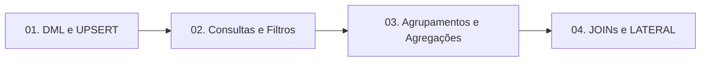

# 🐘 Módulo 03: Manipulação DML e Consultas

Neste módulo, você domina a escrita fluente e profissional de consultas SQL, desde operações atômicas de escrita e UPSERT até agregações estatísticas e junções relacionais complexas.

---

## 🗺️ Mapa de Conteúdo do Módulo

---

## 📑 Aulas Disponíveis

1. [**Aula 01: DML Básico, Cláusula RETURNING e UPSERT**](./01-dml-basico.md)
   - `INSERT`, `UPDATE` e `DELETE` em lote.
   - Retorno instantâneo de identificadores com `RETURNING`.
   - Transações defensivas contra updates/deletes acidentais.
   - Padrão **UPSERT** (`INSERT ... ON CONFLICT DO UPDATE`) com pseudo-tabela `EXCLUDED`.

2. [**Aula 02: Consultas, Filtros, Operadores e Paginação**](./02-consultas-e-filtros.md)
   - Ordem lógica real de execução do compilador SQL.
   - Busca textual case-insensitive com `ILIKE` e wildcards.
   - O perigo dos valores nulos (`NULL`) com `NOT IN` e uso de `COALESCE`.
   - Ordenação com `NULLS FIRST/LAST`.
   - Paginação tradicional (`LIMIT`/`OFFSET`) vs Paginação por Cursor de alta velocidade.

3. [**Aula 03: Agrupamentos, Agregações e a Cláusula FILTER**](./03-agrupamentos-e-agregacoes.md)
   - Funções agregadoras estatísticas (`COUNT`, `SUM`, `AVG`, `MIN`, `MAX`).
   - A regra de ouro do `GROUP BY`.
   - Confronto conceitual: `WHERE` vs `HAVING`.
   - O recurso moderno exclusivo do Postgres: cláusula `FILTER (WHERE ...)`.
   - Agregação de texto e listas com `STRING_AGG` e `ARRAY_AGG`.

4. [**Aula 04: JOINs, Relacionamentos, Subconsultas e LATERAL**](./04-joins-e-relacionamentos.md)
   - Mapa visual e comparativo de `INNER`, `LEFT`, `RIGHT` e `FULL OUTER JOIN`.
   - Padrões de Anti-Join para localizar registros órfãos.
   - Hierarquias com `SELF JOIN`.
   - Subconsultas escalares e correlacionadas com `EXISTS`.
   - Consultas avançadas de loop com `CROSS JOIN LATERAL`.

---

## 🧭 Navegação Rápida
* [⬅️ Voltar para o Módulo 02: Modelagem e DDL](../02-modelagem-e-ddl/README.md)
* [Ir para o Módulo 04: Recursos Avançados SQL ➡️](../04-recursos-avancados-sql/README.md)
