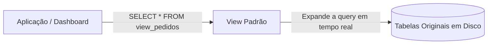
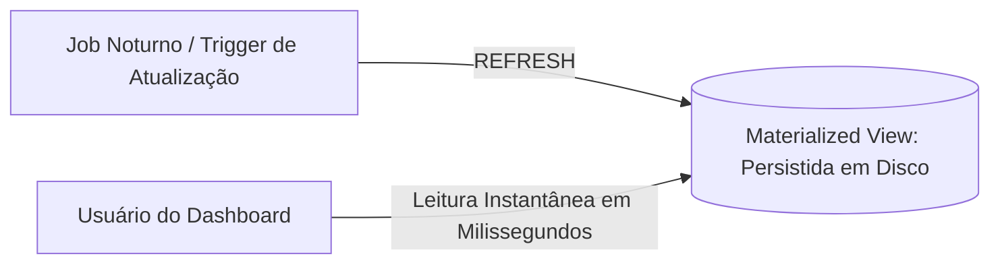

# 🐘 Módulo 04: Recursos Avançados SQL
## 📑 Aula 01: Views e Views Materializadas

> **Navegação**: [⬅️ Módulo 03](../03-manipulacao-dml-e-consultas/README.md) | [Módulo 04](./README.md) | [Próxima Aula: Índices e Otimização ➡️](./02-indices-e-otimizacao.md)

---

### 🎯 Objetivos de Aprendizagem
Ao final desta aula, você será capaz de:
- Criar **Views padrão** para simplificar consultas complexas e proteger colunas confidenciais.
- Compreender quando uma View padrão é atualizável e aplicar `WITH CHECK OPTION`.
- Utilizar **Materialized Views (Views Materializadas)** para acelerar dashboards e relatórios analíticos pesados.
- Executar `REFRESH MATERIALIZED VIEW CONCURRENTLY` sem travar leituras no banco de produção.

---

### 1. View Padrão: A Consulta Salva

Uma **View** é uma tabela virtual baseada no resultado de uma consulta SQL. Ela **não armazena dados em disco**; cada vez que você consulta uma View, o PostgreSQL reexecuta a query interna por baixo dos panos.



#### Principais Usos:
1. **Segurança**: Expor dados a determinados usuários ocultando colunas confidenciais (ex.: ocultar CPF, senhas e salários).
2. **Abstração**: Esconder a complexidade de 5 JOINs sucessivos dos desenvolvedores frontend.

```sql
-- Criando tabelas de exemplo
CREATE TABLE empregados (
    id INT GENERATED ALWAYS AS IDENTITY PRIMARY KEY,
    nome TEXT NOT NULL,
    cargo TEXT NOT NULL,
    salario_bruto NUMERIC(10,2) NOT NULL,
    departamento TEXT NOT NULL
);

INSERT INTO empregados (nome, cargo, salario_bruto, departamento) VALUES
    ('Ana Silva', 'Engenheira de Software', 12500.00, 'Engenharia'),
    ('Bruno Souza', 'Analista de QA', 7500.00, 'Engenharia'),
    ('Clara Rocha', 'Gerente de RH', 14000.00, 'Recursos Humanos');

-- View pública (sem expor o salário confidencial)
CREATE OR REPLACE VIEW vw_equipe_publica AS
SELECT id, nome, cargo, departamento
FROM empregados;

-- Consultando como se fosse uma tabela comum:
SELECT * FROM vw_equipe_publica WHERE departamento = 'Engenharia';
```

---

### 2. Views Materializadas: Cache de Alta Performance em Disco

E se uma consulta analítica demorar 40 segundos para calcular métricas com 10 milhões de registros? Executar essa query a cada visita no dashboard derrubará o banco de dados.

Uma **View Materializada (`MATERIALIZED VIEW`)** executa a consulta uma única vez e **grava o resultado fisicamente em disco**, criando uma réplica estática ultrarrápida.



```sql
-- Criando uma View Materializada de resumo departamental
CREATE MATERIALIZED VIEW mv_resumo_folha AS
SELECT 
    departamento,
    COUNT(*) AS total_colaboradores,
    ROUND(AVG(salario_bruto), 2) AS media_salarial,
    SUM(salario_bruto) AS custo_total
FROM empregados
GROUP BY departamento;

-- Consultar é instantâneo (leitura direta de tabela pré-calculada):
SELECT * FROM mv_resumo_folha;
```

---

### 3. Atualizando os Dados: `REFRESH CONCURRENTLY`

Como a View Materializada é estática, novas inserções na tabela `empregados` não aparecerão na view automaticamente até que ela seja atualizada.

```sql
-- Atualização bloqueante (trava a leitura da view enquanto processa):
REFRESH MATERIALIZED VIEW mv_resumo_folha;
```

#### O Padrão de Produção: Atualização Concorrente (Sem Travamento)
Para atualizar a view em produção sem que os usuários do dashboard recebam lentidão ou erros, criamos um índice único e usamos a cláusula `CONCURRENTLY`:

```sql
-- 1. Obrigatório: Criar um índice UNIQUE em uma ou mais colunas da Materialized View
CREATE UNIQUE INDEX idx_mv_resumo_folha_dept ON mv_resumo_folha (departamento);

-- 2. Atualizar de forma transparente em background (zero downtime de leitura):
REFRESH MATERIALIZED VIEW CONCURRENTLY mv_resumo_folha;
```

---

### 4. Comparativo Definitivo

| Característica | View Padrão (`VIEW`) | View Materializada (`MATERIALIZED VIEW`) |
| :--- | :--- | :--- |
| **Onde os dados ficam?** | Consulta executada na hora (RAM temporária) | Persistidos fisicamente em disco |
| **Frescor dos Dados** | 100% em tempo real | Tão recente quanto o último `REFRESH` |
| **Velocidade de Leitura** | Depende da complexidade dos JOINs | **Extremamente rápida** (leitura direta) |
| **Suporta Índices?** | Não (índices vêm das tabelas originais) | **Sim! Suporta índices próprios (B-Tree, etc.)** |
| **Cenário Ideal** | Segurança, simplificação de código | Dashboards, relatórios de BI, agregações pesadas |

---

### 📝 Exercício Prático

1. Crie uma view padrão chamada `vw_engenharia` que liste apenas os colaboradores do departamento `'Engenharia'`.
2. Tente fazer um `INSERT` diretamente na view adicionando um colaborador de `'Recursos Humanos'`. O que acontece?
3. O que a opção `WITH CHECK OPTION` faria nesse caso?

<details>
<summary>👁️ Clique aqui para ver a explicação e código</summary>

```sql
-- 1. Criação com WITH CHECK OPTION
CREATE OR REPLACE VIEW vw_engenharia AS
SELECT id, nome, cargo, salario_bruto, departamento
FROM empregados
WHERE departamento = 'Engenharia'
WITH CHECK OPTION;

-- 2. Se tentarmos inserir alguém de outro departamento:
INSERT INTO vw_engenharia (nome, cargo, salario_bruto, departamento)
VALUES ('Marcos Lima', 'Recrutador', 6000.00, 'Recursos Humanos');
-- ERRO: new row violates check option for view "vw_engenharia"
```
*A cláusula `WITH CHECK OPTION` impede que dados que violem o `WHERE` da View sejam inseridos ou atualizados através dela!*
</details>

---
> **Navegação**: [⬅️ Módulo 03](../03-manipulacao-dml-e-consultas/README.md) | [Módulo 04](./README.md) | [Próxima Aula: Índices e Otimização ➡️](./02-indices-e-otimizacao.md)
