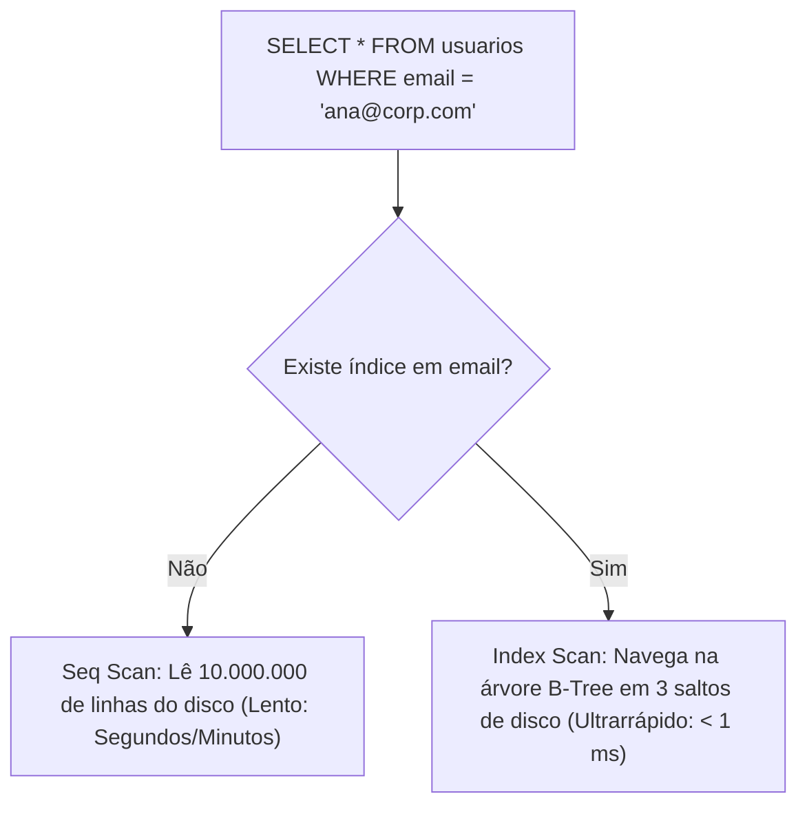

# 🐘 Módulo 04: Recursos Avançados SQL
## 📑 Aula 02: Tipos de Índices, EXPLAIN ANALYZE e Otimização de Queries

> **Navegação**: [⬅️ Aula Anterior: Views](./01-views-e-materialized-views.md) | [Módulo 04](./README.md) | [Próxima Aula: Transações e Concorrência ➡️](./03-transacoes-e-concorrencia.md)

---

### 🎯 Objetivos de Aprendizagem
Ao final desta aula, você será capaz de:
- Compreender o funcionamento interno de índices (árvore B-Tree vs varredura sequencial).
- Diferenciar os 5 tipos de índices do PostgreSQL: **B-Tree**, **Hash**, **GIN**, **GiST** e **BRIN**.
- Criar **Índices Parciais** e **Índices Baseados em Expressões**.
- Interpretar o plano de execução de uma query com **`EXPLAIN (ANALYZE, BUFFERS)`**.
- Criar índices em produção sem bloquear escritas usando **`CREATE INDEX CONCURRENTLY`**.

---

### 1. Por que Precisamos de Índices?

Imagine um livro de 1.000 páginas sobre Medicina. Se você quiser encontrar *"insulina"*:
* **Sem índice (Sequential Scan)**: Você precisa ler página por página do início ao fim (lento: $O(N)$).
* **Com índice (Index Scan)**: Você vai no índice remissivo ao final do livro, descobre que está na página 412 e vai direto até ela (rápido: $O(\log N)$).



---

### 2. O Arsenal de Tipos de Índices do PostgreSQL

O PostgreSQL é famoso por ter a mais sofisticada coleção de estruturas de índices do mundo relacional:

| Tipo de Índice | Estrutura | Casos de Uso Ideais | Operadores Suportados |
| :--- | :--- | :--- | :--- |
| **B-Tree** (Padrão) | Árvore B equilibrada | Chaves primárias, números, datas, strings ordenadas | `=`, `<`, `<=`, `>`, `>=`, `BETWEEN`, `IN` |
| **Hash** | Tabela de espalhamento | Comparações puras de igualdade exata | Apenas `=` |
| **GIN** (Generalized Inverted) | Índice Invertido | **JSONB**, vetores de texto (**Full Text Search**), **Arrays** | `@>`, `?`, `@@` |
| **GiST** | Generalized Search Tree | Dados geométricos (PostGIS), coordenadas geográficas, polígonos, tipos de range (`daterange`) | `&&` (sobreposição), `<->` (distância) |
| **BRIN** (Block Range) | Resumo por blocos | **Tabelas gigantescas sequenciais** (logs, IoT, transações ordenadas por data). Ocupa 1% do tamanho de uma B-Tree! | `=`, `<`, `>` |

---

### 3. Técnicas Avançadas de Indexação

#### A. Índices Parciais (Partial Indexes) - Economia de Espaço
Se você tem 5 milhões de pedidos, mas 95% estão com status `'concluido'`, indexar todas as linhas desperdiça memória. Crie um índice apenas para os 5% que seu sistema busca ativamente:

```sql
CREATE INDEX idx_pedidos_pendentes 
ON pedidos (cliente_id) 
WHERE status = 'pendente';
```

#### B. Índices Baseados em Expressões
Se suas buscas usam funções, uma B-Tree tradicional não será utilizada pelo planejador:

```sql
-- Criando índice funcional para busca insensível a maiúsculas:
CREATE INDEX idx_usuarios_email_lower 
ON usuarios (lower(email));

-- Agora esta query utilizará o índice com velocidade máxima:
SELECT * FROM usuarios WHERE lower(email) = 'usuario@empresa.com';
```

#### C. Índices de Cobertura (`INCLUDE`) - Index Only Scan
Permite responder à consulta inteira sem precisar sequer tocar na tabela física:

```sql
CREATE INDEX idx_produtos_preco_cob 
ON produtos (categoria_id) 
INCLUDE (preco, nome);
```

---

### 4. Laboratório Prático: 100 Mil Registros e `EXPLAIN ANALYZE`

Vamos testar a diferença na prática gerando 100.000 linhas fictícias:

```sql
-- 1. Criar tabela de benchmark
CREATE TABLE auditoria_acessos (
    id INT GENERATED ALWAYS AS IDENTITY PRIMARY KEY,
    ip_origem TEXT NOT NULL,
    status_codigo INT NOT NULL,
    criado_em TIMESTAMPTZ NOT NULL
);

-- 2. Inserir 100.000 registros usando generate_series()
INSERT INTO auditoria_acessos (ip_origem, status_codigo, criado_em)
SELECT 
    '192.168.1.' || (random() * 254)::INT,
    (ARRAY[200, 400, 404, 500])[floor(random() * 4 + 1)],
    NOW() - (random() * 365 || ' days')::INTERVAL
FROM generate_series(1, 100000);
```

#### Teste 1: Consulta SEM índice (Seq Scan)
```sql
EXPLAIN (ANALYZE, BUFFERS)
SELECT * FROM auditoria_acessos WHERE status_codigo = 500;
```

Observe a saída do console:
```text
Seq Scan on auditoria_acessos  (cost=0.00..1935.00 rows=25100 width=36) (actual time=0.015..8.210 rows=24982 loops=1)
  Filter: (status_codigo = 500)
  Buffers: shared hit=685
Planning Time: 0.082 ms
Execution Time: 9.350 ms
```

#### Teste 2: Criando o índice com `CONCURRENTLY` e repetindo
```sql
-- Em produção, NUNCA trave a tabela: use CONCURRENTLY
CREATE INDEX CONCURRENTLY idx_auditoria_status ON auditoria_acessos (status_codigo);

-- Reexecutar a mesma query
EXPLAIN (ANALYZE, BUFFERS)
SELECT * FROM auditoria_acessos WHERE status_codigo = 500;
```

> [!IMPORTANT]
> **Como interpretar os termos do EXPLAIN ANALYZE:**
> * `cost=0.00..1935.00`: Estimativa abstrata calculada pelo planejador.
> * `actual time`: O tempo real medido em milissegundos.
> * `Buffers: shared hit`: Quantidade de páginas de 8KB que já estavam na memória RAM (`shared_buffers`).
> * `Buffers: shared read`: Páginas que precisaram ser lidas fisicamente do disco.

---

### 5. O Custo dos Índices (Não indexe tudo!)

Índices aceleram leituras (`SELECT`), mas tornam operações de escrita (`INSERT`, `UPDATE`, `DELETE`) mais lentas, pois a cada alteração na tabela, todas as árvores de índices correspondentes precisam ser recalculadas e balanceadas.

> [!CAUTION]
> Tabelas com mais de 7 a 10 índices frequentemente apresentam lentidão severa de escrita e consomem gigabytes de memória RAM desnecessários. Crie índices guiando-se estritamente pelas queries mais frequentes e lentas do seu sistema!

---

### 6. Atividade Prática 04: Desafio de Otimização e Index Only Scan

Neste desafio prático, você aplicará os conceitos de `EXPLAIN (ANALYZE, BUFFERS)` e criará um índice de cobertura (*Covering Index*) para transformar uma varredura lenta em um **Index Only Scan** de altíssima performance.

#### Roteiro do Desafio:

```sql
-- Passo 1: Criar tabela de transações
CREATE TABLE transacoes_contas (
    id INT GENERATED ALWAYS AS IDENTITY PRIMARY KEY,
    conta_id INT NOT NULL,
    valor NUMERIC(10,2) NOT NULL,
    tipo VARCHAR(10) NOT NULL,
    efetuada_em TIMESTAMPTZ DEFAULT CURRENT_TIMESTAMP
);

-- Passo 2: Gerar 150.000 registros para simular produção
INSERT INTO transacoes_contas (conta_id, valor, tipo)
SELECT 
    (random() * 1000)::INT + 1,
    (random() * 5000)::NUMERIC(10,2),
    (ARRAY['PIX', 'TED', 'BOLETO'])[floor(random() * 3 + 1)]
FROM generate_series(1, 150000);
```

#### A Consulta Alvo:
```sql
EXPLAIN (ANALYZE, BUFFERS)
SELECT tipo, SUM(valor)
FROM transacoes_contas
WHERE conta_id = 500
GROUP BY tipo;
```
*Observe que o plano exibirá `Seq Scan on transacoes_contas`, lendo 150.000 linhas do disco.*

#### Sua Missão:
Crie um índice que permita ao PostgreSQL responder a essa consulta **sem tocar na tabela física (Heap)**, alcançando o status de `Index Only Scan`.

<details>
<summary>💡 Clique para ver o índice ideal e a análise do plano</summary>

```sql
-- Criando o Índice de Cobertura (Covering Index):
-- conta_id fica na chave de busca da B-Tree
-- tipo e valor são incluídos nas folhas via INCLUDE:
CREATE INDEX idx_transacoes_cob_conta 
ON transacoes_contas (conta_id) 
INCLUDE (tipo, valor);

-- Reexecutar a consulta alvo:
EXPLAIN (ANALYZE, BUFFERS)
SELECT tipo, SUM(valor)
FROM transacoes_contas
WHERE conta_id = 500
GROUP BY tipo;
```

**Resultado esperado:**
* O plano agora exibirá **`Index Only Scan using idx_transacoes_cob_conta`**.
* O tempo de execução cairá de ~20-30 ms para **menos de 0.2 ms** (uma melhoria de mais de 100x!).
* `Heap Fetches: 0` (o motor não precisou ler nenhum bloco de dados da tabela física).
</details>

---

### 📝 Checklist de Otimização

- [ ] Identifiquei as queries lentas ativando a extensão `pg_stat_statements`.
- [ ] Analisei o plano com `EXPLAIN (ANALYZE, BUFFERS)`.
- [ ] Verifiquei se um índice parcial resolveria o problema com menor custo de armazenamento.
- [ ] Em produção, utilizei sempre `CREATE INDEX CONCURRENTLY`.

---
> **Navegação**: [⬅️ Aula Anterior: Views](./01-views-e-materialized-views.md) | [Módulo 04](./README.md) | [Próxima Aula: Transações e Concorrência ➡️](./03-transacoes-e-concorrencia.md)
