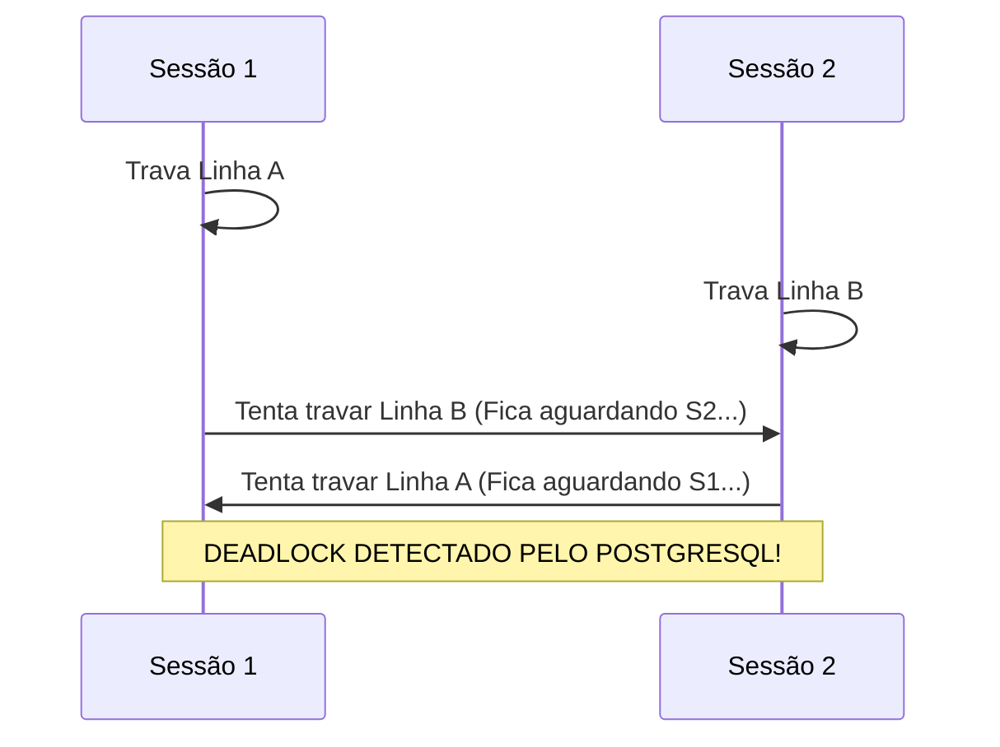

# 🐘 Módulo 04: Recursos Avançados SQL
## 📑 Aula 03: Transações, ACID, Níveis de Isolamento e Locks

> **Navegação**: [⬅️ Aula Anterior: Índices e Otimização](./02-indices-e-otimizacao.md) | [Módulo 04](./README.md) | [Próxima Aula: Funções e Procedures ➡️](./04-funcoes-e-stored-procedures.md)

---

### 🎯 Objetivos de Aprendizagem
Ao final desta aula, você será capaz de:
- Controlar transações complexas com `BEGIN`, `COMMIT`, `ROLLBACK` e `SAVEPOINT`.
- Compreender e configurar os **Níveis de Isolamento**: `READ COMMITTED`, `REPEATABLE READ` e `SERIALIZABLE`.
- Conhecer os fenômenos anômalos de concorrência (Leitura Fantasma, Leituras Não-repetíveis).
- Utilizar bloqueios explícitos de linha com **`SELECT FOR UPDATE`** e **`FOR UPDATE SKIP LOCKED`** (padrão de filas de mensageria).
- Identificar e prevenir **Deadlocks**.

---

### 1. Ciclo de Vida de uma Transação e Savepoints

Uma transação agrupa múltiplos comandos SQL em uma única unidade atômica indivisível.

```mermaid
sequenceDiagram
    autonumber
    actor Dev as Aplicação
    participant PG as PostgreSQL
    Dev->>PG: BEGIN;
    Dev->>PG: UPDATE conta SET saldo = saldo - 100 WHERE id = 1;
    Dev->>PG: SAVEPOINT debito_ok;
    Dev->>PG: UPDATE conta SET saldo = saldo + 100 WHERE id = 999; (Erro: ID não existe!)
    Dev->>PG: ROLLBACK TO SAVEPOINT debito_ok;
    Dev->>PG: UPDATE conta SET saldo = saldo + 100 WHERE id = 2; (Conta correta)
    Dev->>PG: COMMIT;
    Note over Dev,PG: Ambas as contas (1 e 2) foram atualizadas de forma segura e atômica.
```

```sql
BEGIN;

-- Primeira etapa
UPDATE contas SET saldo = saldo - 250.00 WHERE id = 10;

-- Criando um ponto de restauração intermediário
SAVEPOINT etapa_1;

-- Tentativa arriscada
INSERT INTO auditoria_log (evento) VALUES ('Tentativa de saque especial');

-- Se algo der errado apenas nesta etapa:
ROLLBACK TO SAVEPOINT etapa_1;

-- Efetivar o restante
COMMIT;
```

---

### 2. Os 4 Níveis de Isolamento de Transação

O padrão ANSI SQL define quatro níveis de isolamento para mitigar anomalias concorrentes. O PostgreSQL **não implementa `READ UNCOMMITTED`**, pois seu mecanismo MVCC garante que leituras sujas (*Dirty Reads*) nunca ocorram!

| Fenômeno Anômalo | `READ COMMITTED` (Padrão) | `REPEATABLE READ` | `SERIALIZABLE` |
| :--- | :---: | :---: | :---: |
| **Dirty Read** (Ler dados não commitados) | ❌ Impossível | ❌ Impossível | ❌ Impossível |
| **Non-repeatable Read** (Mesma query ler dados alterados por outro commit no meio da transação) | ⚠️ Pode Ocorrer | ❌ Impossível | ❌ Impossível |
| **Phantom Read** (Novas linhas inseridas aparecem em contagens repetidas) | ⚠️ Pode Ocorrer | ❌ Impossível | ❌ Impossível |
| **Serialization Anomaly** (Conflitos lógicos complexos entre transações concorrentes) | ⚠️ Pode Ocorrer | ⚠️ Pode Ocorrer | ❌ **Totalmente Impossível** |

```sql
-- Alterando o nível de isolamento da transação atual:
BEGIN TRANSACTION ISOLATION LEVEL REPEATABLE READ;
-- ou o mais estrito:
BEGIN TRANSACTION ISOLATION LEVEL SERIALIZABLE;
```

> [!NOTE]
> No nível **`SERIALIZABLE`**, se o PostgreSQL detectar um conflito de serialização entre transações concorrentes, ele abortará uma delas com o erro `40001: could not serialize access due to read/write dependencies`. A aplicação backend deve estar preparada para **tentar novamente (retry)** a transação!

---

### 3. Bloqueio Concorrente: `SELECT FOR UPDATE`

Quando dois clientes tentam comprar o último produto em estoque ao mesmo tempo, um `SELECT` comum não impede que ambos leiam `estoque = 1` e tentem subtrair.

Para evitar isso, travamos as linhas selecionadas com **`FOR UPDATE`**:

```sql
BEGIN;

-- Bloqueia a linha daquele produto para outras transações até este commit/rollback:
SELECT estoque 
FROM produtos 
WHERE id = 50 
FOR UPDATE;

-- Outra transação concorrente que tentar rodar FOR UPDATE no id 50 ficará aguardando aqui!

UPDATE produtos 
SET estoque = estoque - 1 
WHERE id = 50;

COMMIT;
```

#### O Padrão Ouro para Filas de Mensageria: `SKIP LOCKED`
Se você tem 10 workers de background processando tarefas pendentes:

```sql
-- Cada worker pega a próxima tarefa livre sem bloquear os outros workers!
SELECT id, payload
FROM fila_de_tarefas
WHERE status = 'pendente'
ORDER BY id ASC
LIMIT 1
FOR UPDATE SKIP LOCKED;
```

---

### 4. Deadlocks: Como Ocorrem e Como Evitar

Um **Deadlock** (Impasse) ocorre quando duas sessões ficam eternamente esperando uma pela outra para liberar uma trava:



O PostgreSQL possui um detector de deadlock em background (`deadlock_timeout`, padrão 1 segundo). Ao detectar o ciclo, ele aborta automaticamente uma das transações com o erro:
`ERROR: deadlock detected`.

#### Como evitar Deadlocks em 100% das vezes:
> [!TIP]
> **Regra da Ordem Canônica**: Sempre acesse e atualize as tabelas e linhas **na mesma ordem determinística** em todas as partes da sua aplicação (por exemplo, ordenando os IDs de forma crescente: `WHERE id IN (1, 2) ORDER BY id`).

---

### 📝 Checklist de Transações Seguras

- [ ] Nunca deixo transações abertas esquecidas no backend sem fechar conexão.
- [ ] Conheço o uso de `SAVEPOINT` para tratamento de erros parciais.
- [ ] Uso `FOR UPDATE SKIP LOCKED` para construir sistemas de fila nativos no Postgres.
- [ ] Padronizei a ordem de atualização de entidades para evitar Deadlocks.

---
> **Navegação**: [⬅️ Aula Anterior: Índices e Otimização](./02-indices-e-otimizacao.md) | [Módulo 04](./README.md) | [Próxima Aula: Funções e Procedures ➡️](./04-funcoes-e-stored-procedures.md)
