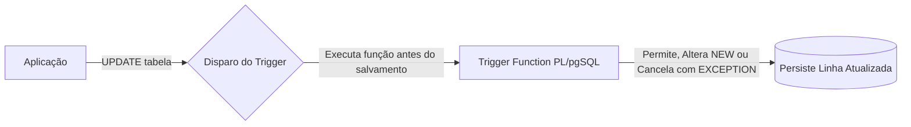

# 🐘 Módulo 04: Recursos Avançados SQL
## 📑 Aula 04: Funções, Stored Procedures e Triggers em PL/pgSQL

> **Navegação**: [⬅️ Aula Anterior: Transações](./03-transacoes-e-concorrencia.md) | [Módulo 04](./README.md) | [Próxima Aula: Window Functions e CTEs ➡️](./05-window-functions-e-ctes.md)

---

### 🎯 Objetivos de Aprendizagem
Ao final desta aula, você será capaz de:
- Diferenciar **Functions** (`CREATE FUNCTION`) e **Procedures** (`CREATE PROCEDURE`).
- Escrever lógica procedural em **PL/pgSQL** com variáveis, blocos condicionais e laços.
- Configurar a volatilidade de funções (`IMMUTABLE`, `STABLE`, `VOLATILE`) para ganho de performance.
- Desenvolver **Triggers** de linha e de instrução utilizando os objetos especiais `NEW` e `OLD`.
- Implementar auditoria automática de alterações e timestamps de atualização.

---

### 1. Funções vs Procedures: A Diferença Fundamental

Historicamente o PostgreSQL suportava apenas funções. Desde a versão 11, o padrão SQL completo introduziu **Procedures**:

| Característica | Funções (`FUNCTION`) | Procedimentos (`PROCEDURE`) |
| :--- | :--- | :--- |
| **Retorno** | **Obrigatório** retornar um valor ou conjunto de dados | Não retorna valor diretamente (usa parâmetros `INOUT`) |
| **Invocação** | Chamadas via `SELECT nome_funcao(...)` | Chamadas via `CALL nome_procedure(...)` |
| **Controle Transacional** | **Não pode** fazer `COMMIT` ou `ROLLBACK` internamente | **Pode executar `COMMIT` e `ROLLBACK`** no meio da execução! |

---

### 2. Escrevendo Funções em PL/pgSQL

```sql
-- Função para calcular desconto progressivo baseado no total
CREATE OR REPLACE FUNCTION calcular_desconto(
    p_valor_bruto NUMERIC,
    p_cliente_vip BOOLEAN
)
RETURNS NUMERIC
LANGUAGE plpgsql
IMMUTABLE -- Promessa ao otimizador: mesmo input sempre retorna mesmo output!
AS $$
DECLARE
    v_percentual NUMERIC := 0.05; -- 5% base
    v_desconto_final NUMERIC;
BEGIN
    IF p_cliente_vip THEN
        v_percentual := v_percentual + 0.10; -- +10% se for VIP
    END IF;

    IF p_valor_bruto > 1000.00 THEN
        v_percentual := v_percentual + 0.05; -- +5% para compras grandes
    END IF;

    v_desconto_final := p_valor_bruto * v_percentual;
    RETURN ROUND(v_desconto_final, 2);
END;
$$;

-- Executando a função:
SELECT calcular_desconto(1500.00, TRUE) AS desconto_vip;
-- Retorno: 300.00 (20% de desconto)
```

> [!TIP]
> **Categorias de Volatilidade de Funções:**
> * **`IMMUTABLE`**: Nunca altera dados e sempre retorna o mesmo valor para os mesmos parâmetros (ex.: cálculo matemático). Pode ser usada em índices baseados em expressões.
> * **`STABLE`**: Retorna o mesmo valor dentro de uma mesma varredura de transação (ex.: funções que usam `NOW()` ou consultam tabelas de parâmetros).
> * **`VOLATILE`**: Pode mudar a cada chamada, mesmo com mesmos parâmetros (ex.: `random()`, ou funções que alteram tabelas).

---

### 3. Escrevendo Procedures com Transações Internas

```sql
CREATE OR REPLACE PROCEDURE processar_fechamento_mensal(p_mes INT)
LANGUAGE plpgsql
AS $$
BEGIN
    -- Etapa 1
    INSERT INTO logs_processamento (etapa) VALUES ('Iniciando lote 1');
    COMMIT; -- Confirma a primeira etapa imediatamente!

    -- Etapa 2
    UPDATE faturas SET status = 'fechada' WHERE EXTRACT(MONTH FROM vencimento) = p_mes;
    COMMIT; -- Confirma a segunda etapa!
END;
$$;

-- Invocando:
CALL processar_fechamento_mensal(10);
```

---

### 4. Triggers (Gatilhos) e Auditoria Automática

Um **Trigger** é uma função disparada automaticamente pelo PostgreSQL em resposta a eventos de `INSERT`, `UPDATE` ou `DELETE`.



#### A. O Padrão Universal: `atualizado_em` Automático

```sql
-- 1. Criar a função genérica que atualiza o timestamp
CREATE OR REPLACE FUNCTION trigger_atualizar_timestamp()
RETURNS TRIGGER
LANGUAGE plpgsql
AS $$
BEGIN
    NEW.atualizado_em = CURRENT_TIMESTAMP;
    RETURN NEW;
END;
$$;

-- 2. Tabela de exemplo
CREATE TABLE postagens (
    id INT GENERATED ALWAYS AS IDENTITY PRIMARY KEY,
    titulo TEXT NOT NULL,
    conteudo TEXT NOT NULL,
    criado_em TIMESTAMPTZ DEFAULT CURRENT_TIMESTAMP,
    atualizado_em TIMESTAMPTZ DEFAULT CURRENT_TIMESTAMP
);

-- 3. Criar o gatilho vinculado
CREATE TRIGGER tg_postagens_atualizado_em
    BEFORE UPDATE ON postagens
    FOR EACH ROW
    EXECUTE FUNCTION trigger_atualizar_timestamp();
```

#### B. Triggers de Auditoria com `OLD` e `NEW`

```sql
CREATE TABLE auditoria_precos (
    id INT GENERATED ALWAYS AS IDENTITY PRIMARY KEY,
    produto_id INT NOT NULL,
    preco_antigo NUMERIC(10,2) NOT NULL,
    preco_novo NUMERIC(10,2) NOT NULL,
    modificado_por TEXT DEFAULT CURRENT_USER,
    modificado_em TIMESTAMPTZ DEFAULT CURRENT_TIMESTAMP
);

CREATE OR REPLACE FUNCTION auditar_mudanca_preco()
RETURNS TRIGGER
LANGUAGE plpgsql
AS $$
BEGIN
    -- Dispara apenas se o preço realmente foi alterado
    IF NEW.preco <> OLD.preco THEN
        INSERT INTO auditoria_precos (produto_id, preco_antigo, preco_novo)
        VALUES (OLD.id, OLD.preco, NEW.preco);
    END IF;
    RETURN NEW;
END;
$$;

CREATE TRIGGER tg_auditoria_produtos
    AFTER UPDATE ON produtos
    FOR EACH ROW
    EXECUTE FUNCTION auditar_mudanca_preco();
```

> [!IMPORTANT]
> Em triggers:
> * **`BEFORE`**: Útil para validar ou modificar dados no objeto `NEW` antes de salvar.
> * **`AFTER`**: Útil para disparar ações secundárias (como gravar em tabelas de log ou auditoria) após a garantia do sucesso da linha.
> * **`NEW`**: Contém a linha que está sendo inserida ou o novo estado no update.
> * **`OLD`**: Contém a linha anterior no update ou a linha sendo apagada no delete.

---

### 📝 Exercício Prático

Crie um trigger `BEFORE INSERT OR UPDATE` que garanta que a coluna `cpf` de uma tabela `clientes` nunca contenha pontos ou traços (isto é, substitua caracteres não numéricos por string vazia antes de gravar).

<details>
<summary>👁️ Clique aqui para ver o código da solução</summary>

```sql
CREATE OR REPLACE FUNCTION sanitizar_cpf()
RETURNS TRIGGER
LANGUAGE plpgsql
AS $$
BEGIN
    -- Remove tudo que não for dígito numérico (0-9)
    NEW.cpf := REGEXP_REPLACE(NEW.cpf, '\D', '', 'g');
    RETURN NEW;
END;
$$;

CREATE TRIGGER tg_sanitizar_cpf_clientes
    BEFORE INSERT OR UPDATE OF cpf ON clientes
    FOR EACH ROW
    EXECUTE FUNCTION sanitizar_cpf();
```
</details>

---
> **Navegação**: [⬅️ Aula Anterior: Transações](./03-transacoes-e-concorrencia.md) | [Módulo 04](./README.md) | [Próxima Aula: Window Functions e CTEs ➡️](./05-window-functions-e-ctes.md)
