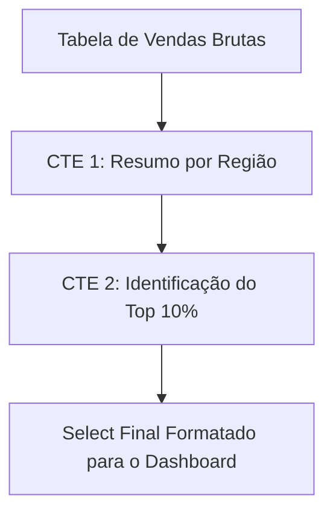
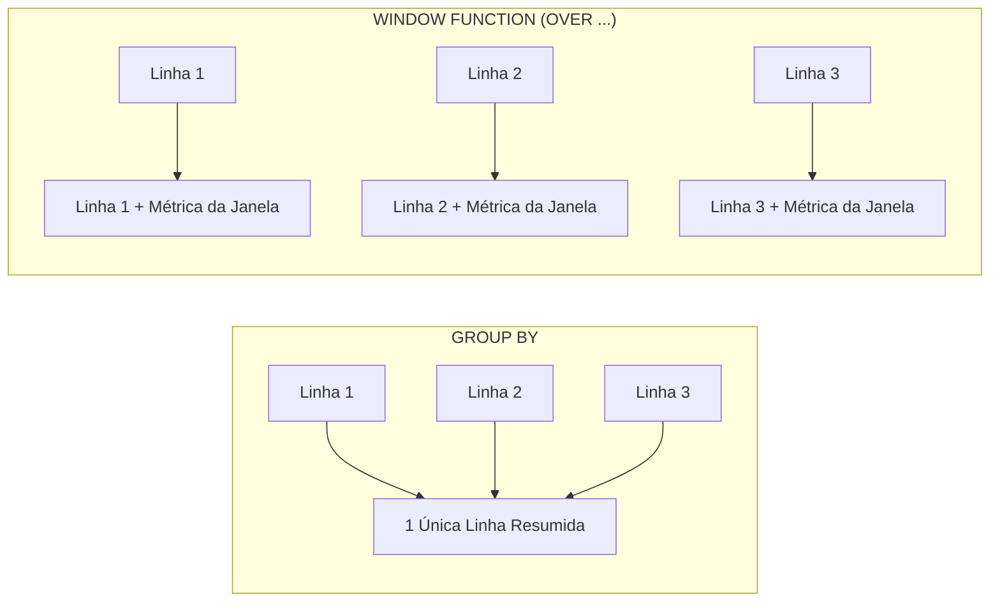

# 🐘 Módulo 04: Recursos Avançados SQL
## 📑 Aula 05: Window Functions e CTEs (Recursivas e Modificadoras)

> **Navegação**: [⬅️ Aula Anterior: Funções e Triggers](./04-funcoes-e-stored-procedures.md) | [Módulo 04](./README.md) | [Módulo 05: Neon PostgreSQL Cloud ➡️](../05-neon-postgresql-cloud/README.md)

---

### 🎯 Objetivos de Aprendizagem
Ao final desta aula, você será capaz de:
- Escrever consultas modulares e legíveis com **CTEs (Common Table Expressions)**.
- Executar operações avançadas com **CTEs Modificadoras de Dados** (`WITH ... DELETE / INSERT`).
- Resolver árvores hierárquicas e grafos com **CTEs Recursivas** (`WITH RECURSIVE`).
- Dominar **Window Functions** (`ROW_NUMBER`, `RANK`, `DENSE_RANK`, `NTILE`).
- Realizar análises temporais de crescimento mês a mês com **`LAG()`** e **`LEAD()`**.
- Calcular totais acumulados (*Running Totals*) e médias móveis sem agrupar linhas.

---

### 1. Common Table Expressions (CTEs)

Uma **CTE** (definida com a cláusula `WITH`) atua como uma tabela temporária nomeada existente apenas durante o escopo daquela instrução SQL.



```sql
WITH metricas_departamento AS (
    SELECT 
        departamento,
        AVG(salario_bruto) AS media_salario,
        COUNT(*) AS total_funcionarios
    FROM empregados
    GROUP BY departamento
)
SELECT 
    e.nome,
    e.salario_bruto,
    m.media_salario,
    ROUND(e.salario_bruto - m.media_salario, 2) AS diferenca_da_media
FROM empregados e
JOIN metricas_departamento m ON e.departamento = m.departamento
WHERE e.salario_bruto > m.media_salario;
```

---

### 2. CTEs com Modificação de Dados (Exclusivo PostgreSQL)

No PostgreSQL, você pode mover dados de uma tabela para outra de forma **100% atômica** em uma única query combinando CTEs com `RETURNING`:

```sql
-- Movendo pedidos cancelados para uma tabela de histórico arquivado:
WITH pedidos_expurgados AS (
    DELETE FROM pedidos
    WHERE status = 'cancelado' AND criado_em < NOW() - INTERVAL '1 year'
    RETURNING id, cliente_id, valor_total, criado_em
)
INSERT INTO historico_pedidos_arquivados (pedido_id, cliente_id, valor, data_original)
SELECT id, cliente_id, valor_total, criado_em
FROM pedidos_expurgados;
```

---

### 3. CTEs Recursivas: Hierarquias e Grafos

Como navegar por uma hierarquia de funcionários (organograma) de profundidade infinita? Usamos **`WITH RECURSIVE`**:

```sql
WITH RECURSIVE organograma AS (
    -- Caso Base (Âncora): Encontrar o Presidente / CEO (quem não tem gerente)
    SELECT id, nome, gerente_id, 1 AS nivel, nome AS trilha_hierarquica
    FROM colaboradores
    WHERE gerente_id IS NULL

    UNION ALL

    -- Passo Recursivo: Encontrar subordinados de quem já encontramos
    SELECT 
        c.id, 
        c.nome, 
        c.gerente_id, 
        o.nivel + 1,
        o.trilha_hierarquica || ' ➡️ ' || c.nome
    FROM colaboradores c
    JOIN organograma o ON c.gerente_id = o.id
)
SELECT nivel, trilha_hierarquica FROM organograma ORDER BY nivel;
```

---

### 4. Window Functions: O Conceito da "Janela"

Enquanto o `GROUP BY` colapsa múltiplas linhas em uma só, uma **Window Function** calcula agregações **mantendo todas as linhas individuais intactas**.



A anatomia da cláusula de janela é:
```sql
FUNCAO() OVER (
    PARTITION BY [coluna_de_grupo] 
    ORDER BY [coluna_de_ordem]
    [ROWS BETWEEN ...]
)
```

---

### 5. Funções de Ranking: `ROW_NUMBER`, `RANK` e `DENSE_RANK`

Qual a diferença entre eles? Vejamos na prática quando há empates nos valores:

| Pontuação | `ROW_NUMBER()` | `RANK()` (Pula posições) | `DENSE_RANK()` (Sem saltos) |
| :---: | :---: | :---: | :---: |
| 100 pts | 1 | 1 | 1 |
| 90 pts | 2 | 2 | 2 |
| 90 pts | 3 | 2 | 2 |
| 80 pts | 4 | 4 *(pulou o 3)* | 3 *(denso!)* |

```sql
-- Identificando os top 3 salários de cada departamento individual:
WITH ranking_salarios AS (
    SELECT 
        nome,
        departamento,
        salario_bruto,
        DENSE_RANK() OVER (PARTITION BY departamento ORDER BY salario_bruto DESC) AS rank_dept
    FROM empregados
)
SELECT * FROM ranking_salarios WHERE rank_dept <= 3;
```

---

### 6. Funções de Deslocamento Temporal: `LAG()` e `LEAD()`

Essenciais para comparar o desempenho do mês atual com o mês anterior (Análise MoM - *Month over Month*):

```sql
SELECT 
    mes_ano,
    faturamento,
    LAG(faturamento, 1) OVER (ORDER BY mes_ano) AS faturamento_mes_anterior,
    ROUND(
        ((faturamento - LAG(faturamento, 1) OVER (ORDER BY mes_ano)) / 
        LAG(faturamento, 1) OVER (ORDER BY mes_ano)) * 100, 
        2
    ) AS variacao_percentual_mom
FROM relatorio_faturamento_mensal;
```

#### Total Acumulado (Running Total):
```sql
SELECT 
    data_venda,
    valor,
    SUM(valor) OVER (ORDER BY data_venda ROWS BETWEEN UNBOUNDED PRECEDING AND CURRENT ROW) AS total_acumulado_ano
FROM vendas_filiais;
```

---

### 📝 Exercício Prático

Dada uma tabela com vendas diárias de um vendedor, escreva uma query que retorne:
1. Data da venda.
2. Valor da venda.
3. Valor da venda anterior feita por aquele mesmo vendedor.
4. Média móvel dos últimos 3 lançamentos (a linha atual e as 2 anteriores).

<details>
<summary>👁️ Clique aqui para ver a solução</summary>

```sql
SELECT 
    data_venda,
    vendedor,
    valor,
    LAG(valor, 1) OVER (PARTITION BY vendedor ORDER BY data_venda) AS valor_anterior,
    ROUND(
        AVG(valor) OVER (
            PARTITION BY vendedor 
            ORDER BY data_venda 
            ROWS BETWEEN 2 PRECEDING AND CURRENT ROW
        ), 
        2
    ) AS media_movel_3_periodos
FROM vendas_filiais;
```
</details>

---
> **Navegação**: [⬅️ Aula Anterior: Funções e Triggers](./04-funcoes-e-stored-procedures.md) | [Módulo 04](./README.md) | [Módulo 05: Neon PostgreSQL Cloud ➡️](../05-neon-postgresql-cloud/README.md)
