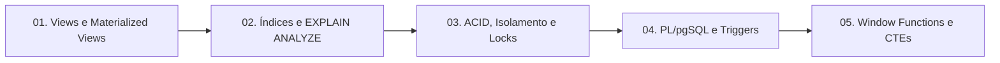

# 🐘 Módulo 04: Recursos Avançados SQL

Neste módulo, você mergulha nos mecanismos internos e nas técnicas de engenharia que separam um operador de banco de dados de um verdadeiro Arquiteto de Dados e Desenvolvedor Sênior.

---

## 🗺️ Mapa de Conteúdo do Módulo

---

## 📑 Aulas Disponíveis

1. [**Aula 01: Views e Views Materializadas**](./01-views-e-materialized-views.md)
   - Views virtuais para abstração e segurança.
   - Restrição de inserção com `WITH CHECK OPTION`.
   - Views Materializadas para relatórios analíticos de alta velocidade.
   - Atualização em segundo plano com `REFRESH MATERIALIZED VIEW CONCURRENTLY`.

2. [**Aula 02: Tipos de Índices, EXPLAIN ANALYZE e Otimização de Queries**](./02-indices-e-otimizacao.md)
   - B-Tree, Hash, GIN (JSONB e busca textual), GiST e BRIN para big data.
   - Índices parciais e baseados em funções.
   - Leitura minuciosa de planos de execução com `EXPLAIN (ANALYZE, BUFFERS)`.
   - Criação sem travamento com `CREATE INDEX CONCURRENTLY`.

3. [**Aula 03: Transações, ACID, Níveis de Isolamento e Locks**](./03-transacoes-e-concorrencia.md)
   - Savepoints e rollbacks parciais.
   - Os níveis de isolamento ANSI: `READ COMMITTED`, `REPEATABLE READ`, `SERIALIZABLE`.
   - Bloqueio explícito com `SELECT ... FOR UPDATE` e `FOR UPDATE SKIP LOCKED`.
   - Detecção, anatomia e prevenção determinística de Deadlocks.

4. [**Aula 04: Funções, Stored Procedures e Triggers em PL/pgSQL**](./04-funcoes-e-stored-procedures.md)
   - Diferenças críticas entre `FUNCTION` e `PROCEDURE`.
   - Volatilidade de funções: `IMMUTABLE`, `STABLE` e `VOLATILE`.
   - Triggers `BEFORE` e `AFTER` com pseudo-registros `NEW` e `OLD`.
   - Sanitização de dados e auditoria automatizada.

5. [**Aula 05: Window Functions e CTEs (Recursivas e Modificadoras)**](./05-window-functions-e-ctes.md)
   - CTEs legíveis e modulares com `WITH`.
   - CTEs que movem dados atomicamente com `DELETE ... RETURNING` e `INSERT`.
   - Navegação em árvores genealógicas e organogramas com `WITH RECURSIVE`.
   - Funções de Janela: `ROW_NUMBER`, `RANK`, `DENSE_RANK`, `LAG`, `LEAD` e médias móveis.

---

## 🧭 Navegação Rápida
* [⬅️ Voltar para o Módulo 03: Manipulação DML](../03-manipulacao-dml-e-consultas/README.md)
* [Ir para o Módulo 05: Neon PostgreSQL Cloud ➡️](../05-neon-postgresql-cloud/README.md)
