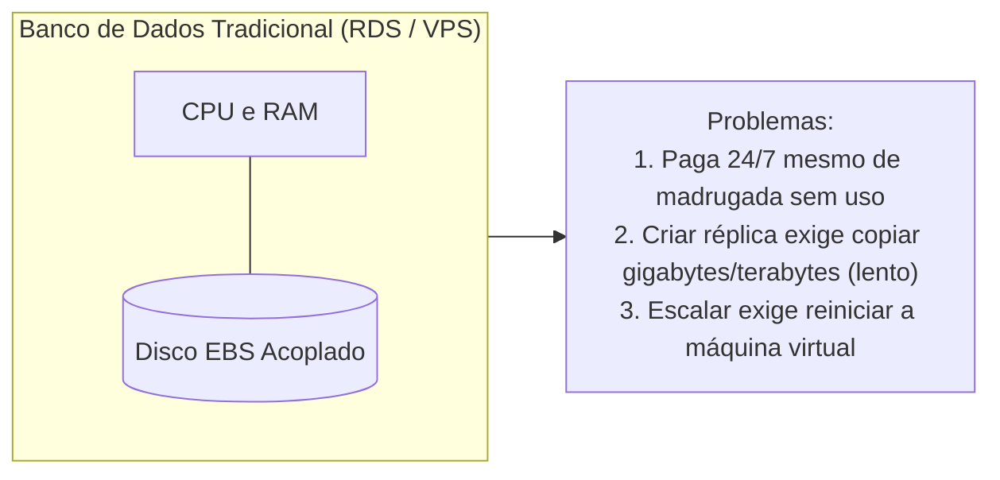
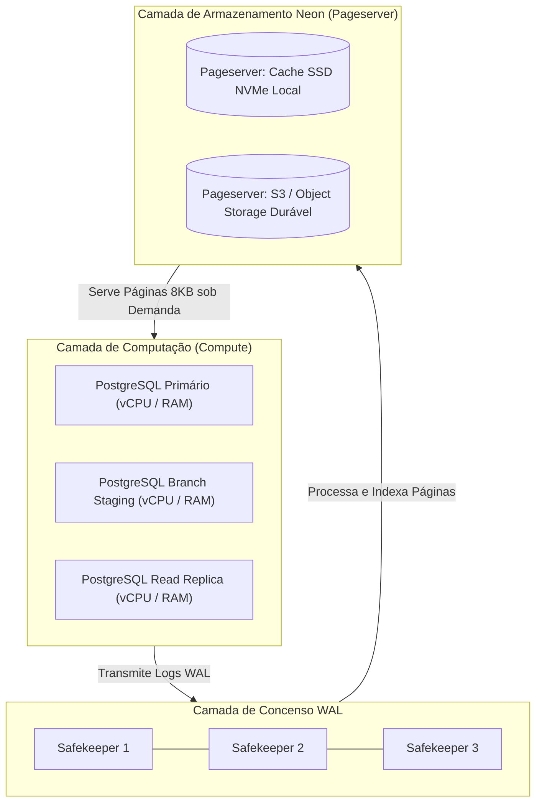

# ⚡ Módulo 05: Neon Serverless PostgreSQL
## 📑 Aula 01: O que é o Neon e a Revolução da Separação entre Compute e Storage

> **Navegação**: [⬅️ Módulo 04](../04-recursos-avancados-sql/README.md) | [Módulo 05](./README.md) | [Próxima Aula: Setup e Conexões ➡️](./02-setup-e-primeiros-passos.md)

---

### 🎯 Objetivos de Aprendizagem
Ao final desta aula, você será capaz de:
- Compreender por que bancos de dados tradicionais monolíticos na nuvem (AWS RDS, instâncias VPS) são ineficientes para desenvolvimento moderno.
- Explicar a arquitetura interna do Neon baseada na **desassociação total entre Computação (Compute) e Armazenamento (Storage)**.
- Entender como funcionam os **Pageservers** e **Safekeepers** no motor open source do Neon.
- Reconhecer os benefícios operacionais: inicialização rápida, *Scale to Zero* e custo sob demanda.

---

### 1. O Problema da Nuvem Tradicional (Arquitetura Acoplada)

Nos serviços tradicionais de banco de dados na nuvem (como instâncias tradicionais EC2 ou RDS padrão), a CPU, a RAM e o Disco Rígido (EBS) estão rigidamente amarrados à mesma máquina virtual:

* **Custo Ocioso**: Se seus alunos ou sua aplicação dormem das 22h às 08h, você continua pagando 100% da conta de computação.
* **Clonagem Demorada**: Clonar um banco de dados de 500 GB para testes demora horas de cópia de blocos de disco.
* **Conexões Limitadas**: Aplicações Serverless (AWS Lambda, Vercel, Cloudflare Workers) abrem milhares de conexões simultâneas e derrubam o limite de conexões do PostgreSQL.

---

### 2. A Solução Neon: Arquitetura Serverless Desacoplada

O **Neon** (projeto open source escrito em Rust e C) redesenhou a fundação do PostgreSQL separando as duas funções em camadas totalmente independentes:

#### Os 3 Pilares da Arquitetura do Neon:

1. **Camada de Computação (Compute Engine)**:
   - É um binário regular do PostgreSQL 16/17 rodando em containers ultraleves (MicroVMs).
   - Não possui disco rígido persistente local!
   - Se não receber requisições por alguns minutos, o container de computação **desliga automaticamente (*Scale to Zero*)**, zerando o custo de CPU e RAM.
   - Ao chegar uma nova requisição via porta 5432, ele inicia em menos de **500 milissegundos**.

2. **Safekeepers (Camada de Consenso WAL)**:
   - Conjunto de nós que recebem o fluxo de WAL do compute em tempo real via algoritmo Paxos/Raft.
   - Garantem que nenhuma transação confirmada seja perdida.

3. **Pageservers (Armazenamento Customizado)**:
   - Substituem o sistema de arquivos tradicional do PostgreSQL (`PGDATA`).
   - O Pageserver entende nativamente a estrutura interna de páginas de 8KB do Postgres.
   - Mantém uma árvore histórica de todas as versões de cada página ao longo do tempo (semelhante ao Git).
   - Arquiva dados frios automaticamente em Object Storage (como Amazon S3), reduzindo os custos de armazenamento drasticamente.

---

### 3. Por que isso Muda o Jogo para Professores e Equipes?

| Benefício | Impacto na Prática |
| :--- | :--- |
| **Gratuito para Estudos** | O plano gratuito oferece projetos com computação e storage sem exigir cartão de crédito. |
| **Instant Branching** | Cria clones exatos do banco em **1 segundo** usando técnica *Copy-on-Write*, sem duplicar dados. |
| **Ambientes por Aluno** | Cada estudante ou cada Pull Request pode ter seu próprio banco isolado com dados reais. |
| **Connection Pooling Nativo** | Suporta dezenas de milhares de conexões simultâneas usando PgBouncer transparente. |
| **Point-in-Time Recovery (PITR)** | Permite voltar o banco para qualquer segundo exato do passado se alguém executar um `DELETE` sem `WHERE`. |

> [!NOTE]
> O Neon é **100% compatível com o PostgreSQL upstream**. Qualquer ferramenta, query, extensão ou driver que funcione com o PostgreSQL oficial funciona de forma idêntica no Neon.

---

### 📝 Checklist de Compreensão

- [ ] Entendi a diferença entre bancos acoplados (RDS tradicional) e desacoplados (Neon).
- [ ] Sei qual o papel dos nós *Safekeepers* e *Pageservers*.
- [ ] Compreendi como o recurso *Scale to Zero* economiza recursos financeiros.
- [ ] Sei que o Neon roda o binário do PostgreSQL padrão, mantendo total compatibilidade de comandos SQL.

---
> **Navegação**: [⬅️ Módulo 04](../04-recursos-avancados-sql/README.md) | [Módulo 05](./README.md) | [Próxima Aula: Setup e Conexões ➡️](./02-setup-e-primeiros-passos.md)
