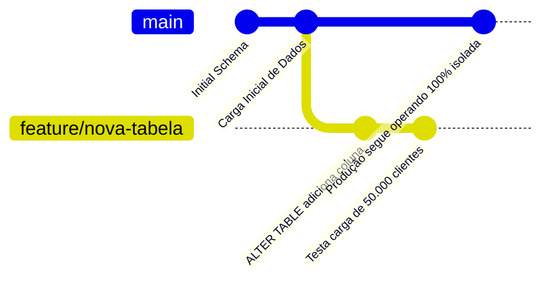
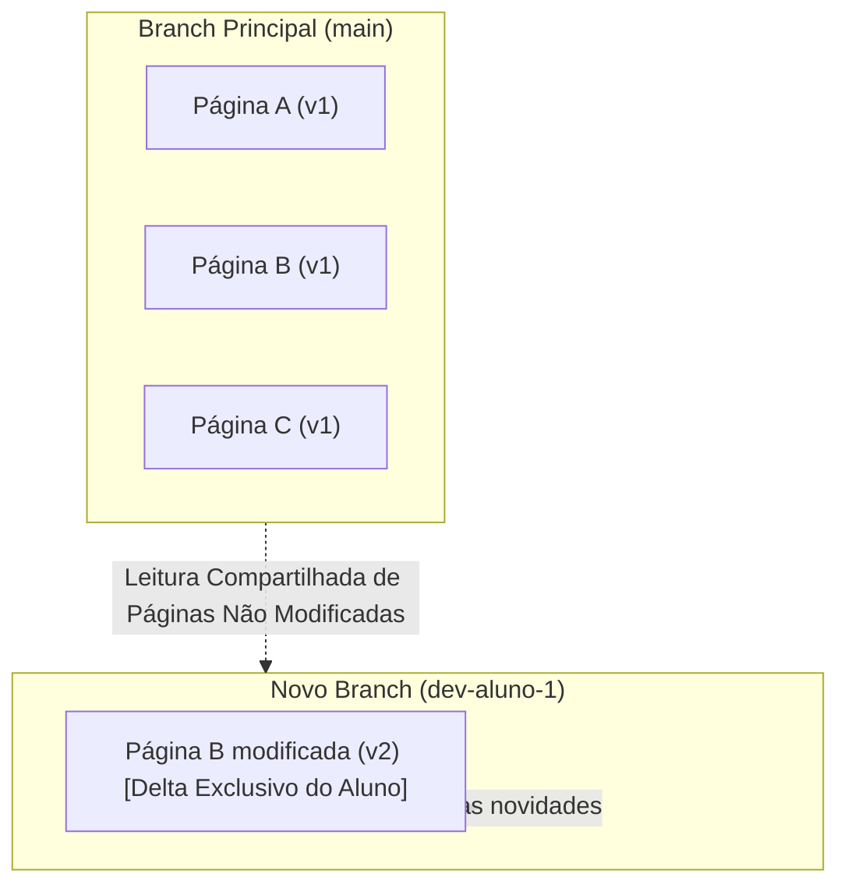
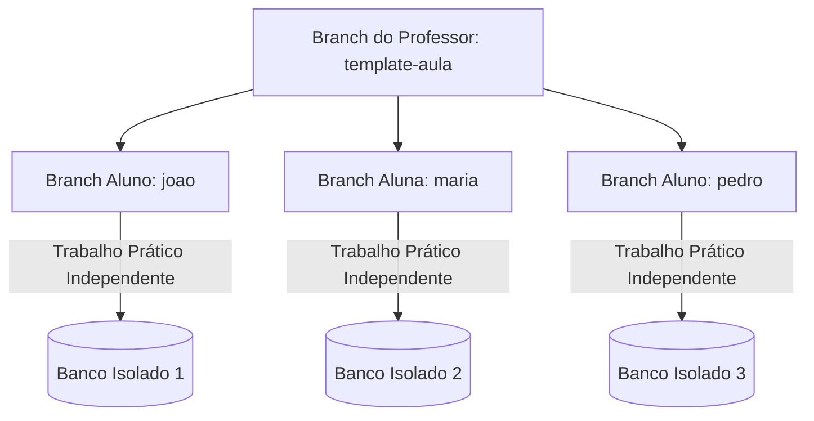
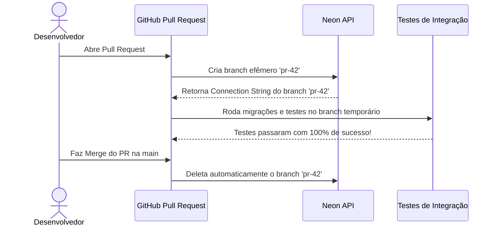

# ⚡ Módulo 05: Neon Serverless PostgreSQL
## 📑 Aula 03: Database Branching: Git para Bancos de Dados

> **Navegação**: [⬅️ Aula Anterior: Setup e Conexões](./02-setup-e-primeiros-passos.md) | [Módulo 05](./README.md) | [Próxima Aula: Escala e PITR ➡️](./04-escala-e-alta-disponibilidade.md)

---

### 🎯 Objetivos de Aprendizagem
Ao final desta aula, você será capaz de:
- Compreender o conceito inovador de **Database Branching** e a tecnologia *Copy-on-Write*.
- Criar branches instantâneos isolados com dados e schema ou apenas schema.
- Integrar branches do banco com fluxos de desenvolvimento Git, Pull Requests e CI/CD.
- Aplicar o branching em sala de aula para fornecer um banco de dados independente e idêntico para cada estudante.
- Gerenciar branches pelo Neon Console e pela CLI (`neonctl`).

---

### 1. O que é Database Branching?

No desenvolvimento moderno de software com Git, nós criamos branches para desenvolver novas funcionalidades de código de forma isolada:
```bash
git checkout -b feature/novo-checkout
```

Por décadas, o banco de dados foi o **elo fraco** desse fluxo: desenvolvedores precisavam usar bancos locais desatualizados ou competir por um ambiente de "staging" compartilhado onde um desenvolvedor quebrava os dados do outro.

O **Neon** resolveu esse problema histórico ao trazer branches nativos para o PostgreSQL em nível de armazenamento:



---

### 2. Como Funciona Fisicamente: A Mágica do *Copy-on-Write*

Como é possível criar um branch de um banco de dados de 500 GB em apenas **1 segundo** sem custo adicional exorbitante?



1. **Sem cópia inicial de bytes**: Ao criar o branch, o Pageserver do Neon cria apenas um ponteiro de metadados apontando para o instante exato do branch pai (Log Sequence Number - LSN).
2. **Copy-on-Write**: Enquanto você apenas lê dados no branch filho, você lê as páginas compartilhadas do pai.
3. **Isolamento de Escrita**: Quando você executa um `INSERT`, `UPDATE` ou `DROP TABLE` no branch filho, apenas os novos blocos modificados (*deltas*) são gravados para aquele branch específico. O branch pai permanece completamente inalterado e seguro!

> [!NOTE]
> Você pode rodar `DROP TABLE clientes;` dentro de uma branch de teste sem nenhum medo: a tabela no branch `main` continuará 100% intacta!

---

### 3. Tipos de Branches no Neon

Ao criar um branch, você escolhe entre duas estratégias:

| Tipo de Branch | O que Contém? | Melhor Caso de Uso |
| :--- | :--- | :--- |
| **Branch Completo (Schema + Data)** | Schema completo e todos os dados do branch pai no momento exato da criação | Debugar bugs reais de produção, testes de carga, ambiente de homologação |
| **Branch Apenas Estrutura (Schema Only)** | Todas as tabelas, tipos e views, mas **zerada de dados** | Ambientes de testes unitários limpos, conformidade rígida com LGPD/GDPR |

---

### 4. Criando Branches na Prática

#### A. Pelo Console Web do Neon:
1. No menu lateral do projeto, clique em **`Branches`**.
2. Clique no botão **`New Branch`**.
3. Defina o nome: `feature-migracao-v2`.
4. Escolha o branch pai: `main`.
5. Clique em **Create Branch**.
6. Pronto! O Neon fornecerá uma nova Connection String exclusiva para este branch.

#### B. Pela CLI (`neonctl`):
```bash
# Criar um branch completo a partir da main
neonctl branches create --name feature-migracao-v2

# Criar um branch apenas com o schema (sem dados sensíveis)
neonctl branches create --name teste-limpo-schema --schema-only

# Obter a string de conexão do novo branch
neonctl connection-string --branch feature-migracao-v2
```

---

### 5. Cenário Pedagógico: Um Banco por Aluno sem Conflitos

Em aulas tradicionais de laboratório, se 30 alunos usam o mesmo banco de dados:
* O aluno A apaga os registros que o aluno B estava consultando.
* O aluno C altera a estrutura da tabela e quebra a query do aluno D.

#### O Fluxo Recomendado para Professores:
1. O professor cria a branch `template-aula-05` com os dados e tabelas preparadas para a atividade.
2. Cada estudante cria seu branch a partir do template do professor:
   - `aluno-joao`
   - `aluna-maria`
   - `aluno-pedro`
3. Cada estudante recebe sua própria URI de conexão, com total autonomia para testar, errar, dropar tabelas e refazer.
4. Ao final da aula, o professor pode inspecionar o branch de cada aluno ou simplesmente deletá-los em lote!



---

### 6. Branches Efêmeros em Pipelines de CI/CD (GitHub Actions)

No ecossistema corporativo, branches do Neon são utilizados em Pull Requests:



---

### 📝 Desafio Prático

1. Crie um branch chamado `sandbox-experimentos` no seu projeto do Neon.
2. Conecte-se a esse branch e crie uma tabela de teste chamada `tabela_secreta`.
3. Conecte-se de volta ao branch `main` e execute `SELECT * FROM tabela_secreta;`.
4. Observe o erro retornado confirmando o isolamento total entre os branches.

---
> **Navegação**: [⬅️ Aula Anterior: Setup e Conexões](./02-setup-e-primeiros-passos.md) | [Módulo 05](./README.md) | [Próxima Aula: Escala e PITR ➡️](./04-escala-e-alta-disponibilidade.md)
