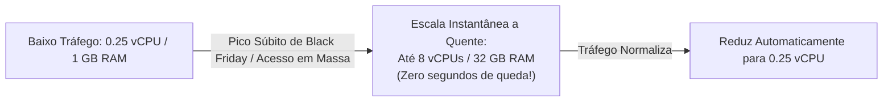
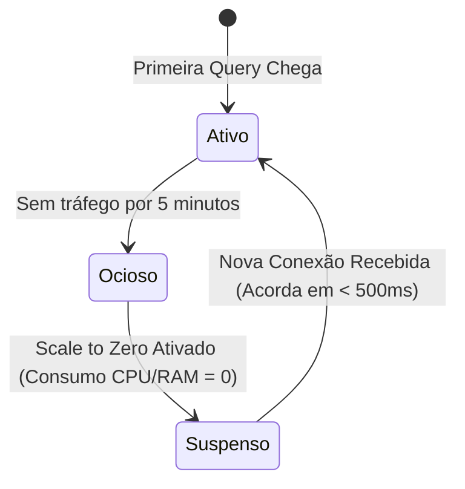
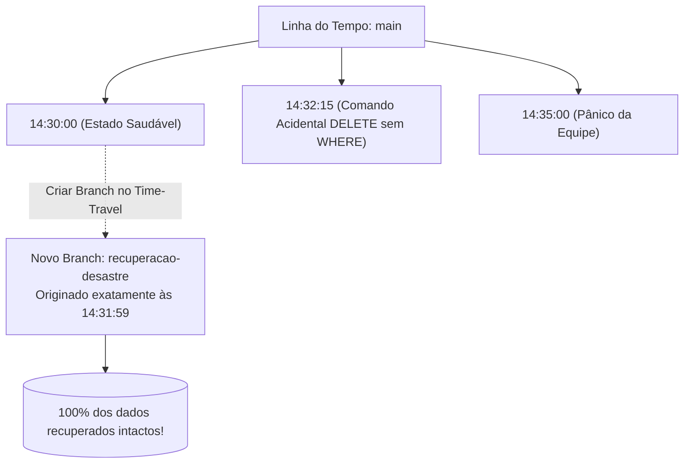

# ⚡ Módulo 05: Neon Serverless PostgreSQL
## 📑 Aula 04: Autoscaling, Scale to Zero e Point-in-Time Recovery (PITR)

> **Navegação**: [⬅️ Aula Anterior: Branching](./03-branching-de-banco-de-dados.md) | [Módulo 05](./README.md) | [Próxima Aula: Integração com Aplicações ➡️](./05-integracao-com-aplicacoes.md)

---

### 🎯 Objetivos de Aprendizagem
Ao final desta aula, você será capaz de:
- Configurar e compreender o funcionamento do **Autoscaling** dinâmico de computação sem downtime.
- Explicar o ciclo de vida do recurso **Scale to Zero** e a latência de ativação (*cold start*).
- Dominar o **Point-in-Time Recovery (PITR)** para recuperação de desastres e "viagens no tempo" de dados.
- Comparar a restauração tradicional de backups com a técnica instantânea de time-travel do Neon.

---

### 1. Autoscaling Dinâmico de Computação (Sem Reinicialização)

Em bancos de dados na nuvem clássicos, aumentar a capacidade de CPU ou memória RAM exige alterar o tipo da máquina virtual (ex.: de `db.t3.medium` para `db.r5.xlarge`), provocando reinicialização obrigatória e queda momentânea da aplicação (*downtime*).

No Neon, a camada de computação roda sobre MicroVMs personalizadas baseadas em Linux cgroups, permitindo **Autoscaling Vertical a Quente**:



#### Como Configurar no Neon:
No painel do projeto, em **Settings -> Compute**, você define uma faixa:
* **Min Compute Unit (CU)**: Exemplo: `0.25 CU` (1 CU equivale aproximadamente a 1 vCPU e 4 GB de RAM).
* **Max Compute Unit (CU)**: Exemplo: `4 CU` (4 vCPUs e 16 GB de RAM).
* O Neon aloca e desaloca recursos de hardware dinamicamente segundo a carga das queries, cobrando estritamente pelos segundos utilizados!

---

### 2. O Recurso Scale to Zero: Economia Inteligente

Bancos de teste, desenvolvimento e laboratoriais passam a maior parte do dia ociosos:



1. **Inatividade**: Se nenhuma query for executada durante um tempo configurável (padrão: 5 minutos), a MicroVM de computação é suspensa.
2. **Custo Zero de CPU/RAM**: Enquanto estiver suspensa, você paga absolutamente nada por processamento (paga apenas os megabytes de dados armazenados no Pageserver).
3. **Reativação Transparente (*Wake-up*)**: No momento em que um usuário ou backend faz um `SELECT`, o proxy do Neon intercepta a conexão TCP, sobe a MicroVM em cerca de 400 a 800 milissegundos e atende à query sem gerar erro de conexão para o cliente.

---

### 3. Point-in-Time Recovery (PITR): "Viagem no Tempo" em Segundos

Imagine o pior pesadelo de um desenvolvedor ou administrador de banco de dados:

> *"Às 14:32:15, um estagiário executou `DELETE FROM clientes;` no banco principal achando que estava no ambiente local."*

#### Como era a recuperação tradicional (Pesadelo de Horas):
1. Encontrar o último backup completo dump/snapshot da noite anterior.
2. Alugar um novo servidor.
3. Descompactar e restaurar gigabytes de dados (demora 2 a 6 horas).
4. Reaplicar arquivos de log WAL até o instante do erro.
5. Perda de todos os dados gerados entre o último backup e o momento do erro.

#### Como é no Neon (Mágica em 2 Segundos):
Graças à arquitetura baseada em árvores imutáveis de páginas do Pageserver, o Neon guarda o histórico contínuo de versões.
Você pode **criar um branch a partir de qualquer segundo específico do passado**:



#### Executando a Recuperação no Console ou CLI:

```bash
# Criar um branch apontando para exatamente 10 minutos atrás:
neonctl branches create \
  --name resgate-dados \
  --parent main \
  --time "2026-10-07T14:31:59Z"
```

Em **menos de 2 segundos**, você tem uma nova instância com todo o estado íntegro dos dados exatamente como estavam 16 segundos antes da catástrofe!

---

### 📝 Resumo Operacional

| Desafio Tradicional | Solução Serverless no Neon |
| :--- | :--- |
| Escalar hardware exige queda | **Autoscaling a quente sem reinicialização** |
| Bancos ociosos geram custos contínuos | **Scale to Zero suspende recursos automaticamente** |
| Restauração de backup demora horas | **Branching PITR restaura em 2 segundos** |
| Medo de encher o disco e derrubar o banco | **Armazenamento elástico auto-expansível no Pageserver** |

---
> **Navegação**: [⬅️ Aula Anterior: Branching](./03-branching-de-banco-de-dados.md) | [Módulo 05](./README.md) | [Próxima Aula: Integração com Aplicações ➡️](./05-integracao-com-aplicacoes.md)
