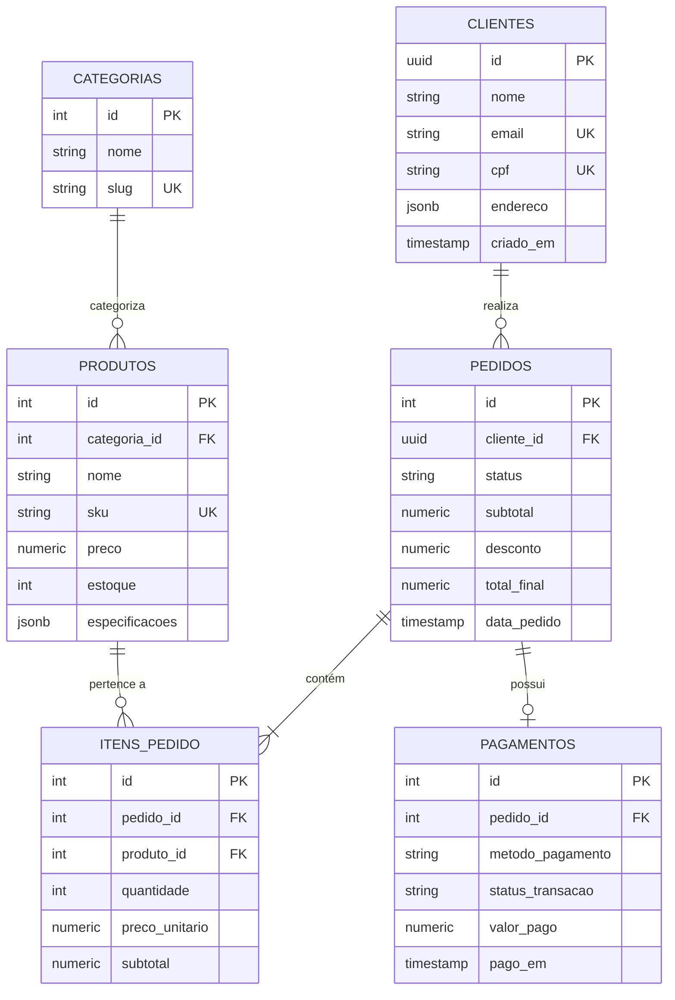

# 🚀 Módulo 06: Projetos Práticos e Desafios
## 🛒 Projeto Integrador: Sistema Completo de E-Commerce

> **Navegação**: [⬅️ Módulo 05](../05-neon-postgresql-cloud/README.md) | [Módulo 06](./README.md) | [Próximo: Banco de 30 Exercícios ➡️](./02-banco-de-questoes-e-exercicios.md)

---

### 🎯 Visão Geral do Projeto
Neste projeto integrador, colocaremos em prática todos os conceitos aprendidos: modelagem relacional, constraints rigorosas, tipos modernos (UUID, JSONB, NUMERIC), triggers de atualização e queries analíticas de inteligência de negócios.

O projeto é 100% executável tanto no seu container Docker local quanto no **Neon PostgreSQL**.

---

### 1. Diagrama Entidade-Relacionamento do E-Commerce



---

### 2. Script DDL Completo (Criação de Tabelas e Regras)

Copie e execute o script abaixo no seu cliente `psql` ou no SQL Editor do Neon:

```sql
-- Limpeza para recriação idêntica se necessário
DROP TABLE IF EXISTS pagamentos CASCADE;
DROP TABLE IF EXISTS itens_pedido CASCADE;
DROP TABLE IF EXISTS pedidos CASCADE;
DROP TABLE IF EXISTS produtos CASCADE;
DROP TABLE IF EXISTS categorias CASCADE;
DROP TABLE IF EXISTS clientes CASCADE;
DROP TYPE IF EXISTS status_pedido_enum CASCADE;
DROP TYPE IF EXISTS status_pagamento_enum CASCADE;

-- 1. Criação de Tipos Enumerados
CREATE TYPE status_pedido_enum AS ENUM ('pendente', 'pago', 'em_transito', 'entregue', 'cancelado');
CREATE TYPE status_pagamento_enum AS ENUM ('processando', 'aprovado', 'recusado', 'estornado');

-- 2. Tabela de Clientes com UUID e JSONB
CREATE TABLE clientes (
    id UUID PRIMARY KEY DEFAULT gen_random_uuid(),
    nome TEXT NOT NULL,
    email TEXT NOT NULL UNIQUE,
    cpf VARCHAR(11) NOT NULL UNIQUE,
    endereco JSONB NOT NULL,
    criado_em TIMESTAMPTZ DEFAULT CURRENT_TIMESTAMP,
    CONSTRAINT chk_cpf_tamanho CHECK (length(cpf) = 11)
);

-- 3. Tabela de Categorias
CREATE TABLE categorias (
    id INT GENERATED ALWAYS AS IDENTITY PRIMARY KEY,
    nome TEXT NOT NULL,
    slug TEXT NOT NULL UNIQUE
);

-- 4. Tabela de Produtos
CREATE TABLE produtos (
    id INT GENERATED ALWAYS AS IDENTITY PRIMARY KEY,
    categoria_id INT NOT NULL REFERENCES categorias(id) ON DELETE RESTRICT,
    nome TEXT NOT NULL,
    sku VARCHAR(20) NOT NULL UNIQUE,
    preco NUMERIC(10,2) NOT NULL CHECK (preco > 0),
    estoque INT NOT NULL DEFAULT 0 CHECK (estoque >= 0),
    especificacoes JSONB DEFAULT '{}'::jsonb,
    criado_em TIMESTAMPTZ DEFAULT CURRENT_TIMESTAMP
);

-- 5. Tabela de Pedidos
CREATE TABLE pedidos (
    id INT GENERATED ALWAYS AS IDENTITY PRIMARY KEY,
    cliente_id UUID NOT NULL REFERENCES clientes(id) ON DELETE RESTRICT,
    status status_pedido_enum NOT NULL DEFAULT 'pendente',
    subtotal NUMERIC(10,2) NOT NULL DEFAULT 0.00 CHECK (subtotal >= 0),
    desconto NUMERIC(10,2) NOT NULL DEFAULT 0.00 CHECK (desconto >= 0),
    total_final NUMERIC(10,2) NOT NULL DEFAULT 0.00 CHECK (total_final >= 0),
    data_pedido TIMESTAMPTZ DEFAULT CURRENT_TIMESTAMP
);

-- 6. Tabela de Itens de Pedido
CREATE TABLE itens_pedido (
    id INT GENERATED ALWAYS AS IDENTITY PRIMARY KEY,
    pedido_id INT NOT NULL REFERENCES pedidos(id) ON DELETE CASCADE,
    produto_id INT NOT NULL REFERENCES produtos(id) ON DELETE RESTRICT,
    quantidade INT NOT NULL CHECK (quantidade > 0),
    preco_unitario NUMERIC(10,2) NOT NULL CHECK (preco_unitario > 0),
    subtotal NUMERIC(10,2) GENERATED ALWAYS AS (quantidade * preco_unitario) STORED
);

-- 7. Tabela de Pagamentos
CREATE TABLE pagamentos (
    id INT GENERATED ALWAYS AS IDENTITY PRIMARY KEY,
    pedido_id INT NOT NULL UNIQUE REFERENCES pedidos(id) ON DELETE CASCADE,
    metodo_pagamento TEXT NOT NULL CHECK (metodo_pagamento IN ('pix', 'cartao_credito', 'boleto')),
    status_transacao status_pagamento_enum NOT NULL DEFAULT 'processando',
    valor_pago NUMERIC(10,2) NOT NULL CHECK (valor_pago > 0),
    pago_em TIMESTAMPTZ
);

-- 8. Índices Estratégicos de Performance
CREATE INDEX idx_produtos_categoria ON produtos(categoria_id);
CREATE INDEX idx_pedidos_cliente ON pedidos(cliente_id);
CREATE INDEX idx_pedidos_data ON pedidos(data_pedido);
CREATE INDEX idx_produtos_specs_gin ON produtos USING GIN (especificacoes);
```

---

### 3. Carga de Dados Realistas (Seed)

```sql
-- Categorias
INSERT INTO categorias (nome, slug) VALUES
    ('Smartphones', 'smartphones'),
    ('Hardware e Periféricos', 'hardware-perifericos'),
    ('Móveis Gamer', 'moveis-gamer');

-- Clientes
INSERT INTO clientes (nome, email, cpf, endereco) VALUES
    ('Juliana Martins', 'juliana@empresa.com', '11122233344', '{"cidade": "São Paulo", "uf": "SP", "cep": "01310-100"}'),
    ('Lucas Alencar', 'lucas@tech.io', '22233344455', '{"cidade": "Belo Horizonte", "uf": "MG", "cep": "30140-071"}'),
    ('Marina Silva', 'marina@design.br', '33344455566', '{"cidade": "Curitiba", "uf": "PR", "cep": "80020-010"}');

-- Produtos
INSERT INTO produtos (categoria_id, nome, sku, preco, estoque, especificacoes) VALUES
    (1, 'Smartphone Galaxy Ultra', 'GALAXY-ULTRA-256', 5499.00, 15, '{"marca": "Samsung", "tela_pol": 6.8, "5g": true}'),
    (1, 'iPhone Pro Max', 'IPHONE-PRO-128', 7899.00, 8, '{"marca": "Apple", "tela_pol": 6.7, "5g": true}'),
    (2, 'Teclado Mecânico RGB', 'KEY-MEC-RGB-01', 349.90, 40, '{"switch": "Cherry MX Blue", "layout": "ABNT2"}'),
    (2, 'Monitor Ultrawide 34"', 'MON-UW-34-144', 2199.00, 12, '{"resolucao": "3440x1440", "hz": 144}'),
    (3, 'Cadeira Ergonômica Pro', 'CAD-ERGO-BLK', 1290.00, 25, '{"material": "Mesh", "peso_max_kg": 150}');

-- Pedidos e seus itens
DO $$
DECLARE
    v_cli1 UUID;
    v_cli2 UUID;
    v_cli3 UUID;
    v_ped1 INT;
    v_ped2 INT;
    v_ped3 INT;
BEGIN
    SELECT id INTO v_cli1 FROM clientes WHERE email = 'juliana@empresa.com';
    SELECT id INTO v_cli2 FROM clientes WHERE email = 'lucas@tech.io';
    SELECT id INTO v_cli3 FROM clientes WHERE email = 'marina@design.br';

    -- Pedido 1 (Juliana)
    INSERT INTO pedidos (cliente_id, status, subtotal, desconto, total_final, data_pedido)
    VALUES (v_cli1, 'entregue', 5848.90, 200.00, 5648.90, '2026-02-10 14:00:00-03')
    RETURNING id INTO v_ped1;

    INSERT INTO itens_pedido (pedido_id, produto_id, quantidade, preco_unitario) VALUES
        (v_ped1, 1, 1, 5499.00),
        (v_ped1, 3, 1, 349.90);

    INSERT INTO pagamentos (pedido_id, metodo_pagamento, status_transacao, valor_pago, pago_em)
    VALUES (v_ped1, 'pix', 'aprovado', 5648.90, '2026-02-10 14:02:00-03');

    -- Pedido 2 (Lucas)
    INSERT INTO pedidos (cliente_id, status, subtotal, desconto, total_final, data_pedido)
    VALUES (v_cli2, 'em_transito', 2199.00, 0.00, 2199.00, '2026-03-01 10:30:00-03')
    RETURNING id INTO v_ped2;

    INSERT INTO itens_pedido (pedido_id, produto_id, quantidade, preco_unitario) VALUES
        (v_ped2, 4, 1, 2199.00);

    INSERT INTO pagamentos (pedido_id, metodo_pagamento, status_transacao, valor_pago, pago_em)
    VALUES (v_ped2, 'cartao_credito', 'aprovado', 2199.00, '2026-03-01 10:32:00-03');

    -- Pedido 3 (Marina)
    INSERT INTO pedidos (cliente_id, status, subtotal, desconto, total_final, data_pedido)
    VALUES (v_cli3, 'pago', 9189.00, 300.00, 8889.00, '2026-03-15 16:45:00-03')
    RETURNING id INTO v_ped3;

    INSERT INTO itens_pedido (pedido_id, produto_id, quantidade, preco_unitario) VALUES
        (v_ped3, 2, 1, 7899.00),
        (v_ped3, 5, 1, 1290.00);

    INSERT INTO pagamentos (pedido_id, metodo_pagamento, status_transacao, valor_pago, pago_em)
    VALUES (v_ped3, 'pix', 'aprovado', 8889.00, '2026-03-15 16:46:00-03');
END $$;
```

---

### 4. Consultas Analíticas e Relatórios de Inteligência (BI)

#### Consulta 1: Ticket Médio e Faturamento por Estado (JSONB + Agregação)
```sql
SELECT 
    c.endereco->>'uf' AS estado,
    COUNT(p.id) AS total_pedidos,
    SUM(p.total_final) AS faturamento_estado,
    ROUND(AVG(p.total_final), 2) AS ticket_medio
FROM clientes c
JOIN pedidos p ON c.id = p.cliente_id
WHERE p.status IN ('pago', 'em_transito', 'entregue')
GROUP BY c.endereco->>'uf'
ORDER BY faturamento_estado DESC;
```

#### Consulta 2: Relatório dos Produtos Mais Vendidos e Representatividade no Faturamento
```sql
SELECT 
    prod.nome,
    cat.nome AS categoria,
    SUM(it.quantidade) AS unidades_vendidas,
    SUM(it.subtotal) AS receita_gerada,
    ROUND(
        (SUM(it.subtotal) / SUM(SUM(it.subtotal)) OVER ()) * 100, 
        2
    ) AS pct_do_faturamento_total
FROM itens_pedido it
JOIN produtos prod ON it.produto_id = prod.id
JOIN categorias cat ON prod.categoria_id = cat.id
GROUP BY prod.id, prod.nome, cat.nome
ORDER BY receita_gerada DESC;
```

#### Consulta 3: Ranking de Clientes (RFV - Recência, Frequência e Valor) com Window Function
```sql
SELECT 
    c.nome,
    c.email,
    COUNT(p.id) AS qtd_compras,
    SUM(p.total_final) AS ltv_cliente,
    DENSE_RANK() OVER (ORDER BY SUM(p.total_final) DESC) AS ranking_vip
FROM clientes c
JOIN pedidos p ON c.id = p.cliente_id
GROUP BY c.id, c.nome, c.email;
```

---

### 📝 Desafio Extra para Estudantes
Crie um Trigger que, sempre que um item for inserido em `itens_pedido`, deduza automaticamente a quantidade comprada da coluna `estoque` na tabela `produtos`. Se não houver estoque suficiente, aborte a transação com um `RAISE EXCEPTION`.

---
> **Navegação**: [⬅️ Módulo 05](../05-neon-postgresql-cloud/README.md) | [Módulo 06](./README.md) | [Próximo: Banco de 30 Exercícios ➡️](./02-banco-de-questoes-e-exercicios.md)
