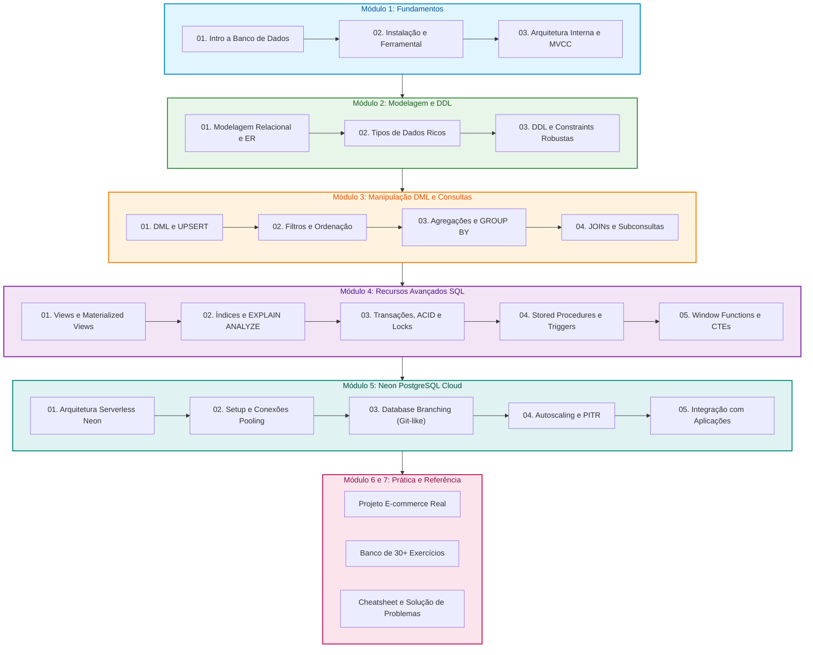

# 🐘 Guia Definitivo de Estudos: PostgreSQL e Neon Serverless

  <b>Material didático aberto, estruturado e prático para estudantes, desenvolvedores e professores.</b> 
  Domine modelagem, SQL moderno, administração, performance e a revolução serverless com o Neon.

[📚 Ementa](#-ementa-e-estrutura-modular) •
[🚀 Como Estudar](#-metodologia-e-como-estudar) •
[🗺️ Trilha de Aprendizado](#%EF%B8%8F-mapa-da-trilha-de-aprendizado) •
[👨‍🏫 Guia do Professor](#-orientações-para-professores-e-instrutores) •
[💻 Projetos](#-projetos-práticos-e-desafios)

---

## 🎯 Sobre Este Material

Este repositório foi concebido como um **livro aberto e laboratório prático** para o ensino e aprendizado moderno de banco de dados relacional. Ele combina o poder e a maturidade do **PostgreSQL** com a vanguarda da arquitetura em nuvem serverless do **Neon PostgreSQL**.

### 🌟 Destaques Pedagógicos
* **Didática Visual**: Diagramas de arquitetura, fluxo e entidade-relacionamento (ER) em **Mermaid** renderizados nativamente no GitHub.
* **Recursos GitHub Flavored Markdown**: Alertas contextuais (`NOTE`, `TIP`, `IMPORTANT`, `WARNING`, `CAUTION`), tabelas comparativas, checklists interativos e soluções retráteis (`
`).
* **Do Zero à Produção**: Cobre desde os conceitos atômicos de banco de dados até Window Functions, otimização com `EXPLAIN ANALYZE`, replicação, branches no Neon e integração com APIs.
* **100% Executável**: Todos os scripts SQL e comandos CLI são testados e prontos para reprodução local ou em nuvem gratuita.

---

## 🗺️ Mapa da Trilha de Aprendizado

---

## 📚 Ementa e Estrutura Modular

| Módulo | Descrição dos Tópicos | Link do Guia |
| :--- | :--- | :---: |
| **01. Fundamentos** | História do PostgreSQL, SGBDs relacionais vs NoSQL, Preparação do Ubuntu Server do zero, instalação oficial do Docker, `psql`, Beekeeper Studio Portable e arquitetura interna (processos, memória, WAL, MVCC). | [Acessar Guia](./01-fundamentos/) |
| **02. Modelagem e DDL** | Diagramação ER, Normalização (1FN a 3FN), Tipos Primitivos, JSONB, Arrays, UUID, Chaves Primárias, Estrangeiras, Check Constraints e boas práticas de schema. | [Acessar Guia](./02-modelagem-e-ddl/) |
| **03. DML e Consultas** | `INSERT`, `UPDATE`, `DELETE`, `ON CONFLICT` (UPSERT), `SELECT`, `WHERE`, `LIKE/ILIKE`, `GROUP BY`, `HAVING`, todas as variantes de `JOIN` e Subqueries. | [Acessar Guia](./03-manipulacao-dml-e-consultas/) |
| **04. SQL Avançado** | Views e Views Materializadas, Índices (B-Tree, GIN, GiST, BRIN), Análise de planos com `EXPLAIN ANALYZE`, ACID, Níveis de Isolamento, Locks, Triggers, Procedures e Window Functions. | [Acessar Guia](./04-recursos-avancados-sql/) |
| **05. Neon PostgreSQL** | Arquitetura Serverless (Separação Compute e Storage Pageserver/Safekeeper), Connection Pooling com PgBouncer, Database Branching para CI/CD, Scale to Zero e PITR. | [Acessar Guia](./05-neon-postgresql-cloud/) |
| **06. Projetos e Desafios**| Estudo de caso completo de E-commerce do zero à modelagem e relatórios, mais banco de 30 exercícios com gabarito retrátil. | [Acessar Guia](./06-projetos-praticos-e-desafios/) |
| **07. Referência Rápida** | Cheat Sheet completo de comandos SQL e Guia de Resolução de Erros comuns (conexão, permissão, deadlock, timeout). | [Acessar Guia](./07-guias-de-referencia-rapida/) |

---

## 🚀 Metodologia e Como Estudar

Para tirar o máximo proveito deste guia, sugerimos o seguinte ciclo de estudo:

1. **Leitura Teórica Atenta**: Compreenda o *porquê* antes do *como*. Observe os diagramas conceituais.
2. **Execução Prática**: Nunca copie e cole cegamente. Digite os comandos, execute no seu terminal ou na nuvem do Neon e observe o retorno.
3. **Provocação e Quebra**: Modifique as queries, introduza erros intencionais para entender as mensagens do compilador SQL e o comportamento das constraints.
4. **Desafios e Exercícios**: Tente resolver os exercícios propostos sem abrir a tag `
` de resposta.

> [!TIP]
> Crie uma conta gratuita no [Neon Console](https://console.neon.tech). Ela não exige cartão de crédito e permite instanciar bancos PostgreSQL 16 em segundos, com suporte a branches imediatos para testes seguros!

---

## 👨‍🏫 Orientações para Professores e Instrutores

Se você é professor ou líder técnico ministrando treinamentos:

* **Aulas Expositivas**: Utilize os diagramas Mermaid dos módulos `01-fundamentos` e `05-neon-postgresql-cloud` para ilustrar a arquitetura interna e o paradigma cloud-native.
* **Aulas de Laboratório**: O módulo `06-projetos-praticos-e-desafios/01-projeto-ecommerce.md` fornece uma base de dados realista para atividades individuais ou em duplas.
* **Ambiente Isolação sem Custo**: Instrua seus alunos a criarem uma branch própria no Neon para cada exercício ou prova prática. Isso elimina conflitos de dados e garante que o professor possa corrigir revisando a branch específica.
* **Tarefas de Casa**: Use a lista de exercícios do módulo `06-projetos-praticos-e-desafios/02-banco-de-questoes-e-exercicios.md`.

> [!IMPORTANT]
> Todo o material está sob licença aberta para uso educacional em escolas, universidades, bootcamps e cursos corporativos.

---

## 🛠️ Pré-requisitos Recomendados

Antes de iniciar, certifique-se de possuir:

- [ ] Vontade de aprender e praticar diariamente.
- [ ] Um navegador moderno para acesso ao Neon Web Console.
- [ ] **Beekeeper Studio Portable** (Community Edition) para visualização e execução gráfica sem precisar de permissões de administrador no laboratório.
- [ ] Um editor de código (VS Code, Antigravity IDE, Cursor ou similar).
- [ ] Opcional (para estudo local offline): Docker ou PostgreSQL Client (`psql`) instalado.

---

## 🤝 Como Contribuir

Encontrou um erro de digitação, uma query que pode ser otimizada ou quer propor um novo desafio?
1. Faça um Fork deste repositório.
2. Crie sua branch: `git checkout -b feature/novo-exercicio`.
3. Commit suas alterações: `git commit -m 'feat: adiciona exercicio de CTE recursiva'`.
4. Envie para o branch: `git push origin feature/novo-exercicio`.
5. Abra um Pull Request detalhado!

---

  Desenvolvido com dedicação para a formação de novos engenheiros e especialistas em dados. 🚀

